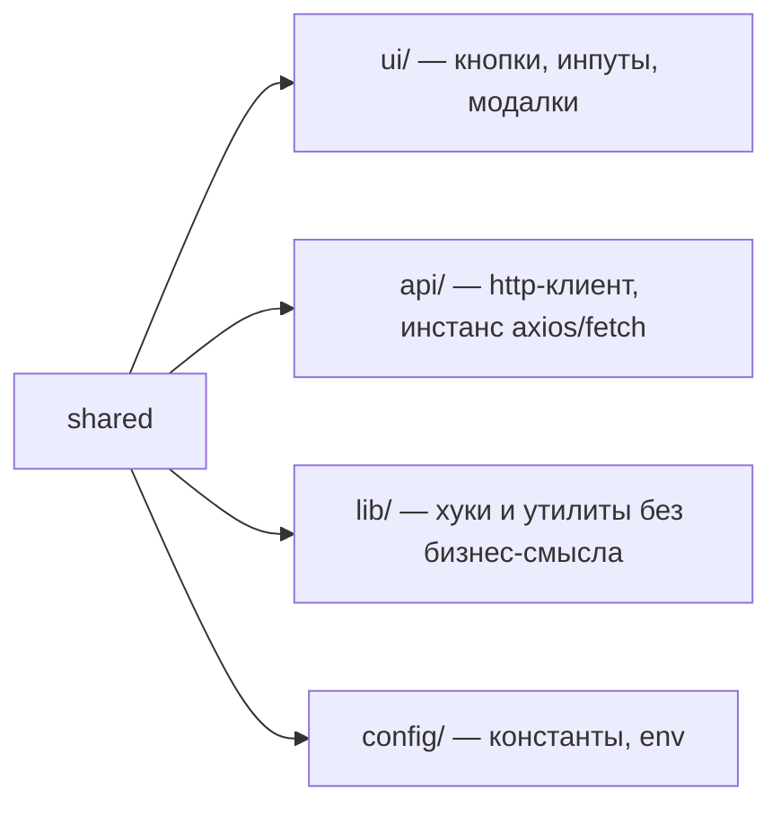

# Уровень 3: Shared — фундамент без бизнес-смысла

`shared` — нижний слой FSD, самый низкий этаж дома. Это розетки, трубы и лифт —
вещами пользуется весь дом, но ни розетка, ни лифт ничего не знают о том, кто в
доме живёт и чем занимается.

## Из чего состоит shared

У `shared`, в отличие от `entities`/`features`/`widgets`/`pages`, **нет слайсов** —
только сегменты:



У каждого сегмента, как и у слайса, есть **public API** — `index.ts`:

```ts
// shared/ui/index.ts
export { Button } from './Button'
export type { ButtonProps } from './Button'
```

```ts
import { Button } from '@/shared/ui' // ✅ через дверь сегмента
import { Button } from '@/shared/ui/Button' // ❌ мимо public API
```

## Главный вопрос: что можно класть в shared

**Тест на бизнес-смысл:** если код упоминает конкретную сущность вашего домена
(`User`, `Product`, `Order`) или бизнес-правило — ему не место в `shared`.

| В shared — можно | В shared — нельзя |
|---|---|
| `Button`, `Modal`, `Input` | `UserCard` (знает про `User`) |
| `capitalize(str)` | `formatUserLabel(user)` (знает про роль пользователя) |
| `apiClient.get(path)` | сущность `User`, `Product` |
| `API_BASE_URL` | бизнес-правило вида «скидка для VIP» |

📌 Правило проверки: спросите себя — «этот код одинаково пригодится и в
интернет-магазине, и в CRM, и в игре»? Если да — это `shared`. Если код имеет
смысл только в контексте вашего конкретного продукта — это `entities` или выше.

## Коротко: как надо и как не надо

**✅ Хорошо**

- у каждого сегмента `shared` — свой `index.ts`;
- в `shared` — только универсальный код без знания о домене;
- бизнес-сущности живут в `entities`, даже если выглядят «переиспользуемыми».

**❌ Ошибки новичков**

- глубокий импорт `@/shared/ui/Button` мимо `index.ts`;
- сущность `User` кладут в `shared/user`, «чтобы было под рукой»;
- доменную функцию форматирования суют в `shared/lib`.
