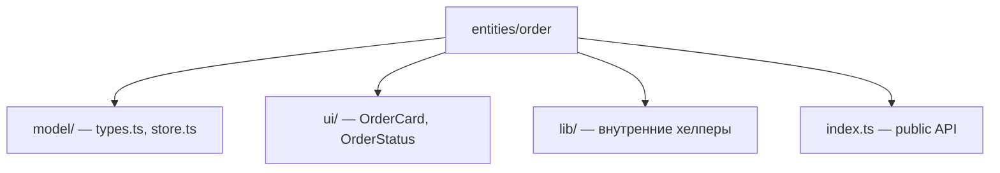
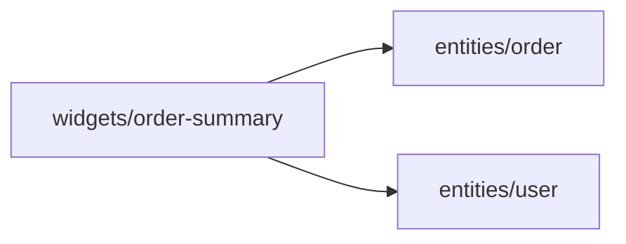
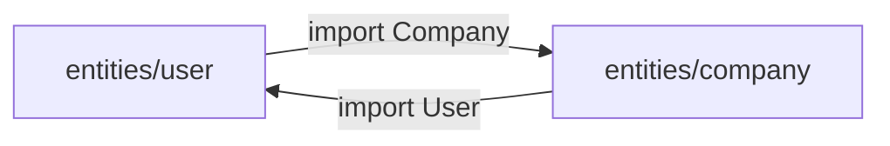

# Уровень 4 (подробно): Сущности (entities)

## Что такое entity в FSD

В FSD-словаре у слоя `entities` особая роль: это единственный слой, который
моделирует **данные предметной области**, а не действия пользователя или композицию
экрана. Ответ на вопрос «какие объекты вообще существуют в этом приложении» —
`User`, `Product`, `Order`, `Company`, `Room`, `Booking`. У каждого объекта — свой
слайс.

Сравните с соседними слоями:

| Слой | Вопрос | Пример |
|---|---|---|
| `entities` | Что это? | `User`, `Product`, `Order` |
| `features` | Что делает пользователь? | `add-to-cart`, `login`, `cancel-order` |
| `widgets` | Как это собрано на экране? | `OrderSummary`, `Header`, `ProductShelf` |

Если в коде появляется сущность, которая одновременно «что это» и «что делает» —
скорее всего, кусок бизнес-действия по ошибке живёт в `entities` вместо `features`.

## Анатомия слайса-сущности

Сущность раскладывается на сегменты так же, как любой другой слайс:



- **`model/`** — «что это за объект»: TypeScript-тип (форма данных) и, если нужно,
  локальный стор (текущее состояние: `orderStore.current`).
- **`ui/`** — элементарное отображение объекта: карточка, бейдж статуса, аватар.
  Никакой сложной композиции нескольких сущностей — это уже `widgets`.
- **`lib/`** — маленькие чистые хелперы, которые нужны только внутри слайса
  (форматирование, вычисления). По умолчанию они **не** идут наружу.
- **`index.ts`** — фасад. Снаружи сущность видна ровно такой, какой её описывает
  этот файл.

Не каждой сущности нужны все сегменты сразу. Простая сущность вроде `entities/tag`
может состоять из одного `model/types.ts` — и это нормально: не нужно City создавать
пустые папки «на будущее».

## Главная опасность: сущности начинают знать друг о друге

Одна из самых частых ошибок в реальных FSD-проектах — сущность, которая импортирует
соседнюю сущность и встраивает её объект целиком:

```ts
// ❌ entities/order/model/types.ts
import type { User } from '@/entities/user'

export interface Order {
  id: string
  buyer: User // весь объект User внутри Order
}
```

На первый взгляд удобно: у заказа сразу «есть» покупатель со всеми полями. Но это
создаёт три проблемы:

1. **Горизонтальная связь.** `order` теперь физически зависит от структуры `user`.
   Поменяется форма `User` (появится новое обязательное поле) — сломается компиляция
   `order`, хотя предметно это разные объекты.
2. **Путь к циклу.** Если завтра в `entities/user` понадобится «последний заказ»
   (`lastOrder: Order`), два cross-import'а замкнутся в цикл `order → user → order`.
   Цикл между слайсами — это гарантированные проблемы со сборкой и порядком
   инициализации модулей.
3. **Устаревшие данные.** Объект `User`, вложенный в `Order` в момент создания заказа,
   не обновится, если пользователь потом сменит имя. С `userId` этого вопроса не
   возникает — актуальные данные всегда запрашиваются заново.

### Решение: связь по идентификатору

```ts
// ✅ entities/order/model/types.ts
export interface Order {
  id: string
  userId: string // ссылка, а не объект
}
```

Теперь `order` вообще не импортирует `user`. Если экрану нужны и заказ, и данные
покупателя вместе — эта композиция происходит **на слое выше**:



```tsx
// ✅ widgets/order-summary/ui/OrderSummary.tsx
import { OrderCard, type Order } from '@/entities/order'
import { UserCard, type User } from '@/entities/user'

function OrderSummary({ order, buyer }: { order: Order; buyer: User }) {
  return (
    <section>
      <OrderCard order={order} />
      <UserCard user={buyer} />
    </section>
  )
}
```

`widget` имеет право знать про обе сущности — это его работа: собрать экран из
кусочков домена. А сами сущности остаются независимыми друг от друга.

## Цикл между двумя сущностями — крайний случай той же ошибки

Если связь идёт в обе стороны — `user` хранит `company: Company`, а `company` хранит
`ceo: User` — получается настоящий цикл импортов:



Лечится тем же приёмом, только с обеих сторон разом:

```ts
// ✅ entities/user/model/types.ts
export interface User {
  id: string
  companyId: string
}

// ✅ entities/company/model/types.ts
export interface Company {
  id: string
  ceoId: string
}
```

Цикл распадается: обе сущности теперь независимы, а связь выражена данными
(`companyId` / `ceoId`), а не импортами модулей.

## Внутреннее не значит публичное

У сущности легко разрастись: помимо типа появляется стор, несколько ui-компонентов,
внутренние хелперы форматирования. Не всё из этого должно попасть в `index.ts`:

```ts
// entities/order/lib/format.ts — используется только внутри слайса
export function formatOrderTotal(total: number) {
  return `${total.toFixed(2)} ₽`
}

// entities/order/index.ts — публичный контракт
export type { Order } from './model/types'
export { orderStore } from './model/store'
export { OrderCard } from './ui/OrderCard'
export { OrderStatus } from './ui/OrderStatus'
// formatOrderTotal наружу НЕ выносим — деталь реализации
```

Правило простое: спрашивайте себя «нужен ли этот символ хоть одному потребителю
снаружи слайса?». Если нет — он остаётся внутренним, и public API сущности не
раздувается лишними обязательствами.

## Хорошие практики

- **Сущность = данные + элементарное отображение.** Сложную композицию нескольких
  сущностей выносите в `widgets`/`features`, а не тащите в `entities`.
- **Связь между сущностями — только по `id`.** `userId`, `companyId`, `roomId` вместо
  вложенных объектов. Данные собираются вместе на уровень выше.
- **Не всё, что есть в слайсе, должно быть в `index.ts`.** Внутренние хелперы
  (`lib/`) остаются приватными по умолчанию.
- **Проверяйте направление импортов.** Сущность может импортировать `shared`, но
  никогда — другую сущность того же слоя.
- **Простая сущность — простая структура.** Не создавайте `ui/`, `lib/`, `api/`
  заранее «про запас», если слайсу они пока не нужны.

## Частые ошибки новичков

- **Встраивание чужой сущности объектом.** `Order.buyer: User` вместо `Order.userId`.
  Самая частая ошибка уровня — воспринимать сущности как вложенные структуры данных,
  а не как независимые домены.
- **Цикл user ⇄ company.** Двусторонняя связь объектами почти всегда всплывает как
  ошибка сборки или бесконечный импорт — гораздо позже, чем хотелось бы её поймать.
- **Композиция сущностей внутри сущности.** Попытка собрать `OrderSummary` прямо в
  `entities/order/ui`, импортируя `entities/user`. Это работа `widgets`, а не
  `entities`.
- **Публикация внутренних хелперов.** `formatOrderTotal` реэкспортируется из
  `index.ts` «на всякий случай» — и превращается в часть контракта, который нельзя
  менять без оглядки на потребителей.
- **Слайс без public API.** Сущность создана, но `index.ts` пустой или отсутствует —
  потребители неизбежно начинают тянуть внутренние сегменты напрямую.

📌 Итог: сущность моделирует один объект домена — независимо от соседних сущностей.
Связь с другим доменом — идентификатор в данных, а не импорт чужого слайса; сборка
нескольких сущностей вместе — задача слоя выше.
