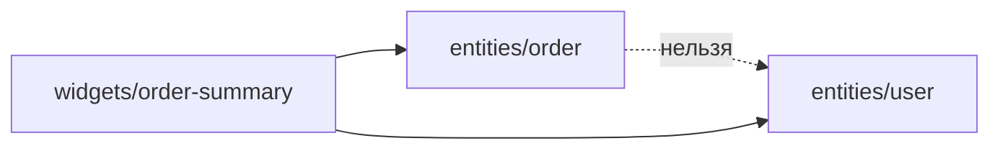

# Уровень 4: Сущности (entities)

**Сущность** (entity) — это слайс, который отвечает на вопрос «что это?»: `user`,
`product`, `order`, `company`. Не «что делает пользователь» (это `feature`), а «какие
объекты вообще есть в предметной области».

## Устройство сущности

Внутри сущности — привычные сегменты:

```
entities/product/
├── model/   ← типы, стор (Product, stockStore)
├── ui/      ← карточка (ProductCard)
├── lib/     ← внутренние хелперы (не публикуются)
└── index.ts ← public API
```

```ts
// entities/product/index.ts
export type { Product } from './model/types'
export { ProductCard } from './ui/ProductCard'
```

Как и у любого слайса, у сущности есть входная дверь — `index.ts`. Всё остальное
снаружи трогать нельзя (это тема уровня 9, здесь — фокус на самой сущности).

## Главное правило уровня: сущности не знают друг о друге



`entities/order` и `entities/user` — соседи одного слоя. Если `order` импортирует
`user` и кладёт объект `User` внутрь `Order`, вы получаете:

- горизонтальную связь между независимыми доменами;
- риск цикла, если `user` когда-нибудь тоже сошлётся на `order`;
- сущность, которая тянет за собой чужую структуру данных при каждой сериализации.

**Решение — ссылаться по идентификатору**, а не встраивать объект:

```ts
// ❌ order знает про user
import type { User } from '@/entities/user'
export interface Order {
  id: string
  buyer: User
}

// ✅ order хранит только ссылку
export interface Order {
  id: string
  userId: string
}
```

Собрать вместе `Order` и полный объект `User` (например, для карточки заказа с именем
покупателя) — задача слоя выше: `widget` или `feature`, который импортирует обе
сущности и соединяет их данные.

## Коротко: как надо и как не надо

**✅ Хорошо**

- сущность = данные + элементарное отображение (`model` + `ui`);
- связь с другой сущностью — через `id`, а не вложенный объект;
- сборка нескольких сущностей вместе — на слое `widgets`/`features`.

**❌ Ошибки новичков**

- `entities/order` импортирует `entities/user` и хранит `User` целиком;
- две сущности ссылаются друг на друга объектами — готовый цикл;
- внутренний хелпер (`lib/format`) экспортируется наружу «на всякий случай».

📌 Итог: сущность — это домен, а не пересечение доменов. Если нужна связь с соседом —
идентификатор в данных плюс композиция на уровень выше.
