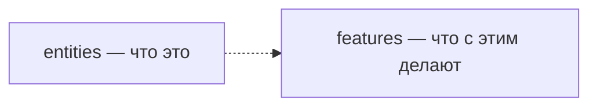
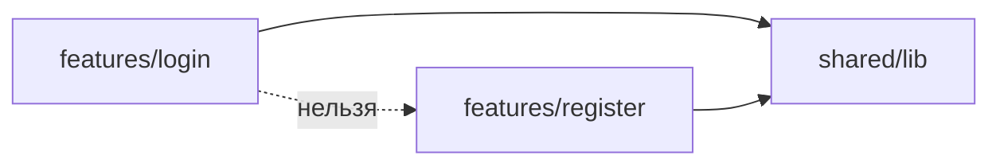

# Уровень 5 (подробно): Фичи

## Что вообще такое фича

В FSD слой `entities` хранит **данные и их состояние** — `User`, `Product`,
`Order`. Слой `features` хранит **действия пользователя над этими данными** —
`login`, `add-to-cart`, `toggle-favorite`, `apply-promo-code`. Простой тест:
если название слайса — существительное («товар», «пользователь») — это
`entity`; если глагол или отглагольное действие («добавить в корзину», «войти»)
— это `feature`.



Фича — не обязательно интерактивный UI-элемент. Это может быть чистая функция
без единого JSX (`features/apply-promo`), хук, стор — что угодно, что реализует
законченный пользовательский сценарий.

## Фича = композиция сущностей и shared

Ключевое свойство фичи — она **собирает** зависимости, а не изобретает их
заново:

```ts
// features/checkout/model/checkout.ts
import { cartStore } from '@/entities/cart' // «что лежит в корзине»
import type { Order } from '@/entities/order' // «как выглядит заказ»
import { formatPrice } from '@/shared/lib' // «как отформатировать сумму»

export function checkout(): { order: Order; label: string } {
  const total = cartStore.total()
  const order: Order = { id: 'o1', total }
  return { order, label: formatPrice(total) }
}
```

Ничего необычного: те же правила public API и изоляции слайсов, что и на
уровне `entities`, — только теперь фича опирается сразу на **несколько**
нижестоящих слайсов. Чем сложнее сценарий, тем больше сущностей и
shared-утилит он в себя собирает — и тем важнее, чтобы каждая связь шла через
`index.ts`, а не вглубь сегментов.

## Правило 1: фича не импортирует вверх

Слои идут в строгом порядке: `app → pages → widgets → features → entities →
shared`. Импорт разрешён только **вниз**. Фича не может импортировать ничего
из `widgets`, `pages` или `app` — эти слои сами зависят от фич, а не наоборот.


Частый сценарий нарушения: у виджета уже есть какая-то константа или утилита
(например, размер карточки), и разработчик фичи «по-быстрому» импортирует её,
вместо того чтобы объявить свою:

```ts
// ❌ features/toggle-favorite/ui/ToggleFavoriteButton.tsx
import { CARD_WIDTH } from '@/widgets/product-card'

export function ToggleFavoriteButton({ active }: { active: boolean }) {
  const iconSize = CARD_WIDTH / 10
  // ...
}
```

Чем это плохо: теперь `widgets/product-card` нельзя изменить (или удалить),
не сломав фичу, — хотя логически фича вообще не должна знать о существовании
этого виджета. Она может использоваться в десятке других виджетов, и у каждого
своя ширина карточки.

**Как чинить:** развернуть зависимость. Либо фича определяет своё собственное
значение (не зависящее от конкретного виджета), либо виджет передаёт нужные
данные фиче явным пропом — тогда стрелка идёт в правильную сторону, сверху
вниз.

```ts
// ✅ features/toggle-favorite/ui/ToggleFavoriteButton.tsx
const ICON_SIZE = 24

export function ToggleFavoriteButton({ active }: { active: boolean }) {
  // ...использует свою константу, не завися от виджета
}
```

## Правило 2: фича не тянет соседнюю фичу

Как и `entities`, слайсы слоя `features` **изолированы друг от друга**. Если
`features/login` начнёт импортировать что-то из `features/register`, вы
получите ту же проблему, что и с cross-import сущностей: жёсткую
горизонтальную связь и риск цикла.



Типичная ситуация: у двух фич есть общий кусочек логики (например, проверка
формата email), и он изначально был написан внутри одной из фич. Вторая фича,
когда ей это тоже понадобилось, просто импортировала функцию у соседа:

```ts
// ❌ features/login/model/login.ts
import { validateEmail } from '@/features/register'

export function login(email: string, password: string): boolean {
  return validateEmail(email) && password.length > 0
}
```

Проблема та же, что и с cross-import сущностей: `login` теперь физически
зависит от `register` — их нельзя ни удалить по отдельности, ни развивать
независимо, хотя по смыслу это два несвязанных сценария.

**Как чинить:** опустить общий кусок туда, где ему место по смыслу. Если это
переиспользуемый примитив без бизнес-специфики (проверка формата строки) — в
`shared/lib`. Если это общая доменная логика, завязанная на сущность, — в
соответствующий `entities/*`.

```ts
// ✅ features/login/model/login.ts
import { validateEmail } from '@/shared/lib'

export function login(email: string, password: string): boolean {
  return validateEmail(email) && password.length > 0
}
```

Теперь и `login`, и `register` пользуются одной и той же функцией из общего
места — дублирования нет, а связи между фичами тоже нет.

## Public API фичи — тот же контракт, что и у сущности

Фича закрывается `index.ts` ровно так же, как и `entity`:

```ts
// features/add-to-cart/index.ts
export { AddToCartButton } from './ui/AddToCartButton'
```

Потребитель фичи (обычно `widget` или `page`) импортирует её целиком:

```ts
import { AddToCartButton } from '@/features/add-to-cart' // ✅
import { AddToCartButton } from '@/features/add-to-cart/ui/AddToCartButton' // ❌ deep import
```

## Хорошие практики

- **Название фичи — глагол или действие.** `add-to-cart`, `login`,
  `toggle-favorite` — не `cart-button` или `login-form`. Имя должно отвечать
  на вопрос «что делает пользователь», а не «что за компонент».
- **Собирайте сущности через public API.** Даже если вы точно знаете, что
  внутри `entities/cart/model/store.ts`, импортируйте `@/entities/cart` —
  контракт слайса важнее сиюминутного удобства.
- **Общий код — в shared или entities, никогда — в соседней фиче.** Прежде
  чем импортировать что-то у соседа по слою, спросите: «а если удалить того
  соседа, эта логика останется нужна?» Если да — ей место ниже.
- **Виджет знает про фичу, а не наоборот.** Если кажется, что фиче нужно что-то
  от виджета, — это сигнал развернуть передачу данных через пропы.
- **Одна фича — один сценарий.** `features/checkout` не должна разрастаться до
  «всё про заказ»: оформление, отмену, историю разумно развести на отдельные
  фичи, каждая — свой сценарий.

## Частые ошибки новичков

- **Импорт константы/утилиты из виджета** «раз она уже там есть» — классический
  импорт вверх. Ищите способ обойтись локально или получить значение пропом.
- **Cross-import соседней фичи** ради одной функции — вместо того чтобы
  вынести её в `shared` или `entities`.
- **Deep import в сущность или shared** (`@/entities/cart/model/store` вместо
  `@/entities/cart`) — то же нарушение public API, что и на уровне `entities`.
- **Фича без public API.** `index.ts` пуст или отсутствует — потребитель
  вынужден лезть глубоко, потому что снаружи взять нечего.
- **Смешение фичи и виджета.** Если слайс не про одно конкретное действие, а
  собирает целую секцию страницы (шапку, панель заказа) — это, скорее всего,
  `widget`, а не `feature`.

📌 Итог: фича — направленная композиция. Вниз (`entities`, `shared`) — через
public API, сколько угодно слайсов. Вверх (`widgets`, `pages`, `app`) и вбок
(соседние `features`) — никогда напрямую.
