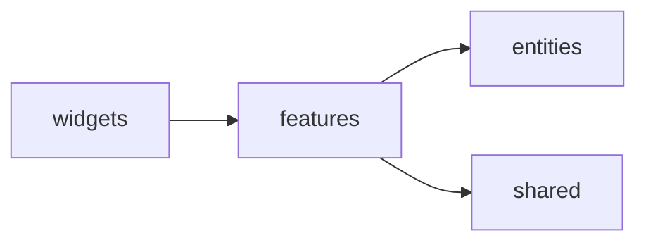

# Уровень 5: Фичи

Если `entities` отвечает на вопрос «что это» (товар, пользователь, заказ), то
`features` отвечает на вопрос «что пользователь делает» — добавить в корзину,
войти, оформить заказ. **Фича — это сценарий**, который собирает вокруг себя
нужные сущности и общий код, чтобы получилось законченное действие.

## Фича собирает, а не изобретает

Фича почти никогда не работает сама по себе — она **композирует** то, что лежит
ниже неё по стеку:

```ts
// features/add-to-cart/ui/AddToCartButton.tsx
import { cartStore } from '@/entities/cart' // сущность — вниз
import { Button } from '@/shared/ui' // shared — вниз

export function AddToCartButton({ productId }: { productId: string }) {
  return <Button onClick={() => cartStore.add(productId)}>В корзину</Button>
}
```

Импорт `entities` и `shared` — это нормально и ожидаемо, но **только через их
public API** (`@/entities/cart`, а не `@/entities/cart/model/store`).

## Два правила направления связей



1. **Фича не импортирует вверх.** `widgets`, `pages`, `app` стоят выше — фича
   ничего не должна о них знать. Если фиче «нужно» что-то из виджета — это
   повод развернуть зависимость: виджет передаёт данные фиче пропом, а не
   наоборот.
2. **Фича не тянет соседнюю фичу.** `features/login` и `features/register` —
   слайсы одного слоя, они друг о друге не знают. Если обеим нужен один и тот
   же примитив (например, `validateEmail`) — ему место в `shared/lib`, а не в
   одной из фич «по-соседски».

## Коротко: как надо и как не надо

**✅ Хорошо**

- фича импортирует `entities`/`shared` только через их `index.ts`;
- у самой фичи есть свой `index.ts` — public API сценария;
- общий код для двух фич живёт в `shared`, а не в одной из них.

**❌ Ошибки новичков**

- фича берёт константу или функцию из `widgets`, который её же и использует
  (импорт вверх);
- `features/login` импортирует что-то из `features/register` напрямую
  (cross-import соседей);
- фича лезет вглубь сегментов чужого слайса (`@/entities/cart/model/store`)
  вместо `@/entities/cart`.

📌 Итог: фича — это направленный сценарий. Она свободно тянет всё, что ниже
(`entities`, `shared`) через их public API, но никогда — то, что выше
(`widgets`, `pages`, `app`) или лежит рядом (другую фичу).
