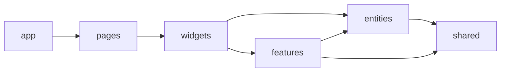
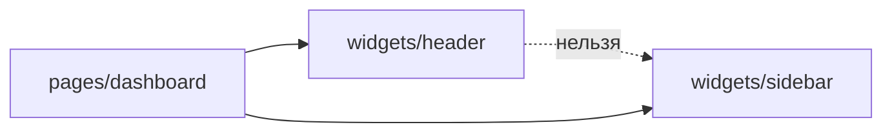

# Уровень 6 (подробно): Виджеты

## Что такое виджет в FSD

`widgets` — слой композиционных блоков интерфейса. Виджет отвечает на вопрос
«какой самостоятельный кусок экрана это составляет» — не отдельная кнопка
(это `features` или `shared/ui`) и не страница целиком (это `pages`), а
законченный смысловой блок: шапка сайта, боковое меню, карточка товара со
всеми её элементами, блок комментариев.



Каждый слой ниже виден слою выше. `widgets` стоит между `pages` и `features` —
это ровно то место, где данные (`entities`) и действия (`features`) впервые
складываются в конкретный визуальный блок.

## Виджет = композиция, а не новая логика

У виджета нет собственной бизнес-логики и собственных данных — только
компоновка того, что уже есть в `entities` и `features`:

```tsx
// widgets/product-card/ui/ProductCard.tsx
import { ProductPrice, type Product } from '@/entities/product'
import { AddToCartButton } from '@/features/add-to-cart'

export function ProductCard({ product }: { product: Product }) {
  return (
    <div className="product-card">
      <strong>{product.title}</strong>
      <ProductPrice product={product} />
      <AddToCartButton productId={product.id} />
    </div>
  )
}
```

`entities/product` не знает про кнопку «в корзину» — это чужое действие.
`features/add-to-cart` не знает про карточку товара — это чужая вёрстка.
Только виджет видит обоих и собирает их в один блок с осмысленной раскладкой.

Как и у любого слайса, у виджета обязателен свой `index.ts` — public API,
через который его подключают страницы:

```ts
// widgets/product-card/index.ts
export { ProductCard } from './ui/ProductCard'
```

## Правило 1: импорт только вниз

Слои идут в строгом порядке: `app → pages → widgets → features → entities →
shared`. Каждый слой видит только тех, кто ниже него в этом списке. Виджету
доступны `features`, `entities`, `shared` — и запрещены `pages`, `app`.

```ts
// ❌ widgets/header/ui/Header.tsx
import { PageTitle } from '@/pages/dashboard' // импорт вверх!
```

Почему это плохо: виджет — переиспользуемый строительный блок. Если он знает
про конкретную страницу, его нельзя поставить ни на какую другую страницу без
переписывания. Импорт вверх переворачивает саму идею слоя: страница должна
собирать виджеты, а не наоборот.

```ts
// ✅ импорт остаётся внутри разрешённых слоёв
import { UserBadge, type User } from '@/entities/user'
```

## Правило 2: виджеты не общаются друг с другом напрямую

Второе, менее очевидное правило — как и слайсы `entities`/`features` одного
слоя, виджеты **не импортируют друг друга**:



```ts
// ❌ widgets/header тянет соседний widgets/sidebar
import { Sidebar } from '@/widgets/sidebar'
```

Два виджета — два равноправных, независимых блока. Прямая связь между ними
создаёт скрытую зависимость: изменения в `sidebar` могут неожиданно сломать
`header`, а сам `header` теряет возможность существовать без `sidebar`.

### Куда девать то, что нужно обоим виджетам

Если `header` и `sidebar` реально должны использовать один и тот же кусок
(например, кнопку сворачивания меню), у этого куска есть собственное место —
он не принадлежит ни одному из виджетов:

- **Опустить на слой ниже.** Если общий кусок — это самостоятельное
  пользовательское действие, ему место в `features` (`features/sidebar-toggle`).
  Если это переиспользуемый визуальный примитив без бизнес-смысла — в
  `shared/ui`. Оба виджета импортируют его оттуда, не зная друг о друге.

  ```ts
  // ✅ оба виджета берут кнопку из одного места ниже по слоям
  import { ToggleButton } from '@/features/sidebar-toggle'
  ```

- **Поднять композицию на страницу.** Если виджетам не нужно ничего общего
  внутри, а нужно просто оказаться рядом на экране — это забота `pages`, не
  `widgets`:

  ```tsx
  // pages/dashboard/ui/DashboardPage.tsx
  import { Header } from '@/widgets/header'
  import { Sidebar } from '@/widgets/sidebar'

  export function DashboardPage() {
    return (
      <div className="dashboard-page">
        <Header user={user} />
        <Sidebar />
      </div>
    )
  }
  ```

## Как это проверяется статически

Оба правила читаются прямо по путям файлов и строкам `import`, без запуска
кода:

- ранг слоя источника импорта (`widgets` = 2) не должен быть **меньше** ранга
  слоя, откуда импортируют (`pages` = 1, `app` = 0) — иначе это импорт вверх;
- если оба файла — в одном слое (`widgets`), но в разных слайсах (`header` и
  `sidebar`) — это cross-import, тоже запрещено;
- импорт чужого слайса — только через его `index.ts`, а не во внутренние
  сегменты (`ui/`, `model/`).

Ровно так работают правила `layers-slices` и `no-cross-imports` в
`@feature-sliced/steiger` и аналогичные правила `eslint-plugin-boundaries`.

## Хорошие практики

- **Виджет = чистая композиция.** Никакой собственной бизнес-логики — только
  сборка `entities` + `features` + `shared` в осмысленный блок вёрстки.
- **У каждого виджета — свой `index.ts`.** Страница подключает виджет одной
  строкой `import { Header } from '@/widgets/header'`, не заглядывая внутрь.
- **Виджет не знает про страницу.** Если виджету «хочется» узнать что-то про
  конкретную страницу — это сигнал, что часть логики нужно передать пропом
  сверху, а не тянуть импортом.
- **Общее между виджетами — либо ниже, либо на странице.** Переиспользуемый
  кусок опускается в `features`/`shared`; чисто визуальное соседство собирает
  `pages`.
- **Виджет может быть маленьким.** Не обязательно нужен блок «на весь экран» —
  виджетом может быть и компактная карточка (`ProductCard`), если она
  компонует несколько нижних слайсов.

## Частые ошибки новичков

- **Импорт вверх.** Виджет тянет что-то из `pages` или `app` «просто чтобы
  быстрее сделать» — переиспользуемость теряется, виджет привязывается к
  одной странице намертво.
- **Cross-import виджетов.** `widgets/header` напрямую импортирует
  `widgets/sidebar` — горизонтальная связь между независимыми блоками, которая
  ломает изоляцию слоя и мешает менять один виджет, не боясь второго.
- **Виджет без public API.** Нет `index.ts` — потребители вынуждены знать
  структуру `ui/Header.tsx` внутри виджета, а не просто «виджет header».
- **Глубокий импорт соседей.** `import { UserBadge } from
  '@/entities/user/ui/UserBadge'` вместо `@/entities/user` — виджет обходит
  public API сущности, которую компонует.
- **Виджет с бизнес-логикой внутри.** Запросы к API, валидация форм, сложные
  вычисления — это `features`/`entities`; виджет должен оставаться тонким
  слоем сборки.
- **«Раз похожи — свалим в один виджет».** Не любой набор компонентов рядом на
  экране — повод объединять их в общий виджет с общей логикой; иногда это
  просто соседство, которое собирает `pages`.

📌 Итог: виджет компонует `features` + `entities` + `shared` в самостоятельный
блок и отдаёт его через `index.ts`. Он смотрит только вниз по слоям и никогда
не смотрит вбок на другой виджет — общее опускается ниже, а совместное
соседство собирает страница.
