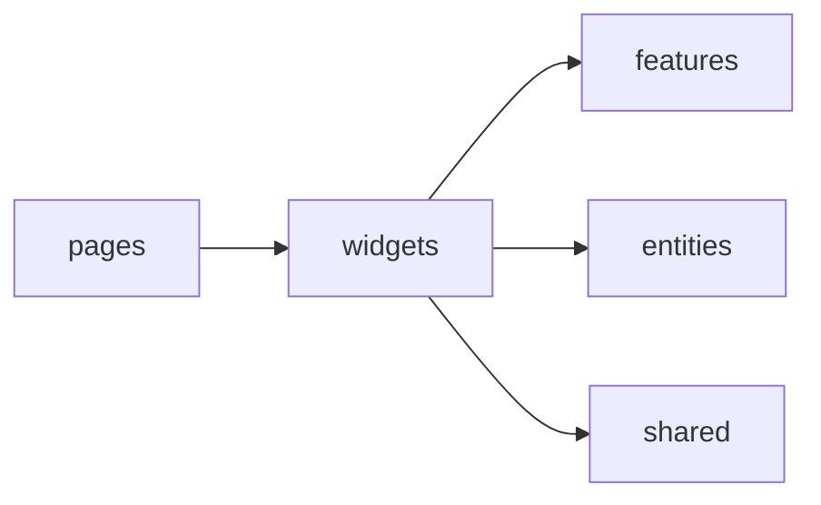

# Уровень 6: Виджеты

Если `entities` — это кирпичи, а `features` — инструменты, то **виджет** —
готовая стена: самостоятельный композиционный блок интерфейса, собранный из
сущностей и фич и обычно занимающий целую зону страницы (`Header`, `Sidebar`,
`ProductCard`, `CommentsSection`).

## Главная работа виджета — компоновать

Виджет не выдумывает данные и не изобретает бизнес-логику — он **собирает**
уже готовые кубики нижних слоёв:

```ts
// widgets/header/ui/Header.tsx
import { Logo } from '@/shared/ui/Logo'
import { UserBadge, type User } from '@/entities/user'

export function Header({ user }: { user: User }) {
  return (
    <header className="header">
      <Logo />
      <UserBadge user={user} />
    </header>
  )
}
```

И, как любой слайс, отдаёт результат наружу через свой `index.ts`:

```ts
// widgets/header/index.ts
export { Header } from './ui/Header'
```

## Куда виджету можно смотреть



Виджет импортирует вниз — `features`, `entities`, `shared`. Ему **нельзя**:

- смотреть **вверх** — знать про `pages` или `app` (иначе виджет привязан к
  одной конкретной странице и не переиспользуется);
- смотреть **вбок** — импортировать другой `widgets/*` напрямую (два виджета
  одного слоя друг другу не соседи, а два независимых блока).

## Если двум виджетам нужно общее — не тянуть друг друга

**❌ Плохо**

```ts
// widgets/header тянет соседний widgets/sidebar
import { ToggleButton } from '@/widgets/sidebar'
```

**✅ Хорошо** — общий кусок опускается на слой ниже (в `features` или
`shared`), а оба виджета берут его оттуда:

```ts
import { ToggleButton } from '@/features/sidebar-toggle'
```

**✅ Или** — композиция двух виджетов поднимается на уровень страницы:

```ts
// pages/dashboard/ui/DashboardPage.tsx
import { Header } from '@/widgets/header'
import { Sidebar } from '@/widgets/sidebar'
```

## Частые ошибки новичков

- виджет импортирует `pages/...` — знает про конкретную страницу, теряет
  переиспользуемость;
- виджет напрямую тянет соседний `widgets/...` — горизонтальная связь между
  равноправными блоками;
- виджет лезет во внутренние сегменты `entities`/`features` в обход их
  `index.ts` — глубокий импорт;
- у самого виджета нет `index.ts` — потребители вынуждены знать про `ui/Header`
  вместо `widgets/header`.
