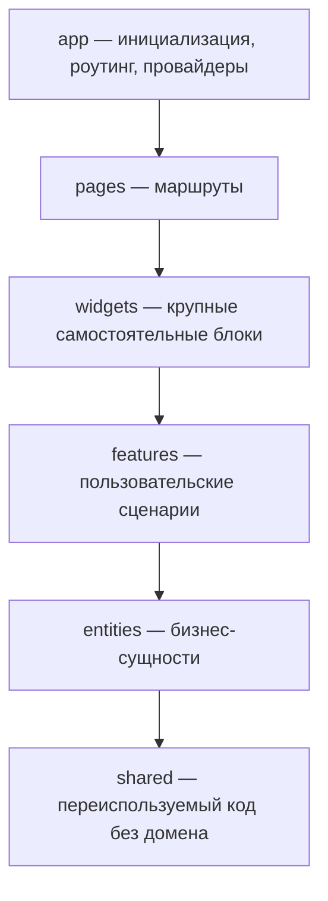

# Уровень 7 (подробно): Страницы

## Место `pages` в иерархии слоёв



`pages` — предпоследний слой сверху. Ему подчиняется всё, что ниже:
`widgets`, `features`, `entities`, `shared`. Выше него — только `app`,
который решает, какую страницу показать на каком маршруте (обычно через
`app/routing`), и сама страница про роутинг ничего не знает.

Каждая страница — отдельный слайс: `pages/profile`, `pages/product`,
`pages/checkout`. Имя слайса обычно совпадает с URL-сегментом или смыслом
экрана, а не с техническим названием компонента.

## Страница — это композиция, а не производство

Ключевая метафора уровня: **страница — дизайн-проект комнаты**, а не цех,
где делают мебель. Мебель (виджеты, фичи) уже изготовлена на нижних
этажах — странице остаётся расставить её под конкретную задачу.

```tsx
// pages/checkout/ui/CheckoutPage.tsx
import { CheckoutForm } from '@/features/checkout-form'
import { PromoForm } from '@/features/apply-promo'
import { OrderSummary } from '@/widgets/order-summary'

export function CheckoutPage() {
  return (
    <div className="checkout-page">
      <CheckoutForm />
      <PromoForm />
      <OrderSummary total={4990} />
    </div>
  )
}
```

Всё как обычно для FSD-слайса: страница закрывается своим `index.ts`,
через который её подключает `app`:

```ts
// pages/checkout/index.ts
export { CheckoutPage } from './ui/CheckoutPage'
```

```ts
// app/routing (упрощённо)
import { CheckoutPage } from '@/pages/checkout'

const routes = [{ path: '/checkout', element: <CheckoutPage /> }]
```

## Импорты страницы — только вниз и только через public API

К странице применимы оба правила уровня 9: направление слоёв и запрет
глубоких импортов.

```ts
import { ProductCard } from '@/widgets/product-card' // ✅ через public API
import { ProductCard } from '@/widgets/product-card/ui/ProductCard' // ❌ deep import
```

Страница может импортировать сколько угодно виджетов и фич — в этом её
работа: собрать несколько независимых блоков в один экран. Но именно
поэтому дисциплина импортов здесь особенно важна: чем больше блоков
собирает страница, тем легче случайно протащить глубокий импорт или
завязаться на внутренности соседнего слайса.

## Главная ловушка: «толстая» страница

Самая частая архитектурная ошибка на уровне `pages` — **перетягивание
бизнес-логики наверх**. Разработчику проще один раз написать `fetch` и
посчитать сумму прямо в компоненте страницы, чем заводить сегменты `api/`
и `lib/` в сущности. Так появляется «толстая» страница:

```tsx
// ❌ pages/order/ui/OrderPage.tsx — толстая страница
export function OrderPage({ orderId }: { orderId: string }) {
  const [order, setOrder] = useState<Order | null>(null)

  useEffect(() => {
    fetch(`/api/orders/${orderId}`)
      .then(res => res.json())
      .then(setOrder)
  }, [orderId])

  function total(o: Order) {
    return o.items.reduce((sum, item) => sum + item.price * item.qty, 0)
  }

  // ...
}
```

Проблема не в том, что код «плохо выглядит» — проблема в том, **где он
живёт**. Если завтра ту же сумму нужно посчитать в виджете корзины или в
уведомлении о заказе, придётся либо копировать функцию, либо тянуть её из
страницы (что запрещено правилом слоёв — страница выше сущности).
Правильное место для домена — `entities`:

```ts
// ✅ entities/order/api/getOrder.ts
export const getOrder = async (orderId: string): Promise<Order> => {
  const res = await fetch(`/api/orders/${orderId}`)
  return res.json()
}
```

```ts
// ✅ entities/order/lib/formatOrderTotal.ts
export function formatOrderTotal(order: Order) {
  return order.items.reduce((sum, item) => sum + item.price * item.qty, 0)
}
```

```tsx
// ✅ pages/order/ui/OrderPage.tsx — тонкая композиция
import { getOrder, formatOrderTotal, type Order } from '@/entities/order'
import { submitOrder } from '@/features/submit-order'

export function OrderPage({ orderId }: { orderId: string }) {
  const [order, setOrder] = useState<Order | null>(null)

  useEffect(() => {
    getOrder(orderId).then(setOrder)
  }, [orderId])

  // страница вызывает готовое, а не производит его сама
}
```

## Как решить, куда опускать логику: entities или features?

- **`entities`** — если это факт о данных: как выглядит заказ, как
  посчитать его сумму, как загрузить его с бэкенда. Ответ на вопрос
  «что это?».
- **`features`** — если это пользовательское действие с побочным
  эффектом: подтвердить заказ, добавить в корзину, применить промокод.
  Ответ на вопрос «что пользователь делает?».

В примере с заказом чтение (`getOrder`, `formatOrderTotal`) — это
`entities/order`, а отправка (`submitOrder`, действие с последствиями) —
`features/submit-order`. Страница объединяет обоих на одном экране, но не
реализует ни одного из них сама.

## Как это проверяется статически

Как и на уровне 9, всё сводится к анализу путей и импортов, без запуска
кода:

- нет ли у страницы глубоких импортов в `widgets`/`features`/`entities`;
- есть ли у страницы собственный `index.ts` с нужным компонентом;
- не появился ли внутри `pages/*/ui/*` фрагмент `fetch(` или локальная
  функция с именем, которое уже реализовано в сущности, — верный признак,
  что логика не опущена вниз, а осталась «на виду».

## Хорошие практики

- **Страница = маршрут.** Один URL (или его сегмент) — один слайс `pages`.
  Не пытайтесь переиспользовать страницу как компонент внутри другой
  страницы — для переиспользуемых блоков есть `widgets`.
- **Тонкий `index.ts` и тонкий `ui/*Page.tsx`.** Компонент страницы — это
  разметка и композиция, а не вычисления и side-эффекты.
- **Импорт вниз, через public API.** Как и с любым слайсом — путь до
  `widgets/…`, `features/…`, `entities/…` только до их `index.ts`.
- **Считать и грузить — задача домена.** Если функция форматирует или
  вычисляет что-то из данных сущности — её место в `entities/<slice>/lib`
  или `entities/<slice>/api`, а не в `pages`.
- **Действие с эффектом — задача фичи.** Отправка формы, оформление заказа,
  добавление в корзину — это `features`, даже если пока используется
  только на одной странице.
- **Несколько виджетов на одной странице — это нормально.** Именно так и
  выглядит композиция: `pages` может собирать сразу несколько независимых
  блоков нижних слоёв.

## Частые ошибки новичков

- **Глубокий импорт виджета/фичи.** `@/widgets/product-card/ui/ProductCard`
  вместо `@/widgets/product-card`. Правило то же, что и для любого слайса.
- **`fetch` прямо в компоненте страницы.** Запрос к API должен жить в
  `entities/<slice>/api` (или в `features`, если это действие с эффектом).
- **Своя копия форматирования/подсчёта.** Страница пишет
  `function formatTotal(...)`, хотя такая функция уже (или должна) жить в
  соответствующей сущности. Приводит к рассинхрону, если формулу поменяют
  в одном месте и забудут в другом.
- **Забытый `index.ts` страницы.** Без public API страницу не за что
  «зацепить» из `app/routing`, и в коде на неё начинают ссылаться по
  внутреннему пути компонента.
- **Страница знает про роутинг.** `useNavigate`, разбор query-параметров
  маршрута — это ответственность `app`, а не самой страницы; странице
  достаточно принять уже готовые пропсы/параметры.
- **Слишком много ответственности в одной странице.** Если `OrderPage`
  одновременно грузит заказ, считает скидки, валидирует форму и шлёт
  аналитику — это признак, что часть логики давно пора вынести вниз.

📌 Итог: `pages` — верхний слой композиции. Страница расставляет готовые
`widgets`/`features`/`entities` под конкретный маршрут и не производит
бизнес-логику сама — считать, грузить и действовать должны нижние слои.
