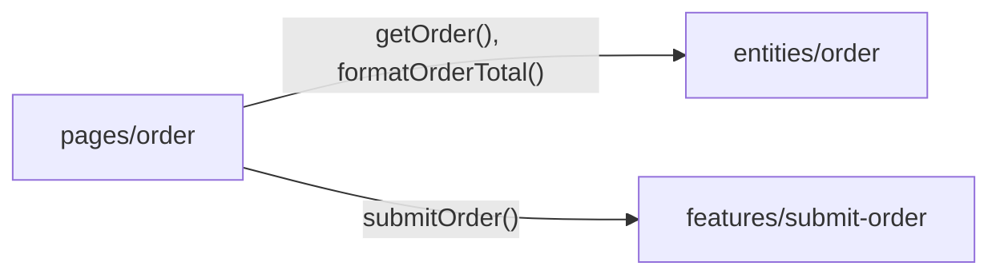

# Уровень 7: Страницы

Если `widgets` — это готовые блоки интерьера (шапка, карточка товара,
форма), то **page** — это дизайн-проект конкретной комнаты. Страница не
придумывает мебель заново — она расставляет уже готовые блоки под
конкретный маршрут.

## Правило 1: страница — это композиция, не производство

`pages` стоит на самом верху (сразу под `app`) и вправе импортировать
`widgets`, `features`, `entities`, `shared` — но не содержать в себе их
работу.

```tsx
// pages/product/ui/ProductPage.tsx
import { ProductCard } from '@/widgets/product-card'
import { AddToCartButton } from '@/features/add-to-cart'

export function ProductPage() {
  return (
    <div className="product-page">
      <ProductCard title="Клавиатура" price={4990} />
      <AddToCartButton productId="kbd-1" />
    </div>
  )
}
```

Как и любой слайс, страница закрывается собственным `index.ts`:

```ts
// pages/product/index.ts
export { ProductPage } from './ui/ProductPage'
```

## Правило 2: бизнес-логика опускается вниз

Страница не должна знать, **как** считается сумма заказа или **как**
устроен запрос к API. Это знание принадлежит `entities`/`features` —
странице остаётся только вызвать готовую функцию.



## Коротко: как надо и как не надо

**✅ Хорошо**

- страница импортирует `widgets/features/entities` только через их
  public API;
- у страницы есть свой `index.ts`, отдающий главный компонент;
- вычисления, форматирование, запросы к сети — в `entities`/`features`.

**❌ Ошибки новичков**

- глубокий импорт `@/widgets/product-card/ui/ProductCard` в обход
  `index.ts`;
- `fetch` прямо в компоненте страницы;
- функция форматирования/подсчёта, продублированная внутри `pages`, хотя
  такая же (или похожая) уже есть в `entities`.

📌 Итог: страница — тонкий слой композиции под конкретный маршрут. Всё, что
можно опустить вниз — в `widgets`, `features` или `entities` — опускайте.
