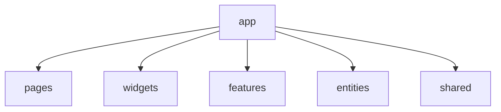
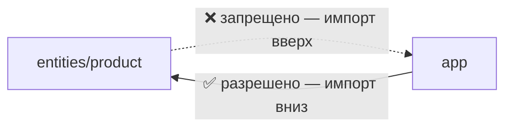

# Уровень 8 (подробно): Слой app

## Что вообще делает app

Во всех предыдущих уровнях слои отвечали за предметную область или композицию
UI: `entities` — данные, `features` — сценарии, `widgets` — крупные блоки,
`pages` — экраны. `app` не про UI и не про бизнес — он про **запуск приложения
как целого**:

- провайдеры контекста (тема, i18n, стор, react-query client…);
- роутинг верхнего уровня — какая страница на каком пути;
- глобальные стили и сброс CSS;
- инициализация — конфигурация SDK, обработчики глобальных ошибок, feature-флаги
  на старте.



Каждая стрелка здесь — не «app состоит из», а «app **имеет право импортировать**
из». На практике `app` обычно импортирует напрямую только `pages` (для роутинга)
и `shared` (для провайдеров/утилит) — с `widgets`/`features`/`entities` напрямую
работает редко, они уже собраны внутри `pages`.

## app не делится на слайсы — только на сегменты

В `entities` и `features` слайс = раздел бизнеса (`user`, `cart`, `order`). У
`app` такого деления нет — не бывает «делового смысла» у роутинга или темизации
самих по себе. Поэтому `app`, как и `shared`, сразу раскладывается на сегменты:

```
app/
├── providers/     # обёртки контекста: тема, стор, react-query
├── routes/        # роутинг верхнего уровня
├── config/        # конфигурация запуска (не путать с shared/config!)
└── styles/        # глобальные стили, reset.css
```

## Правило 1: app импортирует только вниз

`app` имеет самый низкий ранг в порядке слоёв (`app → pages → widgets →
features → entities → shared`), поэтому для него направление «вниз» — это
буквально «куда угодно». Но общее правило FSD никуда не девается: **только
через public API**.

```ts
// ✅ app/routes/AppRouter.tsx
import { HomePage } from '@/pages/home'   // через index.ts страницы

// ❌ app/routes/AppRouter.tsx
import { HomePage } from '@/pages/home/ui/HomePage'   // мимо public API
```

Deep import из `app` в `pages` ловит тот же `noDeepImport`, что и везде — для
`app` как источника импорта никаких исключений нет. (Исключение есть только для
`app` и `shared` как **целей** импорта — deep import можно делать, ссылаясь на
файлы app/shared, но это не отменяет обязательность public API у самих
`pages`/`widgets`/`entities`, которые app потребляет.)

## Правило 2: app — вершина графа, в него никто не импортирует

Это главная новая идея уровня. У `app` ранг `0` — ниже некуда. Значит **для
любого другого слоя импорт из `app` — это импорт «вверх»**, а «импорт вверх»
запрещён тем же правилом слоёв, что запрещает `shared` импортировать `entities`.



На практике это означает: если вы видите `import ... from '@/app/...'` в файле
`pages`, `widgets`, `features` или `entities` — это архитектурная ошибка, даже
если сам по себе символ выглядит невинно (просто константа, просто тип).

### Почему это не «просто формальность»

Представьте: `entities/product` импортирует `API_BASE_URL` из `app/config`.
Через полгода в проект добавляется storybook, который рендерит `product`
изолированно — без `app`. Сборка падает: `entities/product` неявно тянет за
собой весь `app`, хотя по смыслу это просто карточка товара. Чем ниже слой,
тем «переиспользуемее» он должен быть — а зависимость от вершины дерева
переиспользуемость убивает полностью.

## Куда девать общий конфиг, если не в app

Частый вопрос: «а где тогда хранить `API_BASE_URL`, если не в `app`?» Ответ —
в `shared`. `app` — это точка **сборки**, а не источник данных для нижних слоёв.
Всё, что нужно многим слоям одновременно (конфиг, константы окружения, общие
типы), должно жить в `shared`, откуда его может взять кто угодно — включая сам
`app`.

```ts
// ✅ shared/config/appConfig.ts
export const API_BASE_URL = 'https://api.shop.dev'

// entities/product/model/api.ts — можно
import { API_BASE_URL } from '@/shared/config/appConfig'

// app/routes/AppRouter.tsx — тоже можно, app ведь тоже смотрит вниз
import { API_BASE_URL } from '@/shared/config/appConfig'
```

Если конфиг оказался нужен и `entities`, и `widgets`, и `app` одновременно —
это самый явный сигнал, что ему место в `shared`, а не в `app`: `app` не должен
быть «общей кладовкой», из которой тянут все остальные слои.

## Как это проверяется статически

Оба правила уровня проверяются одним и тем же анализом графа импортов, что и
на предыдущих уровнях — без запуска кода:

- для каждого файла смотрим слой источника и слой цели импорта;
- если ранг цели меньше ранга источника — импорт идёт «вверх», это провал;
  именно так ловится и `pages → app`, и `shared → entities` на прошлых уровнях;
- отдельно проверяется, что импорт «вниз» тоже идёт через public API
  (`index.ts`), а не в обход него.

`app` в этом смысле ничем не отличается от любого другого слоя — разве что у
него нет слоя выше, поэтому правило «не импортируй вверх» превращается в «в
меня вообще никто не должен импортировать».

## Хорошие практики

- **Тонкий `app`.** В сегментах `app` — только сборка: обёртки провайдеров,
  роутинг, инициализация. Бизнес-логике здесь не место, для неё есть нижние
  слои.
- **Общий конфиг — в `shared`, а не в `app`.** Если что-то нужно нескольким
  слоям, это по определению не принадлежит вершине дерева.
- **`app` тянет `pages`, а не `widgets`/`features`/`entities` напрямую.**
  Обычно всё, что ниже `pages`, уже собрано внутри неё; прямые обращения `app`
  к глубоким слоям — повод присмотреться к границам страниц.
- **Провайдеры — маленькие и композируемые.** `AppProviders` — это тонкая
  обёртка, которая просто вкладывает провайдеры друг в друга, без своей логики.
- **Роутинг — тоже через public API.** `AppRouter` не должен ничего знать про
  внутреннее устройство страниц, только про их публичный компонент.

## Частые ошибки новичков

- **Нижний слой импортирует из `app`.** Самая частая ошибка уровня:
  `entities`/`widgets`/`features` тянут константу или тип прямо из
  `app/config`. Работает локально, ломается при переиспользовании модуля вне
  приложения (тесты, storybook, другой app).
- **`app` как общая кладовка.** В `app/config` копится всё подряд — конфиг API,
  фиче-флаги, темы — и постепенно туда начинают лезть все слои. Признак того,
  что содержимое пора перенести в `shared`.
- **Deep import в `pages` из `app`.** `app/routes/AppRouter.tsx` импортирует
  `@/pages/home/ui/HomePage` вместо `@/pages/home` — та же ошибка глубокого
  импорта, что и на прошлых уровнях, просто источник импорта теперь `app`.
- **Логика в провайдерах.** `AppProviders` начинает делать сетевые запросы,
  валидацию, бизнес-расчёты — вместо того чтобы просто оборачивать `children`
  в контексты.
- **Множественные не связанные точки правды.** Один и тот же конфиг
  продублирован и в `app`, и в `shared` «на всякий случай» — вместо того чтобы
  оставить единственный источник в `shared` и убрать копию из `app`.

📌 Итог: `app` смотрит вниз на всё дерево, но само дерево на `app` не
смотрит — ни один нижний слой не должен знать о существовании точки сборки
приложения. Всё общее, что нужно нескольким слоям сразу, переезжает в `shared`.
