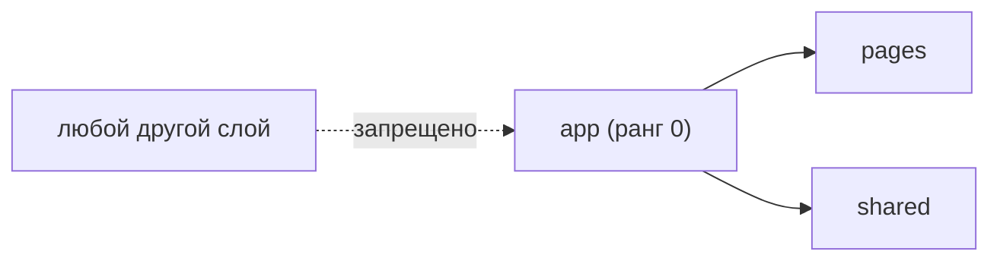

# Уровень 8: Слой app

Если весь проект — дом из уровней `shared → entities → features → widgets → pages`,
то **`app`** — это крыша и рубильник на входе. Здесь ничего не «про предметную
область» — здесь всё «про запуск»: провайдеры, роутинг, глобальные стили,
инициализация.

## app — не слайс-домен

У `entities` и `features` есть слайсы (`user`, `cart`, `auth`…) — разделы бизнеса.
У `app` слайсов в этом смысле нет: он делится сразу на **сегменты**, как и
`shared`, только сегменты другие — `providers/`, `routes/`, `config/`, `styles/`.

```ts
// app/providers/AppProviders.tsx — собирает провайдеры из shared
import { ThemeProvider } from '@/shared/ui'

export function AppProviders({ children }: { children: React.ReactNode }) {
  return <ThemeProvider>{children}</ThemeProvider>
}
```

## Два правила слоя app



1. **app импортирует только вниз.** Он вправе брать что угодно из `pages`,
   `widgets`, `features`, `entities`, `shared` — но только через их public API.
2. **app — вершина: в него никто не импортирует.** У `app` самый низкий ранг
   (0). Любой импорт ИЗ `app` в другой слой — это импорт «вверх», а значит
   структурная ошибка: нижние слои не должны знать о том, как собирается
   приложение.

## Коротко: как надо и как не надо

**✅ Хорошо**

- `app/providers/AppProviders.tsx` берёт `ThemeProvider` из `@/shared/ui`;
- `app/routes/AppRouter.tsx` берёт страницы из их `index.ts` (`@/pages/home`);
- общий конфиг, нужный всем слоям, живёт в `shared`, а не в `app`.

**❌ Ошибки новичков**

- `pages/*` (или любой другой слой) импортирует что-то из `@/app/...` — так
  нельзя, `app` никто не должен импортировать;
- общий конфиг/константу кладут в `app`, а потом её начинают тянуть `entities`
  и `widgets` — вместо этого конфиг переносят в `shared`;
- `app` лезет во внутренние сегменты `pages`/`widgets` в обход `index.ts`.

📌 Итог: `app` — точка сборки и вершина графа зависимостей. Он может смотреть
вниз на всё, но вниз на него не смотрит никто.
