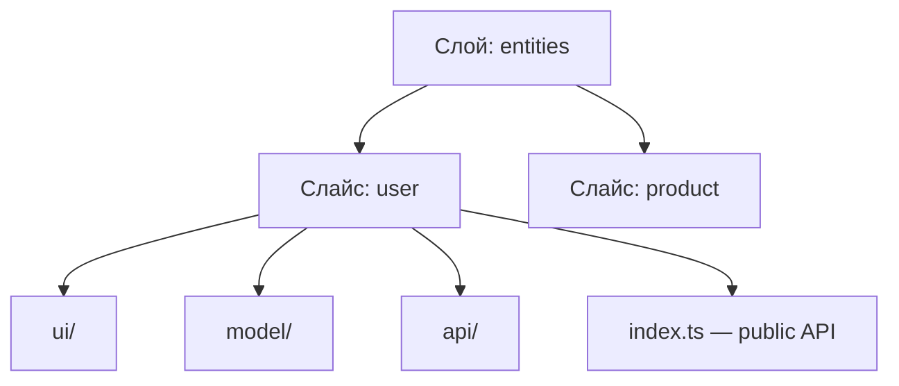
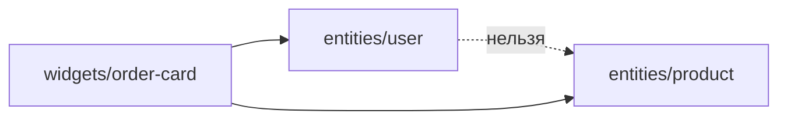

# Уровень 9 (подробно): Слайсы и Public API

## Три уровня организации: слой → слайс → сегмент

Feature-Sliced Design раскладывает код по трём осям:



- **Слой** отвечает на вопрос «насколько это высокоуровневый код» (`app`, `pages`,
  `widgets`, `features`, `entities`, `shared`).
- **Слайс** отвечает на вопрос «про что этот код» — это раздел предметной области:
  `user`, `product`, `cart`, `auth`. Имена слайсов диктует бизнес, а не фреймворк.
- **Сегмент** отвечает на вопрос «какого рода этот код» — `ui` (представление),
  `model` (состояние, типы, бизнес-логика), `api` (запросы к бэкенду), `lib`
  (вспомогательные утилиты слайса), `config`.

Слои `app` и `shared` — исключение: у них нет слайсов, они делятся сразу на сегменты
(`shared/ui`, `shared/api`, `shared/lib`), потому что в них нет «предметных областей».

## Public API — контракт слайса

**Public API** — это `index.ts` в корне слайса. Он играет роль фасада: перечисляет,
что́ слайс отдаёт наружу, и прячет всё остальное.

```ts
// entities/user/index.ts
export type { User } from './model/types'
export { userStore } from './model/store'
export { UserCard } from './ui/UserCard'
// а UserCardSkeleton, внутренние хелперы, приватные типы — НЕ экспортируем
```

Два свойства делают public API ценным:

1. **Инкапсуляция.** Внутреннюю структуру слайса можно рефакторить свободно —
   переименовать файл, разбить `model` на несколько модулей, — и пока `index.ts`
   отдаёт те же имена, ни один потребитель не заметит изменений. Контракт стабилен,
   реализация — нет.

2. **Явная граница.** Импорт `@/entities/user` виден в коде как «я завишу от сущности
   user целиком, по её контракту». Импорт `@/entities/user/model/store` — это уже
   зависимость от детали реализации, которая завтра переедет.

### Глубокие импорты — главный антипаттерн уровня

«Глубокий импорт» (deep import) — обращение к внутренностям чужого слайса мимо
`index.ts`:

```ts
import { UserCard } from '@/entities/user/ui/UserCard' // ❌
import { validate } from '@/features/auth/lib/validate' // ❌
```

Чем плохо:

- ломает инкапсуляцию — теперь кто-то снаружи знает про `ui/UserCard`, и файл нельзя
  спокойно переместить;
- размывает границу — непонятно, что является контрактом слайса, а что случайно
  оказалось импортировано;
- разгоняет граф зависимостей и повышает риск циклов: чем больше «дверей» у слайса,
  тем больше входящих рёбер.

Ровно это ловит линтер `@feature-sliced/steiger` правилом *insignificant-slice* /
*public-api*, а `eslint-plugin-boundaries` — правилом «element entry point».

## Изоляция слайсов: соседи не общаются напрямую

Второе правило слоя: **слайсы одного слоя не импортируют друг друга**.



Если `entities/user` начнёт импортировать `entities/product`, вы получите жёсткую
горизонтальную связь и почти наверняка — цикл (`user → product → user`). Правильно —
поднять композицию на слой выше: `widget`, который знает про обе сущности, собирает
их вместе. А если сущности *действительно* нужно немного знать о соседе, для этого
есть управляемая `@x`-нотация (отдельная тема следующего уровня), а не прямой импорт.

## Как это проверяется статически

Заметьте: чтобы проверить всё вышесказанное, **не нужно запускать код**. Достаточно
посмотреть на пути файлов и на строки `import`:

- есть ли `entities/user/index.ts`;
- реэкспортирует ли он нужные имена (в т.ч. через `export * from './model'`);
- нет ли у внешних импортов пути глубже, чем `entities/user` (т.е. не `…/ui/…`);
- не тянет ли слайс соседний слайс того же слоя.

Именно так работает движок проверок в этом задании — и именно так работают реальные
FSD-линтеры. Архитектура — это свойство **структуры**, а не поведения в рантайме.

## Хорошие практики

- **Тонкий `index.ts`.** В public API — только реэкспорты, без логики, вычислений и
  side-эффектов. Это оглавление слайса, а не модуль с кодом.
- **Экспортируйте минимум.** Наружу отдавайте лишь то, что реально нужно снаружи.
  Каждый лишний экспорт — публичное обязательство, которое потом больно менять.
- **Тип и значение — раздельно.** `export type { User }` и `export { UserCard }`:
  type-only реэкспорт стирается при сборке и явно сообщает «это только тип».
- **Короткий импорт через алиас.** Настройте `@/` (или `baseUrl`), чтобы писать
  `@/entities/user`, а не `../../../entities/user`. Путь до слайса — всегда до его
  корня, без «хвостов» `/ui`, `/model`.
- **Одна предметная область — один слайс.** Не сваливайте доменные сущности в
  `shared`: `shared` — для кода без бизнес-смысла (кнопки, хелперы, конфиг).
- **Границы проверяйте автоматически.** Подключите `@feature-sliced/steiger` или
  `eslint-plugin-boundaries` в CI — ревью не должно ловить deep import руками.

## Частые ошибки новичков

- **Глубокий импорт** `@/entities/user/ui/UserCard` вместо `@/entities/user`. Самая
  массовая ошибка — привыкайте вести импорт до корня слайса.
- **«Реэкспорт всего подряд».** `export * from './ui'`, который вытаскивает наружу и
  приватные хелперы, и черновые компоненты. Public API раздувается и перестаёт быть
  контрактом. Реэкспортируйте поимённо то, что действительно публично.
- **Логика в `index.ts`.** Инициализация стора, вызовы функций, конфиг прямо в барреле.
  Барель должен только реэкспортировать.
- **Cross-import соседа.** `entities/user` импортирует `entities/product` «просто рядом
  же лежит». Это горизонтальная связь и почти всегда — будущий цикл.
- **Домен в `shared`.** Сущность `User` кладут в `shared/lib`, «чтобы переиспользовать».
  Признак того, что на самом деле это `entities/user`.
- **Слишком дробные или слишком крупные слайсы.** Один мелкий компонент ≠ слайс; но и
  god-slice `entities/data` со всем подряд — тоже антипаттерн. Слайс = осмысленный
  раздел домена.
- **Путаница entities и features.** `entity` отвечает на «что это» (данные: user, product),
  `feature` — на «что пользователь делает» (действие: login, add-to-cart). Если кладёте
  бизнес-действие в entity — почти наверняка это feature.

📌 Итог: `index.ts` — входная дверь слайса. Наружу отдавайте минимум необходимого,
импортируйте чужие слайсы только через их public API, а соседей по слою не трогайте
напрямую — композиция живёт слоем выше.
