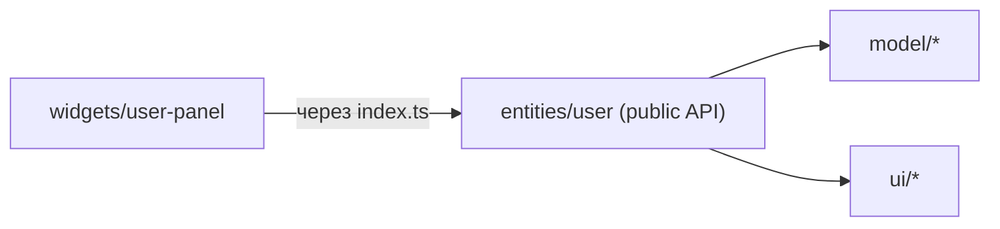

# Уровень 9: Слайсы и Public API

Если слои — это этажи дома, то **слайсы** — квартиры на этаже. Каждая квартира
про свою предметную область: `entities/user`, `entities/product`, `features/auth`,
`widgets/header`. Внутри слайса — сегменты `ui/`, `model/`, `api/`, `lib/`.

## Главное правило: у слайса есть входная дверь

Слайс общается с внешним миром **только через public API** — файл `index.ts` в
корне слайса. Всё остальное внутри — приватная кухня, куда соседям заходить нельзя.

```ts
// entities/user/index.ts — публичный интерфейс сущности
export type { User } from './model/types'
export { UserCard } from './ui/UserCard'
```

Теперь снаружи пишут коротко и стабильно:

```ts
import { UserCard, type User } from '@/entities/user' // ✅ через дверь
```

А так — **нельзя**, это «глубокий импорт» в обход public API:

```ts
import { UserCard } from '@/entities/user/ui/UserCard' // ❌ лезем в чужую кухню
```

## Зачем это



- **Инкапсуляция.** Можно переставлять файлы внутри слайса — снаружи ничего не
  сломается, пока `index.ts` держит контракт.
- **Меньше связей и циклов.** Внешний код зависит от одной точки, а не от десятка
  внутренних файлов.
- **Изоляция слайсов.** Слайсы одного слоя **не импортируют друг друга** напрямую —
  композиция поднимается на слой выше (widget собирает две entity).

## Коротко: как надо и как не надо

**✅ Хорошо**

- `index.ts` — тонкий, только реэкспорты;
- наружу отдаём минимум (`export type { User }` + `export { UserCard }`);
- чужой слайс импортируем до корня: `@/entities/user`.

**❌ Ошибки новичков**

- глубокий импорт `@/entities/user/ui/UserCard` мимо `index.ts`;
- `export * from './ui'`, вытаскивающий наружу всё приватное;
- cross-import соседнего слайса того же слоя;
- доменную сущность кладут в `shared` «чтобы переиспользовать».

📌 Итог: закрывай слайс `index.ts`, наружу отдавай только нужное, а чужие слайсы
подключай через их public API — никаких путей с `/ui/` и `/model/` внутри.
