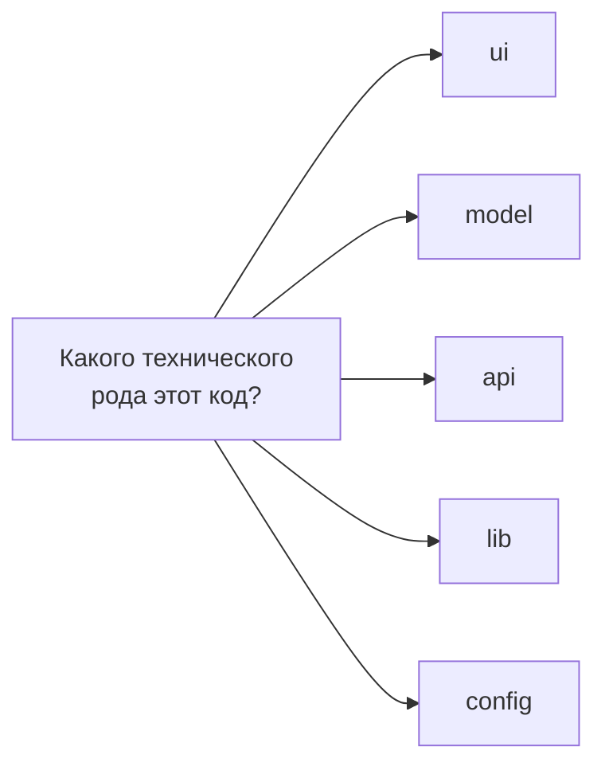

# Уровень 10: Сегменты слайса детально (подробно)

## 1. Зачем ещё одна ось, разве слоя и слайса не достаточно

Слой говорит «это фича, а не сущность». Слайс говорит «это про корзину, а не
про пользователя». Но внутри слайса `cart` всё равно остаётся десяток файлов
разного назначения: компонент корзины, тип `CartItem`, стор с количеством
товаров, функция `postOrder`, хелпер `formatPrice`. Без третьей оси они снова
свалены в одну кучу — просто кучу поменьше.

**Сегмент** отвечает на вопрос «какого технического рода этот файл»,
независимо от того, в каком слое и слайсе он находится. Это горизонтальный
срез, ортогональный слою и слайсу.



## 2. Пять сегментов по отдельности

### 2.1. `ui` — визуальные компоненты слайса

Всё, что рендерит DOM: React-компоненты, локальные CSS-модули, сторибук-стори
(если они лежат рядом с кодом). `ui` **не делает** запросов и **не хранит**
бизнес-состояние сам — он читает данные из `model` (пропсами или через хук
стора) и вызывает функции, которые эту логику инкапсулируют.

```tsx
// entities/user/ui/UserCard.tsx
import type { User } from '../model/types'

interface Props {
  user: User
}

export function UserCard({ user }: Props) {
  return (
    <div className="user-card">
      
      <span>{user.name}</span>
    </div>
  )
}
```

Компонент ничего не знает про HTTP или про то, откуда взялся `user` — это
ответственность вызывающего кода (обычно `model` через стор или пропсы сверху).

### 2.2. `model` — бизнес-логика, стор, типы

Сердце слайса. Сюда идут:

- **типы** предметной области (`interface User`, `type OrderStatus`);
- **стор** — где и как хранится состояние (Zustand slice, Redux slice,
  сигналы, что угодно);
- **схемы валидации** (Zod/Yup), если они относятся к этой сущности;
- **селекторы** и вычисляемые значения поверх стора.

```ts
// entities/user/model/types.ts
export interface User {
  id: string
  name: string
  avatarUrl: string
}
```

```ts
// entities/user/model/store.ts
import { create } from 'zustand'
import type { User } from './types'

interface UserState {
  current: User | null
  setUser: (user: User) => void
}

export const useUserStore = create<UserState>(set => ({
  current: null,
  setUser: user => set({ current: user }),
}))
```

`model` не знает про JSX и не делает fetch напрямую — он принимает уже готовые
данные (обычно от `api`) и решает, как их хранить и вычислять.

### 2.3. `api` — запросы к бэкенду, DTO

Всё, что говорит с внешним миром по HTTP/WS/GraphQL: функции-запросы и
маппинг «DTO бэкенда → модель домена».

```ts
// entities/user/api/getUser.ts
import { apiClient } from '@/shared/api'
import type { User } from '../model/types'

interface UserDto {
  id: string
  full_name: string
  avatar_url: string
}

function toUser(dto: UserDto): User {
  return { id: dto.id, name: dto.full_name, avatarUrl: dto.avatar_url }
}

export async function getUser(id: string): Promise<User> {
  const dto = await apiClient.get<UserDto>(`/users/${id}`)
  return toUser(dto)
}
```

Ключевая идея — **DTO не должен утекать за пределы `api`**. Наружу (в `model`
и дальше в `ui`) уходит уже нормализованная модель домена, а не сырой формат
бэкенда. Так смена бэкенд-контракта чинится в одном файле.

### 2.4. `lib` — вспомогательные утилиты, специфичные для слайса

Хелперы, которые нужны **только этому слайсу** и не тянут на переиспользуемую
общую утилиту.

```ts
// entities/user/lib/formatUserName.ts
import type { User } from '../model/types'

export function formatUserName(user: User): string {
  return user.name.trim() || 'Без имени'
}
```

Если такой хелпер понадобился второму слайсу — это сигнал поднять его в
`shared/lib`, а не копировать или импортировать напрямую из чужого `lib`
(это был бы deep import, запрещённый public API).

### 2.5. `config` — константы, конфигурация слайса

Локальные константы, которые имеют смысл только в контексте слайса: лимиты,
дефолтные значения, тексты, фиче-флаги слайса.

```ts
// entities/user/config/constants.ts
export const MAX_USERNAME_LENGTH = 32
export const DEFAULT_AVATAR_URL = '/img/default-avatar.svg'
```

## 3. Сегменты ≠ слои и ≠ слайсы

Легко перепутать эти три оси, особенно новичку. Разница — в вопросе, на
который отвечает каждая:

| Ось | Вопрос | Значения фиксированы? |
|-----|--------|------------------------|
| Слой | Какой уровень ответственности? | Да, шесть заданных значений |
| Слайс | Про какую предметную область? | Нет, придумывает команда |
| Сегмент | Какого технического рода код? | Обычно да: `ui/model/api/lib/config` |

`entities/user/model` и `entities/product/model` — одинаковый сегмент, разные
слайсы, один слой. `entities/user/model` и `features/login/model` — одинаковый
сегмент, разные слайсы, разные слои. Три оси независимы.

## 4. Не всё нужно сразу

Маленький слайс может обойтись без `api` (если данные приходят пропсами
сверху) или без `lib`/`config`, если хелперов и констант нет. Не создавайте
сегмент «про запас» — пустая папка ничего не документирует, только шумит в
дереве файлов. Заводите сегмент, когда появляется первый файл этого рода.

## 5. Сегменты в `shared`

В `shared` действуют те же имена сегментов, но с другим смыслом: там нет
предметной области, поэтому речь только о технической роли переиспользуемого
кода.

```
shared/
├── ui/       # Button, Input, Modal — не привязаны к бизнес-сущности
├── api/      # apiClient, базовые HTTP-обёртки
├── lib/      # useDebounce, formatDate — общие хелперы
└── config/   # API_BASE_URL, ROUTES
```

`shared/ui/Button` ничего не знает про `User` или `Product` — это чистая
переиспользуемая обёртка. Как только компонент начинает знать про конкретную
сущность (например, принимает `User` как проп и рисует именно карточку
пользователя), он больше не `shared` — это `entities/user/ui`.

## Хорошие практики

- **`api` возвращает модель домена, а не DTO.** Маппинг делайте прямо в
  функции запроса — снаружи `api` никто не должен видеть формат бэкенда.
- **`ui` — «глупый» слой.** Компоненты принимают готовые данные и коллбэки;
  запросы и решения о хранении состояния — не их забота.
- **Заводите сегмент по факту первого файла**, не создавайте пустые папки
  «на будущее».
- **`lib` слайса — только для внутреннего использования.** Если хелпер нужен
  двум слайсам, поднимайте его в `shared/lib`, а не импортируйте напрямую из
  чужого сегмента (это запрещённый deep import).
- **Именуйте сегменты стандартно** (`ui/model/api/lib/config`), даже если
  хочется «более точного» названия — так проект остаётся предсказуемым для
  любого, кто знает FSD.

## Частые ошибки новичков

- **Класть fetch-запрос прямо в компонент `ui`.** Компонент внезапно узнаёт
  про HTTP и становится невозможно протестировать изолированно. Запрос —
  в `api`, компонент только показывает данные.
- **Пропускать маппинг DTO → модель.** Сырые поля бэкенда (`full_name`,
  `avatar_url`) расползаются по всему приложению, и смена контракта бьёт по
  десяткам файлов вместо одного `api/*.ts`.
- **Хранить бизнес-состояние в `ui`** через локальный `useState`, когда оно
  на самом деле нужно нескольким компонентам — это сигнал вынести его в
  `model` как стор.
- **Заводить общий `utils.ts` вместо сегментов.** Один файл-помойка на весь
  слайс не масштабируется — раскладывайте по `ui/model/api/lib/config` сразу.
- **Путать `lib` слайса и `shared/lib`.** Если хелпер нужен только одному
  слайсу — он в `lib` этого слайса; если нужен многим — в `shared/lib`, а не
  скопирован в оба места.

📌 Итог: сегмент — третья, техническая ось FSD. Она не про «где» (слой) и не
про «что» (слайс), а про «какого рода» этот конкретный файл. Пять стандартных
сегментов держат UI, логику, запросы, хелперы и константы раздельно — и слайс
остаётся понятным, даже когда вырастет до полусотни файлов.
