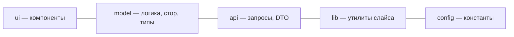

# Уровень 10: Сегменты слайса детально — ui / model / api / lib / config

Слой отвечает «на каком уровне», слайс — «про что», а **сегмент** — «какого
технического рода этот код». На девятом уровне мы собирали public API слайса,
а теперь разберём, что именно кладут в каждый сегмент — и что туда класть
нельзя.

## Пять стандартных сегментов



| Сегмент | Что кладём | Что НЕ кладём |
|---------|-----------|----------------|
| `ui` | React-компоненты слайса: карточки, формы, кнопки | fetch-запросы, бизнес-правила |
| `model` | типы, стор (state), схемы валидации, селекторы | JSX, HTTP-клиент |
| `api` | функции запросов к бэкенду, DTO и мапперы DTO → модель | UI-компоненты, стор |
| `lib` | локальные хелперы и хуки, специфичные именно для этого слайса | код, нужный другим слайсам (это уже `shared/lib`) |
| `config` | константы, флаги, конфигурация слайса | секреты и общесистемные настройки |

📌 Сегменты — это **техническое** деление (как устроен код), в отличие от
слоя (ответственность) и слайса (предметная область). Одно и то же имя
`model` в `entities/user/model` и `entities/product/model` — про разные
сущности, но про одинаковую техническую роль.

## Пример: слайс `entities/user`

```
entities/user/
├── ui/          # UserAvatar.tsx, UserCard.tsx
├── model/       # types.ts, store.ts, selectors.ts
├── api/         # getUser.ts, updateUser.ts, user.dto.ts
├── lib/         # formatUserName.ts
└── index.ts     # public API — реэкспорт наружу
```

## Сегменты не обязательны все сразу

Если у слайса нет запросов к бэкенду — не создавайте пустой `api`. Заводите
сегмент **по мере надобности**: 3 файла в `model` и один компонент в `ui` —
нормальный маленький слайс без `lib` и `config`.

## А как же `shared`?

В `shared` те же имена сегментов (`shared/ui`, `shared/api`, `shared/lib`,
`shared/config`), но **без бизнес-смысла** — там живёт код, который ничего не
знает о предметной области: `Button`, общий `apiClient`, `useDebounce`,
`API_BASE_URL`.

📌 Итог: сегмент — это ответ на вопрос «какого технического рода этот код»,
он не пересекается с вопросами «на каком слое» и «про какую сущность». Держите
UI отдельно от логики, логику — отдельно от запросов, и слайс останется
читаемым даже когда вырастет.
