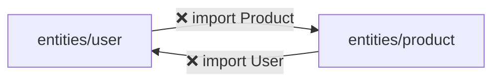
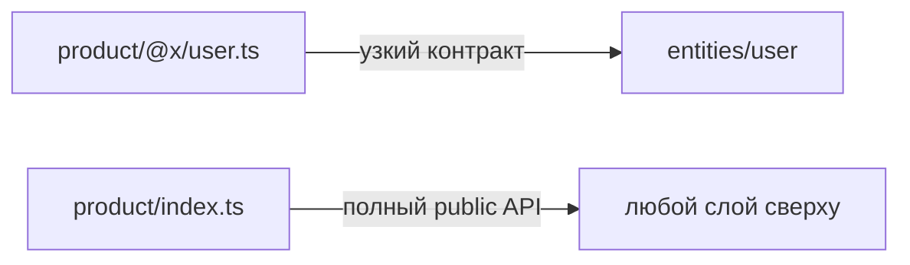
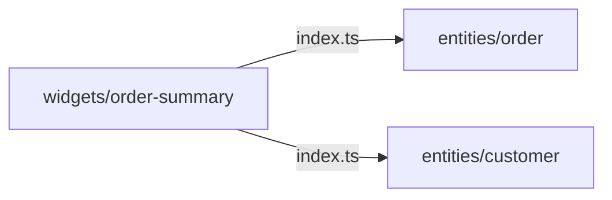
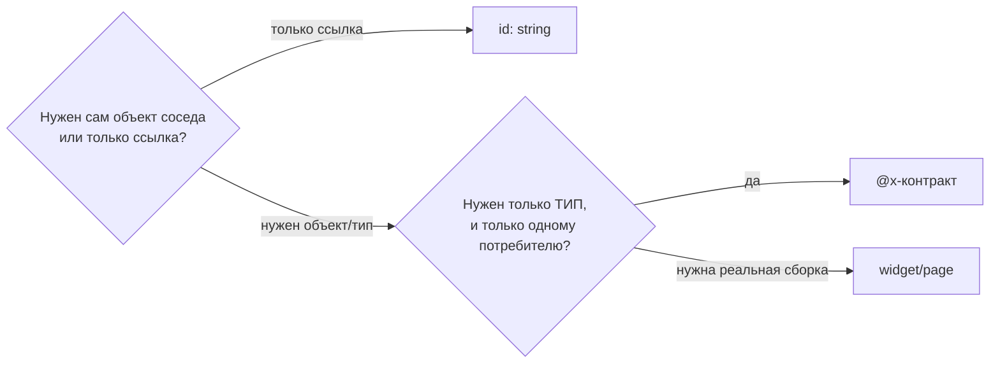

# Уровень 11 (подробно): Cross-imports между сущностями

## Почему изоляция слайсов вообще существует

Правило «слайсы одного слоя не импортируют друг друга» — это то же самое, что
запрет циклических зависимостей на уровне модулей, только сформулированный на
уровне архитектуры. Если `entities/user` может импортировать
`entities/product`, а `entities/product` — `entities/user`, у вас рано или
поздно появится цикл: `user → product → user`. Цикл ломает и сборку (в лучшем
случае — предупреждение бандлера, в худшем — `undefined` в рантайме из-за
порядка инициализации модулей), и ментальную модель: непонятно, кто от кого
на самом деле зависит.



FSD решает эту проблему на корню: **сущности одного слоя не видят друг друга
никак** — ни через прямой импорт, ни через глубокий импорт во внутренние
сегменты. Единственный дозволенный сосед — `shared` (у него по определению нет
бизнес-смысла, поэтому связь с ним не создаёт зависимости между доменами).

## Когда правило начинает мешать

Правило «не знают друг о друге» звучит абсолютно, но реальные предметные
области связаны: у заказа есть покупатель, у товара — продавец, у комментария
— автор. Вопрос не «нужна ли связь», а «на каком уровне она должна жить».

FSD различает три ситуации:

### 1. Нужен только идентификатор

Если весь смысл связи — «у Order есть Customer», а сам объект `Customer`
`Order`-у не нужен (он его не рендерит, не читает его поля) — связи вообще нет,
есть просто строка:

```ts
// ✅ entities/order/model/types.ts
export interface Order {
  id: string
  total: number
  customerId: string // просто ссылка, а не зависимость от модуля customer
}
```

Это самый частый случай, и большинство «cross-import'ов», которые видят
новички, на самом деле избыточны — их можно свести именно к этому.

### 2. Нужен тип соседа — `@x`-нотация

Иногда `customerId: string` недостаточно: сущности реально нужен *тип* соседа
— например, чтобы описать пропсы компонента, который получает данные покупателя
готовыми (переданными сверху), но должен быть типобезопасным. В этом случае
FSD предлагает **`@x`-нотацию** — специальный сегмент `@x/` в корне слайса.

```
entities/
  product/
    @x/
      user.ts       ← «то, что product отдаёт специально для user»
    model/
    index.ts         ← обычный public API (для всех остальных)
```

```ts
// entities/product/@x/user.ts
export type { User } from '../model/types'
```

```ts
// entities/user/ui/SellerBadge.tsx
import type { User } from '@/entities/product/@x/user'

export function SellerBadge({ seller }: { seller: User }) {
  return <span>{seller.displayName}</span>
}
```

Ключевая идея: `@x/<consumer>.ts` — это **не** обычный `index.ts`. Обычный
public API (`index.ts`) — открытая дверь для всех. `@x/user.ts` — дверь,
подписанная «только для user», зафиксированная как осознанное, документируемое
исключение. Если завтра появится ещё один потребитель — заведите ещё один файл
(`@x/analytics.ts`) с ровно тем, что нужно именно ему, а не расширяйте общий
`index.ts` «на всякий случай».



Почему это лучше, чем просто «разрешить импорт `@/entities/product`»:

- **Видимость.** `grep -r '@x/'` мгновенно находит все осознанные исключения
  в проекте — они не растворяются среди обычных импортов.
- **Узость.** `@x`-файл отдаёт ровно то, что нужно конкретному потребителю, а
  не весь `index.ts`. Значит, случайно утащить лишнее (например, стор) нельзя.
- **Именование = документация.** Имя `user.ts` внутри `@x/` прямо говорит, кто
  потребитель, — не нужно читать код, чтобы понять, зачем эта связь.

⚠️ Важно: `@x` **не отменяет** правило изоляции слайсов — он документирует
единственное, узкое, осознанное исключение из него. Если у вас в `@x/` за
месяц набралось десять файлов на все слайсы подряд — это сигнал, что где-то
неправильно проведена граница между сущностями.

### 3. Нужна полная композиция — поднимаем на слой выше

Если сущностям нужно встретиться не типом, а *реально*, в UI или в бизнес-
логике — например, карточка заказа должна отрендерить бейдж покупателя целиком
— это признак, что связь принадлежит более высокому уровню абстракции:
`widget` или `page`.

```ts
// ✅ entities/order/ui/OrderCard.tsx — не знает про customer вообще
export function OrderCard({ order, customerSlot }: { order: Order; customerSlot?: ReactNode }) {
  return (
    <div className="order-card">
      <strong>Order #{order.id}</strong>
      {customerSlot}
    </div>
  )
}
```

```ts
// ✅ widgets/order-summary/ui/OrderSummary.tsx — знает про обе сущности
import { OrderCard, type Order } from '@/entities/order'
import { CustomerBadge, type Customer } from '@/entities/customer'

export function OrderSummary({ order, customer }: { order: Order; customer: Customer }) {
  return <OrderCard order={order} customerSlot={<CustomerBadge customer={customer} />} />
}
```

Приём называется **слот** (slot) — сущность принимает `ReactNode` через проп и
ничего не знает о том, что именно туда положат. Это тот же паттерн, что и
`children` в React, только именованный под конкретное место.



## Как выбрать между тремя путями



Практическое правило: начинайте всегда с идентификатора (путь 1) — это самый
дешёвый и самый частый ответ. Переходите к `@x` только когда типобезопасность
реально требует тип соседа в одном конкретном месте. Поднимайте композицию на
`widget`, когда речь о реальной сборке двух и более сущностей вместе.

## Хорошие практики

- **Начинайте с идентификатора.** Прежде чем тянуть тип соседа, спросите: а
  нужен ли вообще объект, или достаточно `id`? В 80% случаев достаточно `id`.
- **`@x` — точечный инструмент, а не запасной public API.** Один файл в `@x/`
  = один конкретный потребитель с конкретной причиной. Не заводите
  `@x/shared.ts` «для всех» — это переизобретение обычного `index.ts`.
- **Именуйте `@x`-файл по потребителю.** `@x/user.ts`, `@x/checkout.ts` — имя
  сразу отвечает на вопрос «кому это можно».
- **Не путайте `@x` с обычным экспортом.** В обычном `index.ts` экспортируйте
  то, что нужно всем; в `@x/*` — только то, что нужно конкретно этому соседу
  и больше никому.
- **Композицию — наверх.** Как только двум сущностям нужно встретиться в
  разметке или в реальной бизнес-операции — это работа `widget`/`page`, а не
  очередной `@x`-контракт.
- **Слот вместо прямого импорта в UI.** `sellerSlot?: ReactNode` — универсальный
  приём, который разрывает связь между двумя UI-компонентами разных сущностей.
- **Проверяйте границы автоматически.** `@feature-sliced/steiger` умеет
  различать «легальный `@x`» и «незаконный cross-import» — не полагайтесь на
  ревью руками.

## Частые ошибки новичков

- **Прямой cross-import вместо `@x` или id.** `import { Customer } from
  '@/entities/customer'` внутри `entities/order` — даже через полноценный
  `index.ts` — нарушение изоляции слайсов. Через `index.ts` можно импортировать
  только слои выше (widgets, features, pages, app).
- **Глубокий импорт вместо `@x`.** `import { User } from
  '@/entities/product/model/types'` — хуже, чем обычный cross-import: тут ещё и
  обходится public API. `@x` создан именно для того, чтобы у этого случая был
  легальный, узкий путь.
- **`@x`-файл превращается во второй `index.ts`.** Если в `@x/user.ts`
  реэкспортируется «всё подряд на всякий случай» — это признак того, что
  граница между сущностями продумана плохо.
- **Цикл через `@x` в обе стороны без надобности.** Если `A` заводит `@x` для
  `B`, а `B` — для `A`, и оба реально используются — задумайтесь, не должны ли
  эти две сущности объединиться в одну, либо связь принадлежит `widget`.
  Двусторонний `@x` — не запрещён, но должен быть осознанным, а не
  автоматическим ответом на любую связь.
- **Полная композиция через `@x` вместо widget.** Если в `@x`-файле пытаются
  протащить не тип, а готовый React-компонент, который рендерит соседа целиком
  — это уже не «узкий контракт», а обход правила через боковую дверь. Компонент,
  который реально знает про обе сущности, должен жить в `widget`.
- **`customerId`, но рядом всё равно живёт мёртвый импорт `Customer`.** После
  перехода на идентификатор — уберите импорт соседа целиком, а не оставляйте
  «на будущее».

📌 Итог: cross-import между сущностями одного слоя — не «баг, который нужно
запретить любой ценой», а сигнал, требующий выбора инструмента: id, `@x` или
подъём композиции наверх. Все три легальны, и то, каким путём вы пойдёте,
должно быть осознанным решением, а не случайностью.
