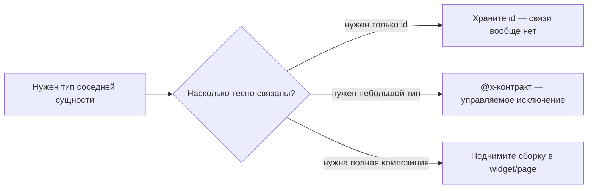
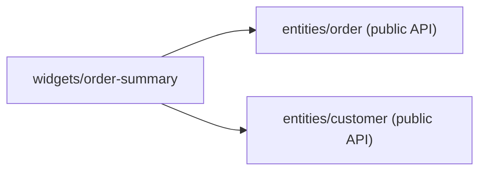

# Уровень 11: Cross-imports между сущностями

Слайсы одного слоя — соседи по лестничной клетке, а не одна семья. Правило FSD
жёсткое: **`entities/user` не импортирует `entities/product`, и наоборот**.
Но реальность иногда сложнее правил: иногда одной сущности *действительно*
нужен тип соседа. У FSD есть на этот случай два легальных пути — и вредный
третий, которого следует избегать.

## Три пути, когда сущности нужен сосед



## Путь 1 — обойтись без связи

Чаще всего связь вообще не нужна: `Order` не обязан хранить объект `Customer`
целиком, достаточно `customerId: string`. Если понадобятся детали покупателя —
их подтянет тот, кто уже работает с обеими сущностями (виджет, страница, бэкенд).

## Путь 2 — `@x`-нотация: управляемое исключение

Если сущности **действительно** нужен тип соседа (не id, а именно тип — для
пропсов, для маппинга), FSD предлагает не прятать это тайным глубоким импортом,
а сделать явным контрактом:

```ts
// entities/product/@x/user.ts — «product отдаёт это специально для user»
export type { User } from '../model/types'
```

```ts
// entities/user/ui/SellerBadge.tsx
import type { User } from '@/entities/product/@x/user' // ✅ явный, узкий канал
```

Имя файла в `@x/` = имя слайса-потребителя. Такой импорт **видно в диффе и в
поиске по коду** — это и есть цель: не запретить связь, а сделать её явной,
узкой и single-purpose.

## Путь 3 — поднять композицию наверх

Когда двум сущностям нужно встретиться **целиком** (не тип, а реальная
композиция UI или данных) — это признак того, что уровень абстракции выше:
пусть `widget` или `page` соберёт обе через их публичные API.



## Коротко: как надо и как не надо

**✅ Хорошо**

- `customerId: string` вместо вложенного объекта — когда id достаточно;
- явный `@x/<consumer>.ts` — когда нужен именно тип соседа;
- сборка в `widget`/`page` — когда нужна полная композиция.

**❌ Ошибки новичков**

- прямой `import { Customer } from '@/entities/customer'` в другой сущности;
- глубокий импорт `@/entities/customer/model/types` в обход и public API, и @x;
- цикл: `A` знает про `B`, `B` знает про `A`.

📌 Итог: `@x` — не лазейка, а протокол. Он не отменяет правило «сущности не
знают друг о друге», а документирует единственное осознанное исключение.
