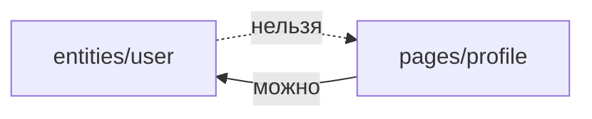
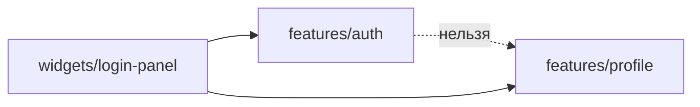

# Уровень 12 (подробно): Нарушения границ

## Зачем уровень-ревью

На предыдущих уровнях вы каждый раз строили модуль с нуля — по чистым правилам.
Но в реальном проекте архитектура портится постепенно: кто-то торопился к дедлайну
и добавил «временный» глубокий импорт, кто-то положил доменный тип в `shared`,
потому что «он же простой». Такие нарушения накапливаются и превращают граф
зависимостей в кашу, где непонятно, что от чего зависит и что можно менять
безопасно.

Единственный устойчивый способ с этим бороться — **уметь быстро находить
нарушение по коду**, не гадая, а системно проверяя четыре вопроса:

1. Куда смотрит импорт — вниз по слоям или вверх?
2. Импорт идёт в чужой слайс через `index.ts` или в обход него?
3. Это сосед по тому же слою — а если да, точно ли ему можно сюда смотреть?
4. Лежит ли код на том слое, к которому реально относится по смыслу?

## Нарушение 1: импорт вверх по слоям



Слои упорядочены `app → pages → widgets → features → entities → shared`, и
зависимости текут **только в одну сторону** — сверху вниз. `entities` ничего не
знает про `pages`, `pages` ничего не знает про `app`. Если сущность вдруг
импортирует что-то из страницы или виджета — это красный флаг: сущность стала
знать о контексте использования, а должна быть переиспользуемым кирпичиком.

Типичный сценарий: разработчик пишет код в `pages/profile`, видит, что похожий
тип нужен в `entities/user`, и вместо того чтобы **поднять** общий тип на уровень
сущности, импортирует его «оттуда, где удобнее». Лечится просто: тип/константа
переезжает на нижний слой (туда, где она архитектурно должна жить), а верхний
слой импортирует её вниз, как и положено.

## Нарушение 2: глубокий импорт мимо public API

```ts
import { UserCard } from '@/entities/user/ui/UserCard' // ❌ deep import
import { UserCard } from '@/entities/user' // ✅ через index.ts
```

Каждый слайс объявляет контракт через `index.ts`. Импорт во внутренний сегмент
чужого слайса (`/model/`, `/ui/`, `/lib/`) ломает инкапсуляцию: снаружи начинают
зависеть от деталей реализации, которые слайс планировал держать приватными.
Часто это происходит не со зла, а потому что `index.ts` **забыли заполнить** —
тогда единственный способ дотянуться до нужного типа — залезть глубже. Правильный
порядок исправления: сначала заполнить `index.ts` нужным реэкспортом, потом
переключить потребителя на импорт из корня слайса.

## Нарушение 3: cross-import слайсов одного слоя



Слайсы одного слоя равноправны и **не должны знать друг о друге** — даже через
public API соседа. Если `features/auth` импортирует `features/profile`, значит
между ними появилась горизонтальная связь, которая рано или поздно превратится в
цикл. Решение — либо убрать зависимость вовсе (часто она случайна и не нужна по
факту), либо поднять композицию на слой выше: виджет или страница, которые уже
знают про оба слайса, сами их соединяют.

## Нарушение 4: домен не на своём слое

`shared` — слой без предметной области: кнопки, форматтеры дат, хелперы работы
со строками. Как только в `shared/lib` появляется `interface Order` или
`interface User` — это сигнал, что доменную сущность туда положили «для
переиспользования», не подумав о том, что у неё есть свой дом — `entities`.

Разница на практике:

```ts
// ❌ shared/lib/discount.ts — бизнес-понятие "скидка" не место в shared
export interface Discount {
  id: string
  percent: number
}

// ✅ entities/discount/model/discount.ts
export interface Discount {
  id: string
  percent: number
}
```

Перенос выглядит как рутинная операция (переместить файл), но именно она чаще
всего пропускается на код-ревью — код ведь «просто работает». Проблема
проявляется позже: когда `Discount` неожиданно тянет за собой другие shared-файлы
и слой `shared`, который должен быть безопасен для импорта откуда угодно,
обрастает доменной логикой.

## Как это находить методично

Не пытайтесь понять весь модуль сразу — читайте **только строки `import`**:

1. Для каждого импорта определите слой источника и слой цели по пути.
2. Если слой цели выше слоя источника (ближе к `app`) — нарушение 1.
3. Если импорт идёт в чужой слайс глубже его `index.ts` — нарушение 2.
4. Если импорт идёт в соседний слайс того же слоя (не `shared`) — нарушение 3.
5. Если внутри `shared` или `app` встречается доменное имя (`User`, `Order`,
   `Product`, `Discount`…) — вероятно, нарушение 4.

Это ровно тот алгоритм, который реализует движок проверок в заданиях этого
уровня (`importsRespectLayers`, `noDeepImport`) — и ровно так работают настоящие
FSD-линтеры вроде `@feature-sliced/steiger`.

## Хорошие практики

- **Чините снизу вверх.** Сначала заполните `index.ts` слайса, к которому нужно
  прийти, и только потом переключайте импорт потребителя — тогда на каждом шаге
  проект в валидном состоянии.
- **Не удаляйте связь молча.** Если убираете поле или импорт, проверьте, что оно
  нигде больше не используется — иначе решите архитектурную проблему, создав
  рантайм-баг.
- **Идентификатор вместо вложенного объекта.** Если сущность тянет другую
  сущность целиком, почти всегда достаточно хранить только `id` — это заодно
  снимает и cross-import, и потенциальный цикл.
- **Домен переносите, а не копируете.** Дублирование типа в `shared` и в
  `entities` — временное решение, которое быстро рассинхронизируется.
- **Автоматизируйте ревью.** `@feature-sliced/steiger` или
  `eslint-plugin-boundaries` в CI ловят все четыре типа нарушений на каждом PR —
  ревьюер не должен искать их руками.

## Частые ошибки новичков

- **«Это же просто тип, какая разница откуда его брать».** Разница есть: тип из
  вышестоящего слоя тянет за собой архитектурную зависимость сущности от
  контекста использования.
- **Забывают заполнить `index.ts` и идут в обход.** Если импортировать неоткуда
  «легально» — это повод завести public API, а не тянуть из внутреннего сегмента.
- **Путают «через public API» и «можно импортировать».** Импорт соседнего слайса
  того же слоя запрещён, даже если он идёт через его `index.ts` — дело не в
  глубине пути, а в самом факте связи между равноправными слайсами.
- **Оставляют половину нарушения починенной.** Например, переключают импорт на
  правильный путь, но забывают убрать старый, ставший ненужным. Итог — два
  источника одного и того же типа и путаница при следующем рефакторинге.
- **«В shared же ничего доменного, просто помощник».** Проверяйте вопросом: если
  этот код исчезнет, сломается ли бизнес-логика конкретной предметной области?
  Если да — это `entities`, а не `shared`.

📌 Итог: у нарушений границ всего четыре формы, и все они видны по путям
`import` без чтения остального кода. Научитесь узнавать их с одного взгляда —
и код-ревью архитектуры перестанет быть гаданием.
