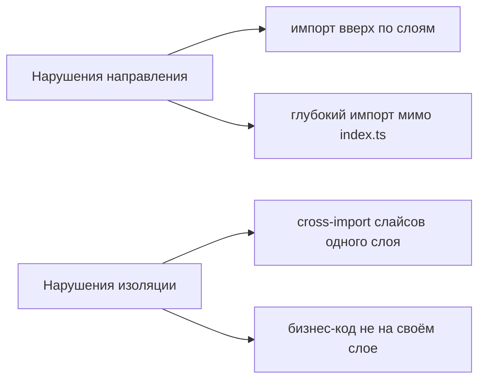

# Уровень 12: Нарушения границ

До сих пор мы строили правильную архитектуру с чистого листа. Реальность иная:
чаще всего вы открываете **чужой код**, где границы уже нарушены, и нужно
разобраться, что сломано и как это чинить. Этот уровень — тренировка ревью FSD:
шесть заданий, в каждом уже есть баг архитектуры, ваша задача — найти и починить.

## Два типа нарушений

**Направление** — про то, _откуда куда_ течёт зависимость: только сверху вниз
(`app → pages → widgets → features → entities → shared`), и только через
`index.ts` слайса.

**Изоляция** — про то, что слайсы одного слоя друг про друга не знают, а домен
живёт в `entities`, а не расползается по `shared`.

## Как искать нарушения глазами

- Импорт с `../../` или длинным путём через несколько слоёв — подозрительно.
- Путь импорта заходит внутрь чужого слайса (`/model/`, `/ui/`, `/lib/`) — deep
  import, чините на импорт из корня слайса.
- Два слайса одного слоя ссылаются друг на друга — cross-import, поднимайте
  композицию выше.
- В `shared` лежит `interface User`, `interface Order` и подобное — домен не на
  своём месте, переносите в `entities`.

📌 Итог: архитектурное ревью — это чтение путей импортов, а не логики кода.
Нарушение видно по одной строке `import ... from '...'`, если знать, куда
смотреть.
