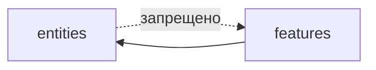
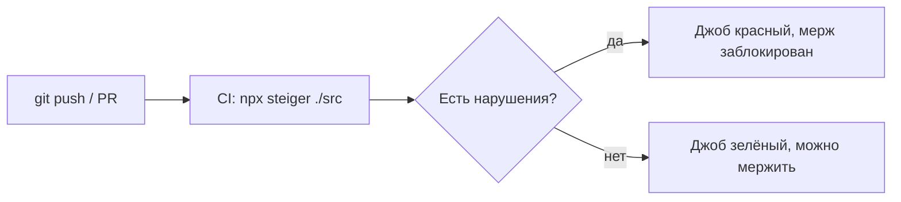

# Уровень 13: Линтеры и автоматическая проверка границ FSD (подробно)

## 1. Проблема: правила есть, а контроля нет

К этому моменту курса вы знаете все правила FSD: слои импортируют только вниз,
слайсы одного слоя изолированы, снаружи слайс виден только через `index.ts`. Но
знание правила и его соблюдение — разные вещи.

Представьте PR на 40 файлов. Ревьюер бегло листает диф, видит новую бизнес-логику,
одобряет. Внутри — строка `import { formatPrice } from '@/entities/product/lib/format'`
вместо `import { formatPrice } from '@/entities/product'`. Незаметная деталь,
которая на глаз ничем не хуже. Через полгода при рефакторинге внутренностей
`entities/product` эта строка ломается в неожиданном месте — потому что кто-то
"подсмотрел" внутрь слайса в обход публичного контракта.

Человеческий ревью **не масштабируется** на архитектурные правила: их слишком много,
они однообразны, и именно поэтому их идеально делегировать инструменту.

## 2. Steiger — линтер структуры, а не синтаксиса

**Steiger** (`feature-sliced/steiger` на GitHub) — официальный линтер команды FSD.
Важно понимать разницу с обычным ESLint:

- **ESLint** анализирует *код внутри файла*: неиспользуемые переменные, стиль,
  синтаксические ошибки.
- **Steiger** анализирует *файловую структуру и связи между файлами*: соответствует
  ли раскладка папок конвенциям FSD, не нарушены ли правила импортов между слоями
  и слайсами.

Установка и запуск:

```bash
npm i -D steiger
# Плагин с правилами именно для Feature-Sliced Design:
npm i -D @feature-sliced/steiger-plugin
```

```js
// steiger.config.js
import { defineConfig } from 'steiger'
import fsd from '@feature-sliced/steiger-plugin'

export default defineConfig([...fsd.configs.recommended])
```

```bash
npx steiger ./src
npx steiger ./src --watch   # следит за изменениями
```

## 3. Ключевые правила и как чинить их сообщения

### 3.1. `fsd/no-higher-level-imports` — импорт вверх

Модуль слоя `entities` не может импортировать что-то из `features` или `pages` —
это движение против однонаправленного графа.



❌ Нарушение:
```ts
// src/entities/product/model/store.ts
import { addToCart } from '@/features/add-to-cart'
```

Сообщение линтера (по смыслу): *«entities/product импортирует из features/add-to-cart,
что находится выше по слоям»*.

✅ Починка — переверните зависимость. Сущность не должна знать о фиче; наоборот,
фича берёт сущность как строительный материал:

```ts
// src/features/add-to-cart/model/store.ts
import { Product } from '@/entities/product'
```

### 3.2. `fsd/no-cross-imports` — сосед по слою

Два слайса одного слоя не видят друг друга напрямую.

❌ Нарушение:
```ts
// src/entities/order/model/types.ts
import { Product } from '@/entities/product'
```

✅ Починка — либо поднять композицию на слой выше (`features`/`widgets` собирают
`order` и `product` вместе), либо, если действительно нужна лёгкая типовая связь
внутри слоя, использовать официальный механизм `@x`-нотации:

```ts
// src/entities/product/@x/order.ts — публичный "мост" именно для entities/order
export type { Product } from '../model/types'
```
```ts
// src/entities/order/model/types.ts
import type { Product } from '@/entities/product/@x/order'
```

`@x` — это осознанное, видимое исключение, а не тихий обход правила: оно явно
показывает, что связь предусмотрена и ограничена одним потребителем.

### 3.3. `fsd/public-api` — глубокий импорт в обход `index.ts`

❌ Нарушение:
```ts
// src/pages/checkout/ui/CheckoutPage.tsx
import { CartItem } from '@/entities/cart/ui/CartItem'
```

Сообщение линтера: *«обход публичного API слайса cart — импорт напрямую из
внутреннего сегмента ui»*.

✅ Починка — импортировать из корня слайса и добавить реэкспорт в `index.ts`, если
его там ещё нет:

```ts
// src/entities/cart/index.ts
export { CartItem } from './ui/CartItem'
```
```ts
// src/pages/checkout/ui/CheckoutPage.tsx
import { CartItem } from '@/entities/cart'
```

### 3.4. `fsd/insignificant-slice` — слайс без ссылок

Если на слайс нет ни одной ссылки (или только одна, случайная) — вероятно, это
мёртвый код, либо кусок, который зря выделили в отдельный слайс вместо того, чтобы
оставить частью другого. Линтер такие слайсы подсвечивает как подозрительные —
это не всегда ошибка, но повод спросить себя «а он точно нужен отдельно?».

### 3.5. `fsd/no-reserved-folder-names` — путаница сегментов

❌ Нарушение — внутри сегмента `ui` создана подпапка `api`, хотя `api` — имя другого
конвенционального сегмента:
```
src/entities/product/ui/api/fetchProduct.ts
```

Это сбивает читаемость пути: `ui/api/...` выглядит так, будто `api` — ещё один
сегмент, хотя на самом деле это случайная вложенность внутри `ui`.

✅ Починка — вынести код туда, где он по смыслу и принадлежит:
```
src/entities/product/api/fetchProduct.ts
```

## 4. ESLint-плагин для проверки "по ходу письма"

`@feature-sliced/eslint-config` встраивает часть правил Steiger прямо в ESLint —
разработчик видит подчёркнутый импорт в редакторе ещё до коммита, а не только
при запуске отдельной команды.

```bash
npm i -D @feature-sliced/eslint-config eslint-plugin-import eslint-plugin-boundaries
```

```js
// eslint.config.js (фрагмент)
export default [
  {
    extends: ['@feature-sliced'],
  },
]
```

Связка получается двухуровневой: ESLint ловит нарушение мгновенно в IDE, Steiger в
CI — финальный, обязательный барьер, который нельзя случайно проигнорировать
(в отличие от подсветки в редакторе, которую легко не заметить).

## 5. CI-гейт: почему это обязательный шаг, а не опция



Пример шага CI (GitHub Actions):

```yaml
- name: Check FSD architecture
  run: npx steiger ./src
```

Смысл в том, что правило перестаёт быть «договорённостью в README», которую
ревьюер может забыть проверить, и становится **автоматическим гейтом**: PR физически
не может попасть в `main`, если нарушает границы слоёв или public API.

## Хорошие практики

- **Ставьте Steiger в CI с самого начала проекта**, а не когда архитектура уже
  расползлась — чем раньше появляется гейт, тем дешевле держать порядок.
- **Дублируйте проверку в ESLint для IDE-фидбэка.** Разработчик должен увидеть
  нарушение до пушa, а не узнать о нём из упавшего CI через 10 минут.
- **Используйте `@x`-нотацию осознанно и редко**, а не как способ обойти
  `no-cross-imports` — если `@x`-мостов становится много, это сигнал пересмотреть
  границы слайсов.
- **Не выключайте правила молча.** Если правило мешает — обсудите с командой и
  зафиксируйте исключение явно в `steiger.config.js` с комментарием, почему.

## Частые ошибки новичков

- **«Линтер — это придирки, разберёмся сами».** На команде до трёх человек ещё
  можно; дальше ручной контроль неизбежно пропускает нарушения — линтер не мнение,
  а факт о структуре.
- **Добавлять Steiger, но не подключать его к CI.** Локальный запуск «когда
  вспомнили» не защищает `main` — обязателен шаг в пайплайне.
- **Чинить нарушение `public-api` импортом через relative-путь на два уровня
  вверх** (`../../../entities/product/ui/Card`) вместо реэкспорта в `index.ts` —
  это тот же обход публичного контракта, просто менее заметный глазу.
- **Путать ESLint и Steiger.** ESLint не проверит нарушение слоёв без специального
  плагина/конфига — для архитектурных правил FSD нужен именно Steiger (или
  `@feature-sliced/eslint-config` поверх ESLint).
- **Злоупотреблять `@x` вместо честного пересмотра границ.** `@x` — предохранительный
  клапан для редких случаев, а не стандартный способ связать сущности одного слоя.

📌 Итог: Steiger проверяет структуру FSD (слои, public API, слайсы), ESLint-конфиг
дублирует часть правил в редакторе, а обязательный шаг в CI превращает архитектурные
договорённости в гарантию, которую не может нарушить ни один PR — независимо от
того, насколько внимателен был ревьюер.
