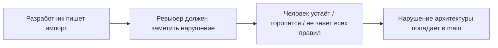
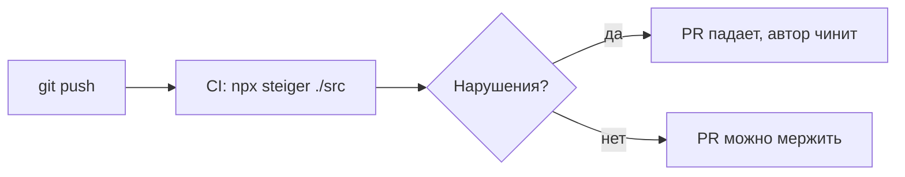

# Уровень 13: Линтеры и автоматическая проверка границ FSD

Все правила FSD, которые мы изучили — однонаправленность, public API, cross-import
только через `@x` — это **договорённости**. На команде из трёх человек их держат в
голове. На команде из тридцати человек их держит в голове ревьюер, который устал,
торопится и однажды пропустит глубокий импорт в PR. А через месяц на этом импорте
всё сломается.

## Проблема: правила, которые нельзя удержать вручную



Ручной ревью границ слоёв — это не масштабируется. Нужен инструмент, который
проверяет структуру так же механически, как компилятор проверяет типы.

## Steiger — официальный линтер FSD

**Steiger** — линтер архитектуры от команды Feature-Sliced Design. Он не проверяет
синтаксис (это делает ESLint), а проверяет **структуру проекта**: правильно ли
разложены слои, слайсы, сегменты, соблюдается ли public API.

```bash
npm i -D steiger @feature-sliced/steiger-plugin
npx steiger ./src
```

Ключевые правила из пакета `@feature-sliced/steiger-plugin`:

| Правило | Что ловит |
|---------|-----------|
| `fsd/forbidden-imports` (+ `no-higher-level-imports`, `no-cross-imports`) | импорт вверх по слоям или между слайсами одного слоя |
| `fsd/public-api` | обход `index.ts` слайса — импорт напрямую во внутренний сегмент |
| `fsd/insignificant-slice` | слайс, на который никто (или почти никто) не ссылается — вероятно, лишний |
| `fsd/no-reserved-folder-names` | подпапка сегмента названа как другой сегмент (`ui/api/`) |

## ESLint-плагин для повседневной проверки

`@feature-sliced/eslint-config` встраивает часть этих правил прямо в ESLint, чтобы
разработчик видел нарушение **в редакторе**, не дожидаясь отдельного запуска Steiger.

## Почему это должно быть в CI



Линтер в CI превращает архитектурное правило из «пожелания в README» в **жёсткий
гейт**: PR с глубоким импортом или сломанным public API просто не проходит проверку,
без участия человека.

📌 Итог: Steiger проверяет структуру FSD, ESLint-плагин — то же самое в редакторе,
а CI делает эти проверки обязательными. Вместе они держат архитектуру в порядке даже
на большой команде, где никто не помнит все правила наизусть.
