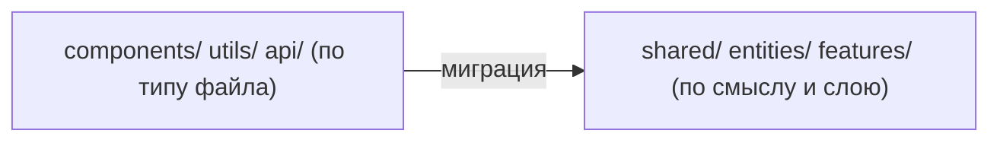
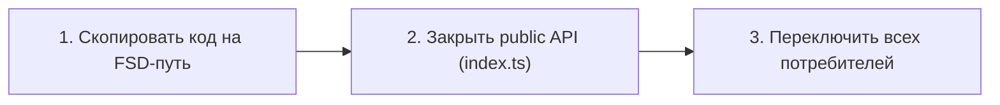

# Уровень 14 (подробно): Миграция legacy-кода на FSD

## Почему миграция — отдельная тема, а не просто «применение всего изученного»

На предыдущих уровнях вы работали с кодом, который уже был размечен по FSD:
данный `entities/user`, данный `shared/ui`. В реальности FSD почти никогда не
внедряют в проект с нуля — его **накатывают** на существующую кодовую базу,
обычно организованную «по техническому типу»: `components/`, `hooks/`, `utils/`,
`api/`, `pages/` (в старом, не-FSD смысле — просто роуты). Такая раскладка ничего
не говорит о том, что с чем связано и что можно менять независимо.



Разница принципиальная: в «плоской» структуре узнать, что можно спокойно
отрефакторить, а что потянет за собой половину приложения, можно только
прочитав весь код. В FSD это видно по одному пути импорта.

## Три вопроса для классификации legacy-куска

Перед переносом любого файла задайте себе три вопроса по очереди — они
однозначно определяют целевой слой.

### 1. Это просто UI-кирпичик, без знания о бизнесе?

`Button`, `Input`, `Modal`, `Avatar`, `Spinner` — они принимают `label`, `onClick`,
`url` и понятия не имеют, что такое «товар» или «пользователь». Такой код —
**примитив**, ему место в `shared/ui`. Признак: компонент одинаково уместен в
интернет-магазине и в админке банка.

```ts
// ❌ было: src/components/Avatar.tsx
export function Avatar({ url }: { url: string }) { /* ... */ }

// ✅ стало: src/shared/ui/Avatar.tsx — тот же код, другой слой
```

### 2. Это объект, у которого есть идентичность и свои поля?

`User`, `Product`, `Order`, `Comment` — у них есть `id`, набор полей, и часто —
своё отображение (`UserCard`, `ProductCard`). Это **сущность**, `entities/<slice>`.
Сущность может «принести с собой» не только тип, но и запрос за данными
(`entities/product/api/fetchProduct.ts`) и компонент отображения
(`entities/product/ui/ProductCard.tsx`) — сегменты одного слайса.

```ts
// ❌ было: src/utils/product.ts + src/api/productApi.ts (два разных места)
// ✅ стало: entities/product/model/types.ts + entities/product/api/fetchProduct.ts
//           (один слайс, разные сегменты)
```

📌 Частая ловушка: `Product` внешне похож на «просто тип», и его тянет положить в
`shared/types.ts` — но `shared` не должен знать о бизнес-объектах. Тест простой:
если тип имеет смысл только в контексте вашего домена (не переиспользуешь его в
другом проекте) — это сущность, а не примитив.

### 3. Это действие пользователя над сущностью?

«Добавить в корзину», «поставить лайк», «отправить форму авторизации» — это не
статичный объект, а **сценарий**, `features/<slice>`. Фича обычно тянет вниз
сущность (знает, что добавляет в корзину `Product`) и/или примитив (кнопку из
`shared/ui`), но никогда не содержит бизнес-объект сама.

```ts
// ❌ было: src/utils/cartHandlers.ts + src/components/AddToCartButton.tsx
// ✅ стало: features/add-to-cart/model/addToCart.ts + .../ui/AddToCartButton.tsx
```

Если ни один из трёх вопросов не подошёл (код собирает несколько сущностей/фич в
готовый блок интерфейса) — это `widgets`, а если собирает целый экран — `pages`.

## Три шага одного переноса

Перенос одного legacy-куска — не одна операция, а последовательность из трёх
действий, и важно не остановиться на середине.



1. **Скопировать код.** Целевой файл уже существует в проекте (как заготовка с
   `// TODO`) — вы переносите туда тело функции/компонента, при необходимости
   поправляя внутренние импорты (примитивы теперь берутся через `@/shared/ui`,
   а не относительным путём внутри `components/`).
2. **Закрыть public API.** Слайс без `index.ts` — не слайс, а просто папка.
   Реэкспортируйте наружу ровно то, чем должны пользоваться другие слои —
   не больше.
3. **Переключить потребителей.** Найдите все места, импортирующие legacy-путь, и
   поменяйте их на новый public API. Если хотя бы один потребитель остался на
   старом импорте — миграция этого куска не закончена, в проекте два источника
   правды одновременно.

## Сборка вверх: виджеты и страницы из уже мигрированного

Финальная часть миграции экрана — не перенос очередного файла, а **сборка**:
виджет собирает несколько уже мигрированных сущностей/фич, страница — несколько
виджетов/фич/сущностей. Здесь легко допустить точно такое же нарушение, как с
legacy-кодом, только на новом месте: тянуть внутренние сегменты чужого слайса
напрямую, «раз уж всё равно рефакторю».

```ts
// ❌ виджет обходит public API сущности и фичи
import { ProductCard } from '@/entities/product/ui/ProductCard'
import { AddToCartButton } from '@/features/add-to-cart/ui/AddToCartButton'

// ✅ виджет собирает их так же, как собирал бы любой внешний потребитель
import { ProductCard } from '@/entities/product'
import { AddToCartButton } from '@/features/add-to-cart'
```

Правило простое: **у мигрированного слайса нет привилегированных потребителей**.
Виджет, который его собирает, обязан заходить через ту же «входную дверь»
(`index.ts`), что и любой другой код в проекте.

## Хорошие практики

- **Мигрируйте снизу вверх.** Сначала `shared` и `entities` (у них меньше всего
  зависимостей), потом `features`, затем `widgets` и `pages`. Так на каждом шаге
  у вас уже есть готовый фундамент, через который можно собирать следующий слой.
- **Переносите вместе со связанными сегментами.** Если у сущности есть и тип, и
  запрос, и компонент отображения — переносите всё в один слайс `entities/x`, а
  не тип в `entities`, а компонент оставляйте «пока» в `components/`.
- **Закрывайте public API сразу**, а не «потом, когда будет время». Слайс без
  `index.ts` не даёт того самого преимущества — стабильного контракта — ради
  которого вообще затевалась миграция.
- **Ищите все точки импорта перед переключением.** В реальном проекте это делает
  IDE («Find Usages»), а не память — легаси-функцию могли использовать в трёх
  разных местах.
- **Не переносите «на будущее».** Если тип используется только в одном
  компоненте и не похож на сущность — возможно, его вообще не нужно выносить в
  отдельный слайс, оставьте локально.
- **Собирайте widgets/pages из готового, не заглядывая внутрь.** Если во время
  сборки виджета тянет заглянуть во внутренний сегмент сущности — это сигнал,
  что public API сущности неполный, и полезно расширить именно его, а не
  обходить.

## Частые ошибки новичков

**❌ Перенесли файл, но забыли переключить потребителя**

```ts
// entities/user/index.ts — готово, экспортирует User и UserBadge
// НО src/widgets/profile/ui/ProfileWidget.tsx всё ещё:
import { UserBadge } from '@/components/UserBadge' // забыли поменять
```

Почему плохо: в проекте два источника правды. Кто-то поправит `entities/user`, не
подозревая, что legacy-копия в `components/` по-прежнему используется где-то ещё.

```ts
// ✅ потребитель переключён на новый public API
import { UserBadge } from '@/entities/user'
```

**❌ Забыли закрыть public API — снаружи лезут во внутренние сегменты**

```ts
// entities/product/index.ts — пустой (забыли заполнить)
// widgets/product-list вынужден:
import { ProductCard } from '@/entities/product/ui/ProductCard' // deep import
```

Почему плохо: без `index.ts` у слайса нет контракта — любой файл внутри можно
случайно сломать, потому что снаружи от него уже кто-то зависит напрямую.

```ts
// ✅ index.ts закрыт, импорт идёт через него
export { ProductCard } from './ui/ProductCard'
```

**❌ Бизнес-сущность «по инерции» кладут в shared**

```ts
// ❌ src/shared/types/product.ts
export interface Product { id: string; title: string; sellerId: string }
```

Почему плохо: `shared` не должен знать о бизнес-объектах. Если сущность окажется
в `shared`, к ней получат доступ вообще все слои без ограничений — а именно
изоляция сущностей друг от друга (через `entities/*`) не даёт связям расползтись.

```ts
// ✅ src/entities/product/model/types.ts
export interface Product { id: string; title: string; sellerId: string }
```

**❌ При сборке виджета/страницы обходят public API «раз уж мигрирую рядом»**

```ts
// ❌ pages/catalog/ui/CatalogPage.tsx
import { ProductCardWidget } from '@/widgets/product-card-widget/ui/ProductCardWidget'
```

Почему плохо: сборка вверх — это тоже импорт, и на него распространяются те же
правила public API, что и на любой другой код. Иначе виджет нельзя будет
безопасно отрефакторить изнутри — снаружи уже зависят от его внутренностей.

```ts
// ✅ через public API виджета
import { ProductCardWidget } from '@/widgets/product-card-widget'
```

**❌ Переносят «наполовину» — тип в новый слой, а функция, которая с ним
работает, остаётся в legacy**

```ts
// entities/product/model/types.ts — Product уже здесь
// НО src/api/productApi.ts всё ещё живёт в legacy и импортирует его обратно:
import type { Product } from '@/entities/product'
```

Почему плохо: связанный код должен переезжать вместе. Если `fetchProduct`
концептуально относится к сущности `product`, ему место в
`entities/product/api/`, а не в отдельной legacy-папке, которая теперь ещё и
тянет зависимость «вверх» на новый слой.

```ts
// ✅ entities/product/api/fetchProduct.ts — в том же слайсе, что и тип
import type { Product } from '../model/types'
```
