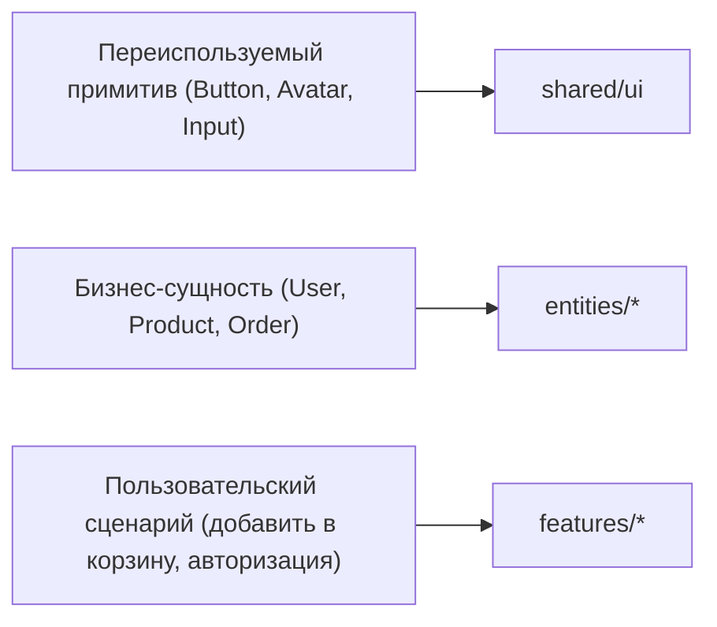
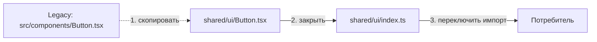

# Уровень 14: Миграция legacy-кода на FSD

Ни один реальный проект не начинается с идеальной FSD-структуры. Обычно всё
наоборот: есть работающее приложение с папками `components/`, `utils/`, `api/`, и
задача — постепенно, файл за файлом, перевести его на слои и слайсы, не сломав по
пути ни одного импорта.

## Миграция — это сортировка, а не переписывание

Ключевой вопрос при переносе каждого куска legacy-кода: **«про что этот код?»**

- Не привязан к предметной области, просто UI-кирпичик → **`shared/ui`**.
- Описывает объект бизнеса (у него есть `id`, свои поля, свой смысл) → **`entities/*`**.
- Описывает действие пользователя над сущностью (добавить, отправить, купить) →
  **`features/*`**.
- Собирает несколько мигрированных фич/сущностей в готовый блок интерфейса →
  **`widgets/*`**, а целый экран — **`pages/*`**.

## Правило переноса: сначала целевой файл, потом — переключить импорт

Перенос куска кода — это не «переименовать файл», а два отдельных шага:

1. **Скопировать код** в правильный FSD-путь и закрыть его public API (`index.ts`).
2. **Переключить всех потребителей** легаси-кода на новый public API.

Пока шаг 2 не сделан, в проекте временно живут два источника правды — старый и
новый. Это нормальная часть миграции, но нельзя останавливаться на полпути: если
потребитель продолжает импортировать `src/components/Button`, миграция не
завершена, даже если `shared/ui/Button.tsx` уже существует.

## Сборка выше по слоям — тоже часть миграции

Миграция не заканчивается на `entities` и `shared`. Финальный шаг — собрать
`widgets` и `pages` из уже перенесённых кусков, причём **строго через их public
API**: если виджет тянет `@/entities/product/ui/ProductCard` в обход
`@/entities/product`, это такое же нарушение границ, как импорт из legacy-папки.

## Коротко: как надо и как не надо

**✅ Хорошо**

- каждый legacy-кусок раскладывается по смыслу: примитив → `shared`, сущность →
  `entities`, сценарий → `features`;
- целевой файл сразу закрывается public API (`index.ts`);
- все потребители переключены на новый путь, никто не импортирует legacy напрямую;
- виджеты и страницы собирают уже мигрированные слайсы только через их `index.ts`.

**❌ Ошибки новичков**

- скопировали код в `entities`, но потребитель по-прежнему импортирует legacy-путь;
- перенесли, но забыли public API — снаружи лезут в `model/` и `ui/` напрямую;
- бизнес-сущность (`Product`, `User`) по привычке кладут в `shared` — она там
  раньше физически лежала в виде `utils/`;
- при сборке виджета/страницы обходят public API мигрированных слайсов «чтобы было
  быстрее».

📌 Итог: миграция — это перенос по смыслу + закрытие public API + переключение
всех потребителей. Ни один из трёх шагов нельзя пропустить.

