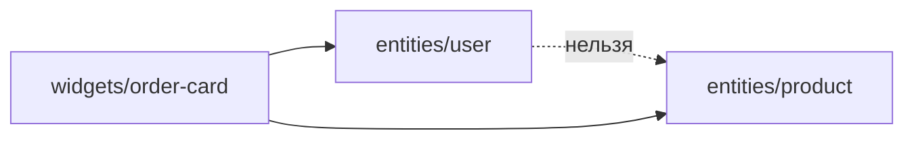
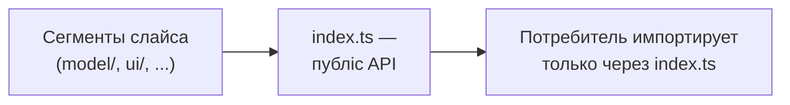

# Уровень 15 (подробно): Паттерны, антипаттерны и капстоун

Это финальный уровень. К этому моменту вы прошли все слои FSD, public API, изоляцию
слайсов и линтеры. Здесь мы не добавляем новых концепций — мы тренируем два навыка,
которые отличают человека, «прошедшего курс», от человека, «умеющего FSD»:

1. **Диагностика.** Открыть чужой модуль и за 10 секунд увидеть, что с ним не так.
2. **Синтез.** Построить корректную вертикаль слоёв с нуля, не подглядывая в чек-лист.

## Тема A: каталог антипаттернов FSD

За курс вы разбирали каждый антипаттерн по отдельности. Соберём их в один каталог —
такой список стоит держать в голове на код-ревью.

### 1. Доменная логика в `shared`

`shared` — слой без слайсов и без бизнес-смысла: кнопки, форматтеры, конфиг,
обёртки над `fetch`. Как только в `shared/lib` появляется функция, которая знает про
конкретную сущность домена (`Order`, `User`, `Product`) — это уже не `shared`, это
`entities`, которая случайно там оказалась.

```ts
// ❌ shared/lib/orderTotals.ts
import type { Order } from '@/entities/order/model/types' // импорт вверх — уже красный флаг!

export function calculateOrderTotal(order: Order) { /* ... */ }
```

Признак почти всегда один и тот же: файл в `shared` вынужден **импортировать тип из
верхнего слоя**, чтобы иметь смысл. Это и есть сигнал: не `shared` его дом.

```ts
// ✅ entities/order/model/orderTotals.ts
import type { Order } from './types'

export function calculateOrderTotal(order: Order) { /* ... */ }
```

### 2. God-slice и раздутый public API

`export * from './ui'` в барреле выглядит удобно — «на будущее, вдруг что-то ещё
понадобится». На практике это медленная утечка: наружу уезжает и приватный кэш, и
debug-компоненты, и внутренние типы. Public API перестаёт быть контрактом — он
становится «всё, что есть внутри».

```ts
// ❌ разом реэкспортирует и публичное, и приватное
export * from './model/types'
export * from './model/internalCache'
export * from './ui/ProductCard'
```

```ts
// ✅ явно, поимённо, только нужное
export type { Product } from './model/types'
export { ProductCard } from './ui/ProductCard'
```

Правило простое: если вы не можете назвать причину, зачем конкретное имя видно
снаружи — не экспортируйте его.

### 3. Cross-import соседей одного слоя

`entities/user` импортирует `entities/product` «ну они же оба сущности, что
такого». Это горизонтальная связь — она не укладывается в направленный граф слоёв
и почти гарантированно рано или поздно замкнётся в цикл (`A → B → A`).



Лечится подъёмом композиции на слой выше: тот, кто знает про обе сущности —
`widget` или `feature`, — а не сами сущности друг про друга.

### 4. Глубокий импорт мимо `index.ts`

Самый частый и самый безобидный на вид антипаттерн: импортировать не сам слайс, а
файл внутри него.

```ts
import { UserCard } from '@/entities/user/ui/UserCard' // ❌
import { UserCard } from '@/entities/user'              // ✅
```

Опасность в том, что deep import невозможно увидеть по типам — TypeScript счастлив,
сборка проходит. Ловится только явной проверкой границ (движок этого курса делает
то же, что `@feature-sliced/steiger` или `eslint-plugin-boundaries` в реальном
проекте).

### 5. Толстый баррель с логикой

`index.ts` — оглавление, а не модуль. Как только там появляется `if`, цикл или
вызов другой фичи — баррель перестаёт быть тонким фасадом и превращается в ещё один
источник логики, который никто не ожидает найти в файле с именем `index.ts`.

```ts
// ❌ логика + cross-import + deep import + export * — всё сразу
import { isInWishlist } from '@/features/wishlist'
import { addItem } from '@/entities/cart/model/store'

export function handleAddToCart(cart, item) {
  if (isInWishlist(item.id)) { /* ... */ }
  return addItem(cart, item)
}
export * from './ui'
```

```ts
// ✅ index.ts — только реэкспорты, логика — в model/
export { handleAddToCart } from './model/addToCart'
export { AddToCartButton } from './ui/AddToCartButton'
```

Реальные модули редко содержат ровно одно нарушение — 15.3 специально совмещает
сразу четыре, чтобы потренировать чтение диагностики движка по одному сообщению за
раз, не теряясь в общей картине.

## Тема B: капстоун — вертикаль с нуля

Диагностика учит чинить. Капстоун учит **строить**, а строить FSD — это всегда одна
и та же последовательность шагов, независимо от слоя:



15.4 повторяет этот шаг на уровне одной сущности. 15.5 повторяет его дважды подряд:
сначала фича собирается поверх сущности (её public API уже готов — только читаем),
затем виджет собирается поверх фичи тем же приёмом. 15.6 — тот же паттерн ещё раз,
но теперь по всей цепочке `pages → widgets → features → entities → shared` разом:
пять уровней, пять баррелей, ни одного глубокого импорта.

Ключевое наблюдение: **на каждом слое повторяется один и тот же приём**. Не нужно
запоминать пять разных правил для пяти слоёв — нужно один раз понять идею «слайс
закрыт дверью, потребитель входит только в дверь» и применять её рекурсивно вверх
по графу зависимостей.

## Хорошие практики

- **Ведите чек-лист антипаттернов в код-ревью.** Пять пунктов из темы A — рабочий
  список для ревьюера: shared с доменной логикой, `export *`, cross-import,
  deep import, толстый баррель.
- **Стройте снизу вверх.** Сначала сущность с public API, потом фича поверх неё,
  потом виджет поверх фичи. Строить сверху вниз (сперва страницу, потом
  «как-нибудь» сущности) почти всегда приводит к обратным зависимостям.
- **Автоматизируйте обе проверки.** И диагностику антипаттернов, и соблюдение
  правильной вертикали должен ловить линтер (`@feature-sliced/steiger`,
  `eslint-plugin-boundaries`) в CI, а не только глаз ревьюера.
- **Тонкий баррель — всегда.** Даже когда «на минутку» хочется добавить в `index.ts`
  одну строчку логики — не надо. Логика съедет в `model/` в первом же рефакторинге,
  а привычка держать баррель чистым экономит это время заранее.
- **Явно называйте экспорты.** `export * from './ui'` экономит одну строку сегодня
  и стоит часов дебага через полгода, когда непонятно, что из слайса на самом деле
  публично.

## Частые ошибки новичков

- **«Починил один симптом — решил, что готово».** В 15.3 четыре нарушения сразу;
  если проверка всё ещё падает после первой правки — читайте сообщение движка
  дальше, там же явно оно скажет какая проверка не прошла.
- **Путают порядок сборки капстоуна.** Начинают с виджета, обнаруживают, что фичи
  ещё нет — и городят временный deep import «пока не соберу остальное». Стройте
  строго снизу вверх: сущность → фича → виджет → страница.
- **Забывают, что shared — не помойка и не сейф.** Ни «переиспользуемая доменная
  функция» (это entities), ни «наш собственный внутренний кэш» (это должно остаться
  внутри своего слайса) не должны лежать в shared.
- **Путают «сузить API» с «удалить функциональность».** В 15.2 задача не убрать
  `internalCache` из кода, а перестать реэкспортировать его наружу — файл остаётся
  на месте и продолжает использоваться внутри слайса.
- **Считают, что раз тип, а не значение — deep import не считается.** Правило
  единое: и `import type`, и обычный `import` идут через `index.ts` слайса.

📌 Итог курса: FSD — это не список запретов, а один повторяющийся приём на каждом
уровне композиции: закрыть модуль дверью, отдать наружу минимум, входить к соседям
только через их дверь. Освоив это на уровне слайса, вы автоматически умеете
применять то же самое к фичам, виджетам и страницам — что и демонстрирует капстоун.
