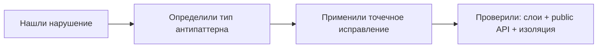
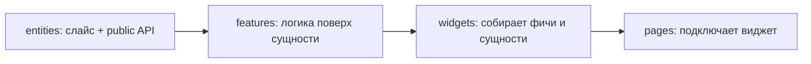

# Уровень 15: Паттерны, антипаттерны и капстоун

Это финальный уровень курса. Он не вводит новых понятий — он проверяет, умеете ли вы
**узнавать** нарушения FSD в чужом коде и **строить** корректную архитектуру с нуля.

## Тема A: паттерны и антипаттерны — распознать и исправить

За весь курс вы видели одни и те же нарушения снова и снова. Соберём их в чек-лист:

| Антипаттерн | Где встречали | Как чинить |
|---|---|---|
| Доменная логика в `shared` | тема shared | Перенести в `entities`/`features` |
| God-slice, `export *` в барреле | тема public API | Именованные реэкспорты, только нужное |
| Cross-import соседей одного слоя | темы entities/features/widgets | Композиция на слой выше |
| Глубокий импорт мимо `index.ts` | тема public API | Импорт до корня слайса |
| Толстый баррель с логикой | тема public API | Логика — в сегменты, баррель — реэкспорты |

## Тема B: капстоун — собрать вертикальный срез приложения

Вторая половина уровня — противоположная задача: не чинить чужие ошибки, а **строить**
правильно с нуля. Идём снизу вверх, как в реальном проекте:

Каждый шаг — тот же приём: сегменты слайса → `index.ts` → потребитель импортирует
только через public API. Как только вы можете повторить это осознанно на пустом
месте — вы умеете FSD, а не просто прошли задания.

📌 Итог: паттерн один и тот же на любом слое — закрыть слайс дверью (`index.ts`),
экспортировать минимум, импортировать чужое только через public API, соседей по слою
не трогать. Тема A учит это чинить, тема B — строить с нуля.
