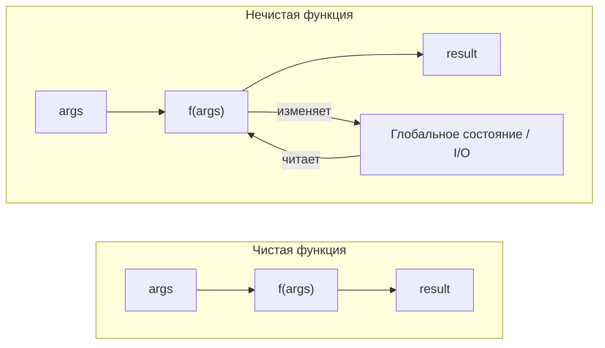
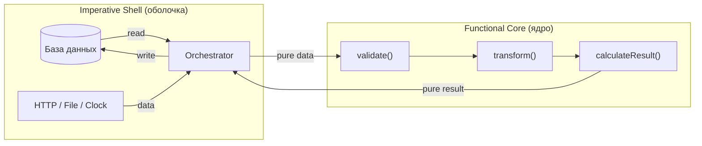

# Чистые функции — углублённо

## Математическое определение

В математике функция — это отображение: каждому элементу из области определения (domain) соответствует ровно один элемент из области значений (codomain). Функция `f(x) = x²` всегда возвращает `4` для `x = 2`. Без исключений.

Программная чистая функция — это то же самое: **тотальное детерминированное отображение** из аргументов в результат. Она не хранит история вызовов, не зависит от внешнего мира, не меняет его.

```ts
// Это честное математическое отображение
const square = (x: number): number => x * x
// square(4) === 16 — сегодня, завтра, через 10 лет
```

## Referential Transparency (прозрачность ссылок)

Функция прозрачна по ссылкам, если любой её вызов можно заменить результатом — и поведение программы не изменится.

```ts
const double = (x: number) => x * 2

// Оба варианта абсолютно равнозначны:
const a = double(5) + double(5)
const b = 10 + 10
```

Если функция нечистая — замена невозможна, потому что вызов функции производит эффект:

```ts
let counter = 0
const increment = () => ++counter

// Нельзя заменить на константу:
const x = increment() + increment() // counter === 2, x === 3
const y = 1 + 1                     // counter не изменился, y === 2
// x !== y по семантике!
```

Referential transparency — это то, что делает код **удобным для рассуждений**: вы можете подставлять определения функций вместо их вызовов в голове, как в алгебре.

## Диаграмма: чистая vs нечистая



## Виды побочных эффектов

Любое взаимодействие функции с "миром" за пределами её аргументов и возвращаемого значения — это побочный эффект.

### 1. Мутация состояния

```ts
// Мутация аргумента
function addItem(cart: Cart, item: Item): Cart {
  cart.items.push(item)   // изменяет оригинальный cart
  return cart
}

// Мутация глобального состояния
let requestCount = 0
function fetchUser(id: string) {
  requestCount++          // меняет глобальную переменную
  return api.get(`/users/${id}`)
}
```

### 2. Ввод / вывод

```ts
// Запись в консоль
const debug = (x: number) => { console.log(x); return x }

// HTTP-запрос
const getUser = (id: string) => fetch(`/api/users/${id}`)

// Запись в файл (Node.js)
const saveLog = (msg: string) => fs.writeFileSync('log.txt', msg)
```

### 3. Недетерминированность

```ts
// Зависимость от времени
const now = () => Date.now()

// Случайность
const dice = () => Math.floor(Math.random() * 6) + 1

// Зависимость от окружения
const host = () => process.env.API_HOST
```

### 4. Исключения

```ts
// Выброс исключения — это наблюдаемый эффект
function divide(a: number, b: number): number {
  if (b === 0) throw new Error('Division by zero') // эффект!
  return a / b
}

// Чистая альтернатива — возвращать тип-обёртку
function safeDivide(a: number, b: number): number | null {
  return b === 0 ? null : a / b
}
```

## Стратегии изоляции эффектов

### Инъекция зависимостей

Передавайте нечистые зависимости как аргументы:

```ts
// Нечистая: зависит от Date.now() и console внутри
function processOrder(order: Order): ProcessedOrder {
  return { ...order, processedAt: Date.now(), status: 'done' }
}

// Чистая: все зависимости — аргументы
function processOrder(
  order: Order,
  now: number,            // вместо Date.now()
  log: (s: string) => void, // вместо console.log
): ProcessedOrder {
  log(`Processing ${order.id}`)
  return { ...order, processedAt: now, status: 'done' }
}

// Вызов с реальными зависимостями:
processOrder(order, Date.now(), console.log)

// Вызов в тесте — никаких моков, чистые данные:
processOrder(order, 1000000000, () => {})
```

### Разделение логики и эффектов

Принцип "functional core, imperative shell":

```ts
// Логика — чистая (ядро)
function calculateDiscount(order: Order): number {
  if (order.total > 1000) return order.total * 0.1
  if (order.isFirstOrder) return order.total * 0.05
  return 0
}

// Оркестратор — нечистый (оболочка)
async function applyDiscount(orderId: string): Promise<void> {
  const order = await db.orders.findById(orderId)      // эффект: I/O
  const discount = calculateDiscount(order)            // чистая логика
  await db.orders.update(orderId, { discount })       // эффект: I/O
  console.log(`Applied discount: ${discount}`)        // эффект: I/O
}
```

Чистая часть — тестируется мгновенно и без настройки. Нечистая оболочка — тонкая и её логика минимальна.

### Монады для управления эффектами

В продвинутом FP эффекты оборачивают в типы-контейнеры: `IO<A>`, `Task<A>`, `Effect<R, E, A>`. Сами функции остаются чистыми — они описывают *программу*, а не выполняют эффекты немедленно.

```ts
// IO-монада: функция возвращает "описание" эффекта, не выполняет его
const readLine: IO<string> = () => prompt('Enter name:') ?? ''

// Трансформируем описание — чисто, никакого I/O
const greet: IO<string> = pipe(readLine, map((name) => `Hello, ${name}!`))

// Эффект происходит только при вызове unsafeRun:
unsafeRun(greet) // "Hello, World!" — и только здесь читается консоль
```

## Связь с тестируемостью

Чистые функции — идеальные объекты для юнит-тестов:

```ts
// Тест чистой функции: никаких beforeEach, моков, teardown
describe('calculateTotal', () => {
  it('sums item prices multiplied by qty', () => {
    expect(calculateTotal([{ price: 10, qty: 3 }])).toBe(30)
  })

  it('returns 0 for empty list', () => {
    expect(calculateTotal([])).toBe(0)
  })
})
```

Нечистую функцию приходится "обвязывать" инфраструктурой:

```ts
// Тест нечистой функции: нужен мок для Date и console
jest.spyOn(global.Date, 'now').mockReturnValue(1000)
jest.spyOn(console, 'log').mockImplementation(() => {})
// ...и не забыть сделать cleanup
```

## Связь с параллелизмом

Две чистые функции, работающие с одними данными, никогда не создадут состояние гонки — они не пишут в общую память. Это делает параллельную обработку тривиальной:

```ts
// Безопасно запускать параллельно — нет общего состояния
const results = await Promise.all(orders.map(processOrderPure))
```

## Диаграмма: functional core, imperative shell



## Memoization

Referential transparency позволяет кэшировать результаты:

```ts
function memoize<A, B>(fn: (a: A) => B): (a: A) => B {
  const cache = new Map<A, B>()
  return (a) => {
    if (cache.has(a)) return cache.get(a)!
    const result = fn(a)
    cache.set(a, result)
    return result
  }
}

const expensiveCalc = memoize((n: number) => {
  // тяжёлые вычисления...
  return n * n
})

expensiveCalc(100) // считает
expensiveCalc(100) // берёт из кэша
```

Мемоизация работает только с чистыми функциями — нечистую кэшировать нельзя (результат может измениться).

## Аналогия: торговый автомат

Чистая функция — это торговый автомат:

- Те же монеты → тот же товар (детерминированность)
- Автомат не знает, кто вы и сколько раз покупали (нет внешнего состояния)
- Он не звонит вашему боссу при каждой покупке (нет побочных эффектов)
- Вы можете предсказать результат, просто глядя на кнопку и монеты

Нечистая функция — это продавец, который:
- Помнит прошлые покупки (глобальное состояние)
- Меняет настроение и цену (недетерминированность)
- Рассказывает коллегам о вашей покупке (побочный эффект)

## Частые ошибки

**Скрытая мутация через Object.assign**

```ts
// Выглядит как иммутабельное, но первый аргумент мутируется
const updated = Object.assign(original, { status: 'done' }) // мутация!

// Правильно: первый аргумент — пустой объект
const updated = Object.assign({}, original, { status: 'done' })
// или spread:
const updated = { ...original, status: 'done' }
```

**Async-функция с побочным эффектом внутри**

```ts
// Нечистая — даже если возвращает Promise
async function getAndCache(id: string) {
  const data = await fetch(`/api/${id}`)   // I/O
  cache[id] = data                          // мутация
  return data
}
```

**Функция с необработанным исключением**

```ts
// throw — это тоже побочный эффект
function parseAge(s: string): number {
  const n = parseInt(s)
  if (isNaN(n)) throw new Error('Not a number') // эффект
  return n
}

// Чистая альтернатива: возвращаем Either/Result
function parseAge(s: string): number | null {
  const n = parseInt(s)
  return isNaN(n) ? null : n
}
```

## Итог

Чистые функции — это строительный блок надёжного кода. Они не заменяют эффекты, но делают логику изолированной, тестируемой и понятной. В следующих уровнях мы увидим, как FP управляет эффектами системно: через монады, IO и Effect.
