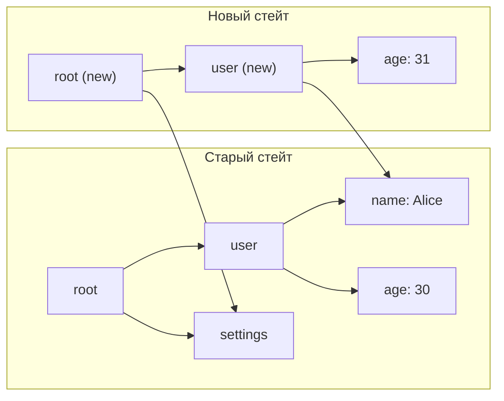
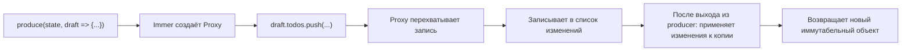
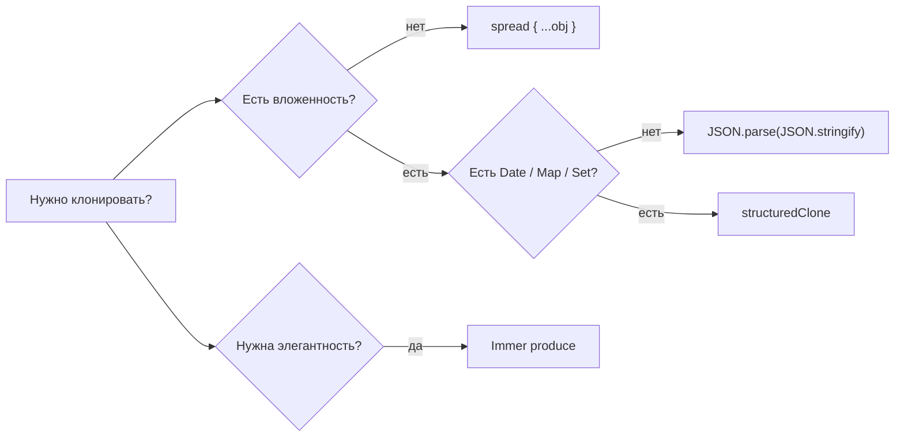

# Иммутабельность — подробно

## Аналогия

Представьте документ в Google Docs, к которому у вас есть доступ.
Если вы редактируете оригинал — все, кто смотрит на этот документ, видят ваши изменения немедленно.
Хотели они этого или нет.

Иммутабельность — это «Создать копию перед редактированием».
Ваш черновик — отдельный документ. Оригинал нетронут.
Когда вы уверены в изменениях — вы публикуете новую версию.

## Structural Sharing

Наивная иммутабельность = полное копирование при каждом изменении.
На больших структурах данных это было бы катастрофой по памяти.

**Structural sharing** — умная оптимизация: новый объект содержит только изменённые части,
остальные поддеревья разделяются со старым объектом по ссылке.



`settings` переиспользуется — не копируется.
Только `root` и `user` — новые объекты. Это эффективно.

Именно так работают immutable.js, Immer, Redux Toolkit под капотом.

## Persistent Data Structures

Термин из функционального программирования: структура данных, каждая версия которой
остаётся доступной после «модификации».

В JavaScript у нас нет persistent data structures в языке, но мы эмулируем их
через иммутабельные обновления. Это позволяет:
- Хранить историю (undo/redo)
- Безопасно кешировать предыдущие состояния
- Сравнивать версии по ссылке (быстро: `prev === next`)

## Object.freeze — поверхностность

`Object.freeze` делает объект нередактируемым, но только на один уровень:

```js
const config = Object.freeze({
  db: {
    host: 'localhost',
    port: 5432,
  },
})

config.db = {}          // TypeError в strict mode, silently ignored иначе
config.db.port = 9999   // Работает! freeze не глубокий
```

Для глубокой заморозки нужна рекурсия:
```js
function deepFreeze(obj) {
  Object.getOwnPropertyNames(obj).forEach(name => {
    const val = obj[name]
    if (typeof val === 'object' && val !== null) deepFreeze(val)
  })
  return Object.freeze(obj)
}
```

На практике `deepFreeze` редко используют в production — слишком много накладных расходов.
В React-проектах достаточно дисциплины и Immer.

## Immer internals: Proxy

Immer использует JavaScript `Proxy` — объект-«обёртку», перехватывающий обращения к свойствам.



Внутри `produce` вы работаете с Proxy, который выглядит как обычный объект,
но каждое «мутирующее» действие записывается в журнал.
После выхода из функции Immer применяет журнал к структурной копии оригинала.

Вы получаете:
- Простой императивный код
- Гарантированную иммутабельность результата
- Structural sharing (изменились только затронутые ветки)

## Производительность иммутабельности

Частый аргумент против: «копирование — это медленно».
На практике это почти никогда не узкое место:

1. **Structural sharing** минимизирует реальное копирование.
2. **Референциальное сравнение** (`===`) ускоряет React reconciliation.
   React.memo, useMemo, useCallback работают именно на этом.
3. Стоимость мутации — это стоимость отладки непредсказуемого состояния.

Когда производительность действительно важна (горячий цикл, WebAssembly):
мутация локальных переменных внутри функции — это нормально.

## Стратегии клонирования: сравнение



| Способ | Глубина | Date | Map/Set | Функции | Скорость |
|--------|---------|------|---------|---------|---------|
| `{ ...obj }` | shallow | ok | ok | ok | быстро |
| JSON | deep | string | потеря | потеря | медленно |
| structuredClone | deep | ok | ok | нет | средне |
| Immer | deep | ok | ok | ok | средне |

## Когда мутация допустима

Иммутабельность — это о публичных данных, о данных между компонентами, о состоянии.
Внутри функции, пока данные ещё «ваши» — мутируйте:

```js
// Это нормально — result не выходит за пределы функции
function normalize(items) {
  const result = {}
  for (const item of items) {
    result[item.id] = item  // мутация локальной переменной
  }
  return result
}
```

```js
// Это нормально — draft это специальный Proxy от Immer
produce(state, draft => {
  draft.count++  // выглядит как мутация, но Immer контролирует это
})
```

```js
// Это опасно — мутируем аргумент, который пришёл снаружи
function addTag(user, tag) {
  user.tags.push(tag)  // мутируем чужой объект!
  return user
}
```

## Иммутабельность и React

React строится на предположении, что если ссылка на объект не изменилась — объект не изменился.
Нарушение этого соглашения через мутацию даёт трудно воспроизводимые баги:

```js
// Bug: React не перерисует компонент
function Component({ items }) {
  const [list, setList] = useState(items)
  const addItem = (item) => {
    list.push(item)   // мутация — React не видит изменения
    setList(list)     // та же ссылка => нет ре-рендера
  }
}

// Правильно
const addItem = (item) => {
  setList(prev => [...prev, item])  // новая ссылка => ре-рендер
}
```

## Типичные ошибки

**Забыть про вложенные массивы:**
```js
// Плохо: items — тот же массив
const next = { ...state, items: state.items }
next.items.push(x)  // мутирует state.items!

// Хорошо
const next = { ...state, items: [...state.items, x] }
```

**Деструктурирование не копирует:**
```js
const { user } = state         // user — та же ссылка
user.name = 'Bob'              // мутирует state.user!

const { user: { ...userCopy } } = state  // теперь копия
userCopy.name = 'Bob'                    // ок
```

**Array.sort мутирует на месте:**
```js
// Плохо
return { ...state, items: state.items.sort(compareFn) }

// Хорошо
return { ...state, items: [...state.items].sort(compareFn) }
```
