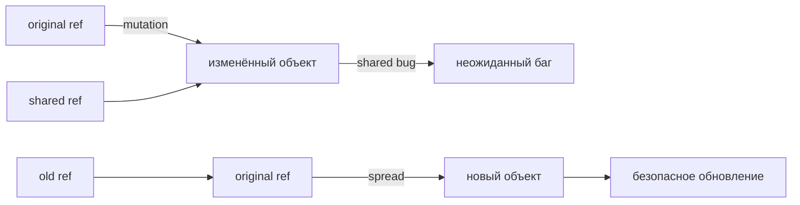

# Иммутабельность

## Что это и зачем

Иммутабельность — принцип, при котором данные после создания не изменяются.
Вместо изменения объекта создаётся новый с нужными значениями.

Это не ограничение языка, а осознанное решение.
JavaScript позволяет мутировать что угодно — но это не значит, что нужно.

## Проблемы мутаций

Когда несколько частей программы держат одну ссылку на объект, мутация в одном месте
ломает другие — неочевидно и трудно отлаживается.

```js
// Shared state bug
const user = { name: 'Alice', age: 30 }
const cache = user              // тот же объект
user.age = 31                   // меняем
console.log(cache.age)          // 31 — сюрприз!
```

Ещё одна проблема: React не перерисовывает компонент, если ссылка на объект не изменилась.
Мутация объекта «в тихую» означает, что UI не обновится.

## Диаграмма: мутация vs копия



## Инструменты

**Object.freeze** — запрещает мутации (только верхний уровень):
```js
const obj = Object.freeze({ a: 1, nested: { b: 2 } })
obj.a = 99        // silently ignored (strict: TypeError)
obj.nested.b = 99 // работает! freeze поверхностный
```

**Spread оператор** — создаёт новый объект с копией полей:
```js
const updated = { ...user, age: 31 }
user === updated  // false — новая ссылка
```

**structuredClone** — глубокое клонирование, встроено в современные браузеры и Node 17+:
```js
const deep = structuredClone(obj)
// Date, Array, Map, Set сохраняются корректно
// Функции и DOM-узлы не клонируются
```

**Immer** — пишем «мутирующий» код, получаем иммутабельный результат:
```js
import { produce } from 'immer'

const next = produce(state, draft => {
  draft.user.settings.theme = 'light' // выглядит как мутация
  draft.todos.push({ id: 3, text: 'new' })
})
// state не изменился, next — новый объект
```

## Когда мутация допустима

Мутация внутри функции, которая не «утекает» наружу — не проблема:

```js
function buildReport(items) {
  const result = []          // локальная переменная
  for (const item of items) {
    result.push(item.value)  // мутируем result — ок
  }
  return result
}
```

Правило: мутируй только то, что создал сам и что не видно снаружи.

## Распространённые ошибки новичков

**1. Неполный spread для вложенных объектов:**
```js
// Плохо
const next = { ...state, user: state.user }
next.user.name = 'Bob'  // мутирует оригинал!

// Хорошо
const next = { ...state, user: { ...state.user, name: 'Bob' } }
```

**2. Array.sort мутирует массив:**
```js
// Плохо
const sorted = arr.sort()  // arr изменился

// Хорошо
const sorted = [...arr].sort()
```

**3. JSON.parse/stringify теряет типы:**
```js
const clone = JSON.parse(JSON.stringify({ d: new Date() }))
typeof clone.d  // 'string', а не Date
```
