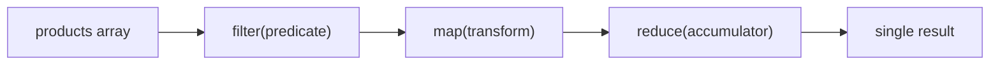

# Функции высшего порядка

## Функции как объекты первого класса

В JavaScript функция — это значение. Её можно сохранить в переменную, передать
в другую функцию, вернуть из функции. Именно это делает возможными функции высшего
порядка (Higher-Order Functions, HOF).

```js
// Функция в переменной
const greet = (name) => `Привет, ${name}!`

// Функция как аргумент
[1, 2, 3].forEach(n => console.log(n))

// Функция как возвращаемое значение
const multiply = (factor) => (n) => n * factor
const double = multiply(2)
double(5)  // 10
```

**Функция высшего порядка** — функция, которая принимает другую функцию как аргумент
и/или возвращает функцию.

## map / filter / reduce

Три кита работы с массивами в FP. Каждый — HOF из стандартной библиотеки.

```js
const products = [
  { name: 'Laptop',  price: 1200 },
  { name: 'Book',    price: 25   },
  { name: 'Monitor', price: 450  },
]

// filter — оставляет элементы по предикату (функция -> boolean)
const expensive = products.filter(p => p.price > 100)
// [{ Laptop, 1200 }, { Monitor, 450 }]

// map — трансформирует каждый элемент
const names = products.map(p => p.name)
// ['Laptop', 'Book', 'Monitor']

// reduce — сворачивает массив в одно значение
const total = products.reduce((sum, p) => sum + p.price, 0)
// 1675
```

Их мощь — в возможности цепочки:

```js
const total = products
  .filter(p => p.price > 100)
  .map(p => p.price * 0.9)     // скидка 10%
  .reduce((s, p) => s + p, 0)  // сумма
```

## Диаграмма пайплайна



## Замыкания

Когда функция «запоминает» окружение в котором была создана — это замыкание.
Внутренняя функция имеет доступ к переменным внешней даже после того, как
внешняя уже завершила работу.

```js
function createCounter(initial) {
  let count = initial  // приватная переменная

  return {
    increment: () => { count++ },
    getCount:  () => count,
  }
}

const c = createCounter(0)
c.increment()
c.increment()
c.getCount()  // 2 — count живёт в замыкании
```

Переменная `count` недоступна снаружи — это приватное состояние через замыкание.

## Где HOF встречаются в браузере

```js
// addEventListener — HOF: принимает callback
button.addEventListener('click', () => console.log('clicked'))

// setTimeout — HOF: принимает функцию и задержку
setTimeout(() => console.log('3 секунды'), 3000)

// Array.prototype.sort — HOF: принимает компаратор
arr.sort((a, b) => a - b)

// Promise.then — HOF: принимает callback для успеха
fetch('/api').then(res => res.json())
```

## Распространённые ошибки новичков

**1. Вызов функции вместо передачи:**

```js
// Плохо — onClick сразу вызывает handleClick() при рендере
<button onClick={handleClick()}>

// Хорошо — передаём ссылку на функцию
<button onClick={handleClick}>
<button onClick={() => handleClick(id)}>
```

**2. Забыть возвращаемое значение в map:**

```js
// Плохо — map возвращает массив undefined
const prices = products.map(p => { p.price * 2 })  // нет return!

// Хорошо
const prices = products.map(p => p.price * 2)
const prices = products.map(p => { return p.price * 2 })
```

**3. Мутировать аргумент внутри map:**

```js
// Плохо — мутируем исходный объект
const result = products.map(p => { p.price *= 0.9; return p })

// Хорошо — возвращаем новый объект
const result = products.map(p => ({ ...p, price: p.price * 0.9 }))
```

**4. Использовать forEach когда нужен map:**

```js
// Плохо — forEach возвращает undefined
const doubled = [1, 2, 3].forEach(n => n * 2)  // undefined!

// Хорошо
const doubled = [1, 2, 3].map(n => n * 2)  // [2, 4, 6]
```
