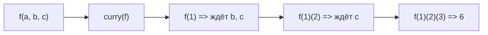

# Каррирование

## Откуда название

Термин «каррирование» назван в честь математика Хаскелла Карри, хотя идею первым описал Мозес Шёнфинкель.
Суть: преобразовать функцию от многих аргументов в цепочку функций, каждая из которых принимает один аргумент.

```js
// Обычная функция
const add = (a, b, c) => a + b + c
add(1, 2, 3)  // 6

// Каррированная форма
const addC = a => b => c => a + b + c
addC(1)(2)(3)  // 6
```

## Ручное каррирование vs автоматическое

Можно писать функции сразу в каррированной форме — это ручное каррирование.
Можно использовать утилиту `curry`, которая превращает любую функцию автоматически.

```js
function curry(fn) {
  const arity = fn.length
  return function curried(...args) {
    if (args.length >= arity) return fn(...args)
    return (...more) => curried(...args, ...more)
  }
}

const add = curry((a, b, c) => a + b + c)
add(1)(2)(3)    // 6 — по одному
add(1, 2)(3)    // 6 — два потом один
add(1)(2, 3)    // 6 — один потом два
add(1, 2, 3)    // 6 — сразу все
```

## Диаграмма частичного применения



## Зачем каррировать

Основная польза — **частичное применение**: зафиксировать часть аргументов заранее.

```js
const multiply = curry((a, b) => a * b)
const double   = multiply(2)  // зафиксировали 2
const triple   = multiply(3)  // зафиксировали 3

[1, 2, 3, 4].map(double)  // [2, 4, 6, 8]
[1, 2, 3, 4].map(triple)  // [3, 6, 9, 12]
```

Вместо `n => n * 2` мы передаём `double` — это **point-free** стиль.

## Partial application vs Currying

Оба паттерна фиксируют аргументы, но по-разному.

```js
// partial — фиксирует N первых аргументов сразу
function partial(fn, ...presetArgs) {
  return (...rest) => fn(...presetArgs, ...rest)
}

const add5 = partial(add, 2, 3)  // фиксируем сразу 2 и 3
add5(10)  // 15

// curry — даёт возможность применять по одному
const addC = curry(add)
const add2 = addC(2)      // фиксируем только 2
const add5 = add2(3)      // дофиксируем 3
add5(10)  // 15
```

## Point-free стиль

Каррированные функции открывают point-free: описание трансформации без упоминания данных.

```js
const prop      = key => obj => obj[key]
const filterBy  = pred => arr => arr.filter(pred)
const mapWith   = fn   => arr => arr.map(fn)

// Verbose
users.filter(u => u.active).map(u => u.name)

// Point-free
pipe(filterBy(prop('active')), mapWith(prop('name')))(users)
```

## Типичные ошибки новичков

**1. Забыть про арность:**

```js
// Плохо — curry не знает сколько ждать аргументов у rest-функции
const f = curry((...args) => args.reduce((a, b) => a + b, 0))
f(1)(2)  // не сработает как ожидается — fn.length === 0

// Хорошо — явные аргументы
const f = curry((a, b, c) => a + b + c)
```

**2. Смешивать порядок аргументов:**

```js
// Плохо — данные первыми делают частичное применение бесполезным
const filter = (data, pred) => data.filter(pred)

// Хорошо — данные последними, конфиг первым
const filter = pred => data => data.filter(pred)
filter(x => x > 0)([1, -2, 3])  // можно передавать как filterPositive
```

**3. Переусердствовать с point-free:**

```js
// Плохо — нечитаемо
const process = pipe(map(prop('a')), filter(compose(not, isNil, prop('b'))), ...)

// Хорошо — явные переменные когда логика сложная
const process = items => items
  .map(item => item.a)
  .filter(item => item.b != null)
```
