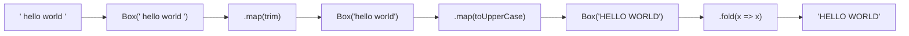

# Функторы

## Что такое функтор

Функтор — это значение, помещённое в контекст, которое умеет применять функцию к своему содержимому, не выходя из контекста.

Если ещё проще: функтор = коробка, у которой есть метод `map`.

```js
// Массив — самый известный функтор
[1, 2, 3].map(x => x * 2)  // [2, 4, 6]
// Значения умножились, но остались в массиве (контексте)
```

## Паттерн Box

Простейший функтор — `Box`. Оборачивает одно значение и позволяет строить цепочки трансформаций:

```js
class Box {
  constructor(value) { this._value = value }
  static of(value) { return new Box(value) }
  map(fn) { return new Box(fn(this._value)) }  // трансформируем, остаёмся в Box
  fold(fn) { return fn(this._value) }           // выходим из Box
}

Box.of('  hello world  ')
  .map(s => s.trim())
  .map(s => s.toUpperCase())
  .fold(s => s)
// => 'HELLO WORLD'
```



`fold` — единственный выход из Box. Это принципиально: пока мы внутри Box, трансформации можно безопасно цеплять.

## Массив как функтор

Array — функтор, потому что:

- обёртывает значения (контекст = список)
- имеет `map`, который применяет функцию к каждому элементу
- `map` всегда возвращает новый массив (остаётся в контексте)

```js
['a', 'b', 'c'].map(s => s.toUpperCase())  // ['A', 'B', 'C']
```

## Законы функторов

Чтобы что-то называлось функтором, `map` обязан соблюдать два закона:

**Закон 1 — Идентичность (Identity):**

```js
F.map(x => x)  ===  F
// Применение функции-тождества не меняет функтор
```

**Закон 2 — Композиция (Composition):**

```js
F.map(f).map(g)  ===  F.map(x => g(f(x)))
// Два map подряд = один map с составной функцией
```

Закон 2 важен для оптимизации: вместо двух проходов по массиву можно сделать один.

## Аналогия

Функтор — как конверт с письмом. `map` позволяет редактировать текст, не вскрывая конверт. `fold` — вскрыть и достать содержимое.

## Типичные ошибки

**Мутировать значение внутри map:**

```js
// Плохо
box.map(arr => { arr.push(1); return arr })  // меняет оригинал

// Хорошо
box.map(arr => [...arr, 1])                  // возвращает новый массив
```

**Вернуть не Box из map:**

```js
// Плохо — нарушает закон, цепочка сломается
map(fn) { return fn(this._value) }

// Хорошо — всегда возвращаем тот же тип контейнера
map(fn) { return new Box(fn(this._value)) }
```
