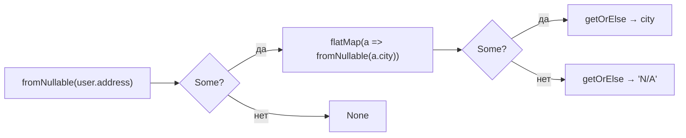
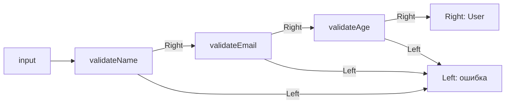

# Maybe и Either

## Maybe: замена null-проверок

`Maybe<T>` — контейнер, который либо содержит значение (`Some`), либо не содержит ничего (`None`). Он делает отсутствие значения **явным на уровне типов** и исключает `TypeError: Cannot read properties of null`.

```ts
type Maybe<T> = { tag: 'Some'; value: T } | { tag: 'None' }

const Some = <T>(value: T): Maybe<T> => ({ tag: 'Some', value })
const None: Maybe<never> = { tag: 'None' }

// Точка входа: превращает null/undefined в None
const fromNullable = <T>(v: T | null | undefined): Maybe<T> =>
  v == null ? None : Some(v)
```

Ключевые операции:

| Функция | Назначение |
|---|---|
| `fromNullable(v)` | `null/undefined → None`, иначе `Some(v)` |
| `map(m, fn)` | применяет `fn` если `Some`, иначе возвращает `None` |
| `flatMap(m, fn)` | как `map`, но `fn` сама возвращает `Maybe` |
| `getOrElse(m, def)` | извлекает значение или возвращает `def` |



---

## Either: замена try/catch

`Either<L, R>` — контейнер с **двумя** возможными состояниями: `Left` (ошибка) и `Right` (успех). По соглашению Left — это "что-то пошло не так" (Left = плохо), Right — успех (Right = правильно).

```ts
type Either<L, R> = { tag: 'Left'; value: L } | { tag: 'Right'; value: R }

const Left  = <L>(value: L): Either<L, never> => ({ tag: 'Left', value })
const Right = <R>(value: R): Either<never, R> => ({ tag: 'Right', value })
```

Операции аналогичны Maybe, но работают только над `Right`. `Left` "протаскивается" насквозь без изменений — именно это делает возможным railway-oriented programming.

---

## Railway-oriented programming

Идея Скотта Влашина: функции выстраиваются в **два рельса** — Success track (Right) и Failure track (Left). При первой ошибке цепочка "переключается" на рельс ошибки, и все последующие функции **пропускаются**.



Это аналог цепочки `.then()` в Promise, только синхронный и полностью типизированный.

---

## Конвертация Maybe в Either

```ts
const maybeToEither = <T>(m: Maybe<T>, error: string): Either<string, T> =>
  m.tag === 'Some' ? Right(m.value) : Left(error)
```

Используется когда функция поиска возвращает `Maybe`, но нужно продолжить `Either`-пайплайн с описанием причины ошибки.
