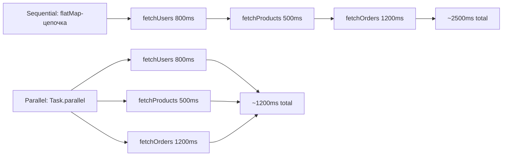

# Монады: продвинуто

## IO: оборачиваем побочные эффекты

Чистые функции не могут обращаться к файловой системе, базе данных, часам или случайности — они нарушают детерминированность. IO-монада решает это иначе: функция **не выполняет** эффект, а **возвращает описание** эффекта. Само выполнение откладывается на "конец мира" — момент, когда вы явно вызываете `run()`.

```ts
class IO<T> {
  constructor(private effect: () => T) {}

  static of<T>(value: T): IO<T>               // поднять значение
  map<U>(fn: (value: T) => U): IO<U>           // трансформировать без запуска
  flatMap<U>(fn: (value: T) => IO<U>): IO<U>   // цепочка IO-шагов
  run(): T                                     // ТОЛЬКО здесь происходят эффекты
}
```

Аналогия: IO — это **рецепт**. Рецепт описывает, как приготовить блюдо, но ничего не готовит, пока вы не скажете "Готовь!". Можно передавать рецепт, копировать, комбинировать — еда не появится сама собой.


Ключевое свойство: один и тот же IO можно запустить **несколько раз** — каждый раз эффект выполнится заново.

---

## Task: асинхронная IO-монада

`Task<T>` — то же самое, что IO, но обёртка над `() => Promise<T>` вместо `() => T`. Ключевое отличие от Promise: Task **ленив**, Promise **энергичен**.

| | Promise | Task |
|---|---|---|
| Когда запускается | При создании (`new Promise(...)`) | При явном вызове `.run()` |
| Повторный запуск | Нельзя | Можно — `task.run()` снова |
| Комбинирование | `.then()` / `async/await` | `.map()` / `.flatMap()` / `.run()` |



`Task.parallel` превращает массив Task в один Task, который запускает все параллельно через `Promise.all`.

---

## Do-нотация: flatMap без лестницы

Длинная цепочка `flatMap` уходит вправо:

```ts
// Вложенность нарастает с каждым шагом
eitherFlatMap(parseHost(host), host =>
  eitherFlatMap(parsePort(port), port =>
    eitherFlatMap(parseDbName(dbName), dbName =>
      Right({ host, port, dbName })
    )
  )
)
```

Do-нотация через генераторы делает то же самое в линейном стиле:

```ts
Do(function* () {
  const host   = yield parseHost(host)    // если Left — выход немедленно
  const port   = yield parsePort(port)    // если Left — выход немедленно
  const dbName = yield parseDbName(dbName)
  return { host, port, dbName }           // автоматически оборачивается в Right
})
```

`yield` здесь означает "распакуй Either или прервись на Left". Генератор реализует то же short-circuit поведение, что и вложенный flatMap — но без вложенности.

---

## Аналогия: async/await — встроенная Do-нотация

`async/await` — это Do-нотация для Promise, встроенная в язык:

```ts
// Do(function* () { ... })  ←→  async function() { ... }
// yield someEither          ←→  await somePromise

async function getData() {
  const users    = await fetchUsers()    // "распакуй Promise или прервись на reject"
  const products = await fetchProducts()
  return { users, products }
}
```

Монады позволяют применить тот же паттерн к **любому** контейнеру, а не только к Promise.

---

## Когда применять

| Монада | Когда использовать |
|---|---|
| IO | Синхронные побочные эффекты, которые нужно отложить или повторить |
| Task | Асинхронные операции (HTTP, I/O), нужна ленивость или параллелизм |
| Do-нотация | Цепочки flatMap из 3+ шагов, каждый зависит от предыдущего |

---

## Общие ошибки

**Запуск IO при построении:**

```ts
// Плохо: эффект уже выполнился при создании
const io = new IO(() => console.log('side effect'))
// Хорошо: эффект происходит только в run()
const io = new IO(() => someEffect())
io.run() // только здесь
```

**Забыть вызвать run():**

```ts
const pipeline = buildIOPipeline() // IO<Report>
// Без .run() — просто объект, никакого результата
const result = pipeline.run()      // вот теперь работает
```

**Использовать yield вне Do:**

```ts
// yield вне генератора — синтаксическая ошибка или неверное поведение
const result = yield parsePort(port)  // Нельзя — только внутри Do(function* () { ... })
```
