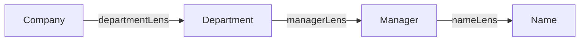
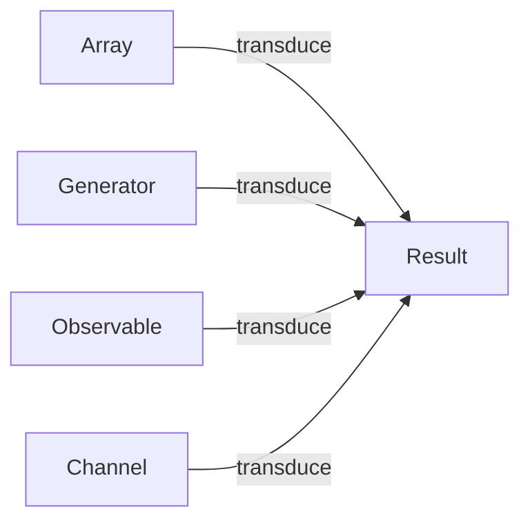
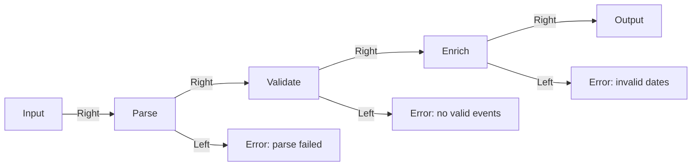

# Уровень 8: Трансформации данных (расширенная теория)

## Lens: прицел снайпера

Представьте снайперский прицел. Он фокусируется ровно на одной точке и позволяет
воздействовать на неё, не затрагивая ничего вокруг. Lens в FP — то же самое:
пара функций get/set, сфокусированная на одном поле структуры данных.

### Проблема иммутабельных обновлений

Иммутабельный код приводит к многословному spread-коду при работе с вложенными структурами:

```ts
// Без линз — повторяем структуру вручную при каждом обновлении
const setManagerName = (name: string, company: Company): Company => ({
  ...company,
  departments: company.departments.map((d, i) =>
    i === 0
      ? { ...d, manager: { ...d.manager, name } }
      : d
  )
})
```

При изменении структуры все эти места ломаются. Линза инкапсулирует знание
о том, как добраться до поля и как собрать новую структуру обратно.

### Устройство Lens

```ts
type Lens<S, A> = {
  get: (source: S) => A          // "посмотреть через прицел"
  set: (value: A, source: S) => S // "изменить через прицел"
}

// Три операции
const view = <S, A>(l: Lens<S, A>, s: S): A =>
  l.get(s)

const lset = <S, A>(l: Lens<S, A>, a: A, s: S): S =>
  l.set(a, s)

const over = <S, A>(l: Lens<S, A>, fn: (a: A) => A, s: S): S =>
  l.set(fn(l.get(s)), s)
```

💡 `over` — это `lset(l, fn(view(l, s)), s)`. Это самая мощная операция:
обновить значение, зная текущее.

### Законы линз

Хорошая линза обязана выполнять три закона:

```ts
// 1. get-set: если поставить то же значение — ничего не меняется
lset(l, view(l, s), s) === s

// 2. set-get: после set — get возвращает новое значение
view(l, lset(l, a, s)) === a

// 3. set-set: два set подряд — побеждает последний
lset(l, b, lset(l, a, s)) === lset(l, b, s)
```

Нарушение закона 1 — лишние аллокации. Нарушение закона 2 — set что-то игнорирует.
Нарушение закона 3 — set имеет побочные эффекты сверх ожидаемого.

### Композиция линз

Ключевое свойство: линзы компонуются как функции.



```ts
const composeLens = <A, B, C>(outer: Lens<A, B>, inner: Lens<B, C>): Lens<A, C> => ({
  get: s => inner.get(outer.get(s)),
  set: (c, s) => outer.set(inner.set(c, outer.get(s)), s),
})

// Теперь можно компоновать:
const managerNameLens = composeLens(
  composeLens(departmentLens(0), managerLens),
  nameLens
)

view(managerNameLens, company)           // 'Alice'
lset(managerNameLens, 'Bob', company)    // новый Company с новым именем менеджера
```

### Van Laarhoven lenses (упоминание)

Существует более обобщённая форма линз через функторы (Van Laarhoven lenses),
используемая в библиотеках вроде `monocle-ts` и Haskell `lens`:

```ts
// Вместо { get, set } — одна функция с Functor
type Lens<S, A> = <F>(f: (a: A) => F<A>) => (s: S) => F<S>
```

Это позволяет использовать одну функцию и для чтения, и для модификации —
путём выбора подходящего функтора. В учебных целях достаточно простой формы,
но стоит знать, что промышленные реализации выглядят иначе.

---

## Transducers: идея из Clojure

Transducers появились в Clojure (Rich Hickey, 2014). Цитата из оригинального анонса:

> "Transducers are a powerful and composable way to build algorithmic transformations
> that you can reuse in many contexts, and they're separate from the context of their
> input and output sources and sinks."

Суть: трансформация отделена от структуры данных. Один и тот же transducer
можно применить к массиву, потоку, каналу, Observable — без изменения кода трансформации.

### Почему обычная цепочка неэффективна

```ts
products
  .filter(p => p.price > 100)  // проходит все 1000 элементов, создаёт массив #1
  .map(applyDiscount)           // проходит отфильтрованные элементы, создаёт массив #2
  .slice(0, 10)                 // создаёт массив #3
```

Проблемы:
- 3 промежуточных массива = 3 аллокации в памяти
- Если `filter` пропустил 50 элементов из 1000 — `map` обрабатывает все 50,
  хотя нам нужны только 10
- Нельзя применить к потоку/генератору

### Как работает transducer

```ts
type Reducer<A, B> = (acc: A, item: B) => A
type Transducer<A, B> = <R>(reducer: Reducer<R, B>) => Reducer<R, A>
```

Transducer принимает "последующий" редьюсер и возвращает "новый" редьюсер.
Это как middleware: каждый шаг решает, передавать ли элемент дальше.

```ts
const filtering = <A>(pred: (a: A) => boolean): Transducer<A, A> =>
  <R>(reducer: Reducer<R, A>): Reducer<R, A> =>
    (acc, item) => pred(item) ? reducer(acc, item) : acc
//               ^^ не вызываем reducer — элемент отброшен
```

### Порядок composition transducers

Это ключевая точка путаницы. В отличие от `compose` функций, transducers
компонуются в порядке применения (как `pipe`):

```ts
// Для функций: compose(f, g)(x) = f(g(x)) — g применяется первой
// Для transducers: composeTransducers(t1, t2) — t1 применяется первым

const xf = composeTransducers(
  composeTransducers(filtering(pred), mapping(fn)),
  taking(10)
)
// Порядок обработки: filtering → mapping → taking
```

Это происходит потому что transducer "оборачивает" редьюсер снаружи,
и при реальном выполнении данные идут от внешнего к внутреннему.

### Pull vs Push: контекст применения

Transducers независимы от направления потока:



```ts
// Array (pull)
transduce(xf, appendReducer, [], productsArray)

// Generator (pull)
function* transduceGen<A, B>(xf: Transducer<A, B>, source: Iterable<A>): Iterable<B> {
  const results: B[] = []
  const r = xf((acc: B[], item: B) => { acc.push(item); return acc })
  for (const item of source) r(results, item)
  yield* results
}
```

### Когда transducers оправданы, а когда overkill

Используйте transducers, если:
- Датасет большой (тысячи+ элементов) и производительность имеет значение
- Трансформация применяется к разным источникам данных (массив + поток)
- Несколько шагов трансформации, и каждый создаёт промежуточную коллекцию

Не используйте transducers, если:
- Датасет маленький — цепочка `.filter().map()` понятнее и быстрее для компилятора
- Нет необходимости переиспользовать трансформацию между источниками
- Команда не знакома с концепцией — усложнит поддержку без выгоды

---

## FP Data Pipeline: архитектура

### Railway-oriented programming

Метафора: поезд едет по рельсам. На каждой остановке (этапе) может перейти
на запасной путь (Left) — и тогда уже никогда не вернётся на основной:



### Связь pipe + lens + transducers

Все три паттерна — частные случаи одной идеи: **компоновка трансформаций**.

- `pipe` компонует функции `A → B → C → D`
- `lens` компонует фокусы `S → A → B → C`
- `transducer` компонует редьюсеры `Reducer<R, D> → Reducer<R, C> → Reducer<R, A>`

Пайплайн данных использует `pipe`/Either для последовательности этапов,
`lens` для точечных обновлений внутри этапов,
`transducers` для эффективного прохода по большим коллекциям внутри этапов.

### Чистые функции на каждом этапе

Каждый этап пайплайна обязан быть чистым:

```ts
// Хорошо: чистая функция, нет побочных эффектов
function validateEvents(events: RawEvent[]): Either<string, ValidEvent[]> {
  return events.every(isValid)
    ? Right(events.map(toValid))
    : Left('validation failed')
}

// Плохо: логирование внутри этапа — побочный эффект
function validateEvents(events: RawEvent[]): Either<string, ValidEvent[]> {
  console.log('Validating...')  // побочный эффект!
  return ...
}

// Решение: логирование снаружи пайплайна
const result = validateEvents(events)
if (result.tag === 'Left') logger.warn('Validation failed:', result.value)
```

### Типизация пайплайна

TypeScript позволяет строго типизировать каждый переход:

```ts
function parseJSON(input: string): Either<string, RawEvent[]>
function validateEvents(events: RawEvent[]): Either<string, ValidEvent[]>
function enrichEvents(events: ValidEvent[]): Either<string, EnrichedEvent[]>

// Компилятор проверяет: выход одного = вход следующего
const result: Either<string, FormattedResult[]> = pipeChain(
  pipeChain(parseJSON(input), validateEvents),
  enrichEvents
)
```

Если перепутать порядок или типы — TypeScript сообщит об ошибке на этапе компиляции.

⚠️ **Типичные ошибки начинающих**

```ts
// Мутация внутри set-функции линзы:
const nameLens = lens(
  s => s.name,
  (a, s) => { s.name = a; return s }  // МУТАЦИЯ! Законы нарушены
)

// Either-ветка игнорируется — пайплайн "глотает" ошибки:
const result = validateEvents(events)
return enrichEvents(result as ValidEvent[])  // краш если result = Left

// Transducers — забытый сброс счётчика taking:
const taking = n => reducer => {
  let count = 0  // если переиспользовать transducer — count не сбросится!
  return (acc, item) => count++ < n ? reducer(acc, item) : acc
}
// Решение: создавать новый transducer для каждого вызова transduce
```

📌 **Best practices**

- Lens: всегда проверяйте три закона (get-set, set-get, set-set)
- Transducer: создавайте новый экземпляр перед каждым `transduce` (из-за внутреннего состояния `taking`)
- Pipeline: держите все этапы чистыми, эффекты (логирование, метрики) — снаружи
- Either в пайплайне: никогда не делайте `as Right<T>` — это обходит всю защиту типов
