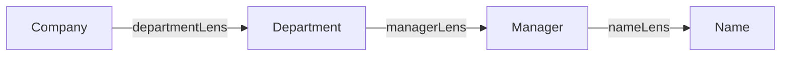
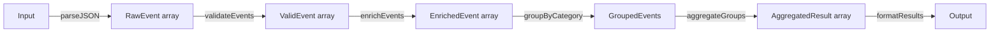

# Уровень 8: Трансформации данных

## Lens: иммутабельный фокус

Обновить вложенное поле в иммутабельном объекте без Lens выглядит неуклюже:

```ts
// Обычный spread — повторяем всю структуру вручную
const updated = {
  ...company,
  departments: company.departments.map((d, i) =>
    i === 0
      ? { ...d, manager: { ...d.manager, name: 'Bob' } }
      : d
  )
}
```

Lens делает это обобщённо:

```ts
type Lens<S, A> = {
  get: (source: S) => A
  set: (value: A, source: S) => S  // возвращает новый S, source не мутируется
}

const view = <S, A>(l: Lens<S, A>, s: S): A => l.get(s)
const lset = <S, A>(l: Lens<S, A>, a: A, s: S): S => l.set(a, s)
const over = <S, A>(l: Lens<S, A>, fn: (a: A) => A, s: S): S =>
  l.set(fn(l.get(s)), s)
```

### Композиция линз

Линзы компонуются: если есть линза на поле A и линза на поле внутри A,
можно получить линзу прямо до внутреннего поля.



```ts
const composeLens = <A, B, C>(outer: Lens<A, B>, inner: Lens<B, C>): Lens<A, C> => ({
  get: s => inner.get(outer.get(s)),
  set: (c, s) => outer.set(inner.set(c, outer.get(s)), s),
})

const managerNameLens = composeLens(
  composeLens(departmentLens(0), managerLens),
  nameLens
)

const updated = lset(managerNameLens, 'Bob', company)
// company не изменён, updated — новый объект
```

---

## Transducers: композиция без промежуточных массивов

Цепочка `filter → map → slice` создаёт три промежуточных массива:

```ts
products
  .filter(p => p.price > 100)  // массив 1
  .map(applyDiscount)           // массив 2
  .slice(0, 10)                 // массив 3
```

Transducer — это функция над редьюсером:

```ts
type Reducer<A, B> = (acc: A, item: B) => A
type Transducer<A, B> = <R>(reducer: Reducer<R, B>) => Reducer<R, A>
```

Примитивы:

```ts
const mapping = fn => reducer => (acc, item) => reducer(acc, fn(item))
const filtering = pred => reducer => (acc, item) => pred(item) ? reducer(acc, item) : acc
const taking = n => reducer => { let count = 0; return (acc, item) => count++ < n ? reducer(acc, item) : acc }
```

Один проход, никаких промежуточных массивов:

```ts
const xf = composeTransducers(
  composeTransducers(filtering(p => p.price > 100), mapping(applyDiscount)),
  taking(10)
)

transduce(xf, (acc, item) => [...acc, item], [], products)
```

---

## FP Data Pipeline

Пайплайн из чистых функций с Either на каждом шаге:



Ошибка на любом этапе — Left, все следующие этапы пропускаются:

```ts
const result = pipeChain(
  pipeChain(
    pipeChain(parseJSON(input), validateEvents),
    enrichEvents
  ),
  formatResults
)
```

⚠️ **Типичные ошибки начинающих**

```ts
// Мутация внутри set — нарушает иммутабельность линзы
const badLens = lens(
  s => s.name,
  (a, s) => { s.name = a; return s }  // мутирует source!
)

// Правильно:
const goodLens = lens(
  s => s.name,
  (a, s) => ({ ...s, name: a })  // возвращает новый объект
)
```

```ts
// Transducer — порядок compose обратный (как в pipe, не как в compose)
// Неправильно: compose(taking(10), filtering(pred), mapping(fn))
// Правильно:
const xf = composeTransducers(
  composeTransducers(filtering(pred), mapping(fn)),
  taking(10)
)
// filtering применяется первым, затем mapping, затем taking
```
