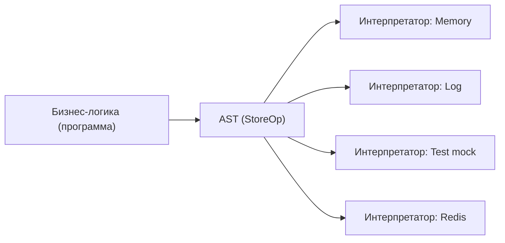

# Level 9: Алгебраические паттерны — расширенная теория

## Алгебраические структуры: от magma до monoid

Программисты работают с алгеброй каждый день, не замечая этого. Рассмотрим иерархию:

```
Magma → Semigroup → Monoid → Group → Abelian Group
```

**Magma** — просто тип с бинарной операцией. Никаких законов:
```ts
// concat(a, b) возвращает что-то того же типа
// Пример — вычитание чисел: не ассоциативно, нет нейтрального элемента
```

**Semigroup** — magma с законом ассоциативности:
```ts
// concat(concat(a, b), c) === concat(a, concat(b, c))
// Пример: строки с конкатенацией ("ab") + "c" === "a" + ("bc")
```

**Monoid** — semigroup с нейтральным элементом `empty`:
```ts
// concat(a, empty) === a
// concat(empty, a) === a
// Пример: числа с +, empty = 0
```

**Group** — monoid с обратным элементом (для каждого `a` существует `a⁻¹`):
```ts
// concat(a, inverse(a)) === empty
// Пример: целые числа с +, inverse(a) = -a
```

**Abelian Group** — group с коммутативностью:
```ts
// concat(a, b) === concat(b, a)
// Пример: числа с +
```

В повседневном программировании нас интересуют Semigroup и Monoid — они достаточно мощны и встречаются повсеместно.

## Почему Monoid так полезен

### 1. Параллелизация fold

Обычный `reduce` последователен:
```
[1, 2, 3, 4] → ((1+2)+3)+4 → 10
```

Моноидный fold можно разбить:
```
Поток 1: [1, 2] → 1+2 = 3
Поток 2: [3, 4] → 3+4 = 7
Объединить: 3+7 = 10
```

Это основа map-reduce в Hadoop/Spark: каждый воркер обрабатывает свою часть, результаты объединяются через `concat`.

### 2. Инкрементальные вычисления

Если у вас есть `result = fold(M, [a, b, c])` и добавился элемент `d`:
```
newResult = M.concat(result, d)  // не нужно пересчитывать всё!
```

Это основа кеширования агрегатов в базах данных.

### 3. Аналогия: LEGO-блоки

Monoid — это как LEGO:
- Любые два блока можно соединить (concat)
- Порядок соединения не важен для итогового результата (ассоциативность)
- Существует "пустой" блок, который ничего не добавляет (empty)
- Результат соединения — такой же блок (замкнутость)

### 4. Декларативность агрегаций

Без монады вам нужно писать:
```ts
let total = 0
let hasError = false
let maxVal = -Infinity
for (const item of items) {
  total += item.amount
  if (item.status === 'error') hasError = true
  if (item.amount > maxVal) maxVal = item.amount
}
```

С foldMap каждая агрегация — независимое, читаемое выражение:
```ts
const total    = foldMap(Sum, item => item.amount, items)
const hasError = foldMap(Any, item => item.status === 'error', items)
const maxVal   = foldMap(Max, item => item.amount, items)
```

## Semigroup без Monoid: First и Last

Не каждый Semigroup является Monoid. Классический пример — `First<T>`:

```ts
const First: Semigroup<T | null> = {
  concat: (a, _b) => a  // всегда возвращает первый ненулевой
}
```

Нельзя определить `empty` для произвольного `T`: какое значение типа `User` является "нейтральным"? `null` не является `T`.

Использование:
```ts
// Первое ненулевое значение из нескольких источников
const config = [envConfig, fileConfig, defaultConfig]
  .reduce((acc, c) => First.concat(acc, c), null)
```

## Free Monad: программа как данные (упрощённо)

Интерпретатор в задании 9.3 — упрощённая идея Free Monad. Полная версия выглядит сложнее, но идея та же: **описываем программу как структуру данных** и выбираем интерпретатор отдельно.

Зачем это нужно:
1. **Тестирование**: тестируем программу с mock-интерпретатором
2. **Оптимизация**: анализируем AST перед выполнением, убираем лишние операции
3. **Трансформация**: один и тот же запрос → SQL, NoSQL, кеш
4. **Аудит**: логируем все операции без изменения бизнес-логики



## CQRS и Event Sourcing как FP-паттерны

**CQRS (Command Query Responsibility Segregation)** — разделение операций чтения (Query) и записи (Command):

```ts
// Command — изменение состояния (как Set/Delete в нашем DSL)
type Command = SetCmd | DeleteCmd

// Query — чтение состояния (как Get)
type Query = GetQuery

// Два интерпретатора:
const commandHandler = (store: Store, cmd: Command): Store => { ... }
const queryHandler   = (store: Store, q: Query): string | null => { ... }
```

**Event Sourcing** — хранение не состояния, а цепочки событий:

```ts
type Event = { type: 'Set'; key: string; value: string }
           | { type: 'Delete'; key: string }

// Текущее состояние = fold(events) через Monoid!
const storeMonoid: Monoid<Map<string, string>> = {
  empty: new Map(),
  concat: (store, event) => {
    if (event.type === 'Set') return new Map([...store, [event.key, event.value]])
    const next = new Map(store)
    next.delete(event.key)
    return next
  }
}

const currentState = fold(storeMonoid, events)
```

Это прямое применение Monoid: каждое событие — "маленький" элемент, финальное состояние — результат fold.

## Ошибки начинающих

### Нарушение ассоциативности

❌ Плохо:
```ts
// "Monoid" для разбиения строки — НЕ ассоциативен
const Split: Semigroup<string[]> = {
  concat: (a, b) => [...a, ...b.join('').split(',')]
}
// Результат зависит от группировки!
```

✅ Хорошо:
```ts
// Правильный Monoid для массивов — простая конкатенация
const ArrayMonoid: Monoid<string[]> = {
  concat: (a, b) => [...a, ...b],
  empty: []
}
```

### Неправильный empty

❌ Плохо:
```ts
const Max: Monoid<number> = {
  concat: Math.max,
  empty: 0  // неверно! fold(Max, []) = 0, но fold(Max, [-1, -2]) = 0, а не -1
}
```

✅ Хорошо:
```ts
const Max: Monoid<number> = {
  concat: Math.max,
  empty: -Infinity  // concat(x, -Infinity) === x для любого x
}
```

### Смешивание описания и выполнения в Interpreter

❌ Плохо:
```ts
// побочный эффект внутри описания программы
function myProgram(store: Map<string, string>) {
  console.log('starting...')  // немедленный эффект при построении!
  return set('key', 'val', get('key', v => ret(v ?? '')))
}
```

✅ Хорошо:
```ts
// описание чистое, эффекты только в интерпретаторе
const myProgram: StoreOp<string> = set('key', 'val',
  get('key', v => ret(v ?? ''))
)
// runInMemory(myProgram, new Map()) — эффекты здесь
```

## Best Practices

- Определяйте `Monoid` для своих доменных типов — это упрощает агрегации
- Используйте `foldMap` вместо ручных циклов с несколькими аккумуляторами
- Проверяйте законы Monoid юнит-тестами: get-set, set-get, set-set для Lens, ассоциативность и нейтральный элемент для Monoid
- Паттерн интерпретатора применяйте когда нужны: несколько "режимов" выполнения, тестовые заглушки, аудит операций
- Не злоупотребляйте абстракциями: если у вас один вид агрегации — простой `reduce` читаемее
