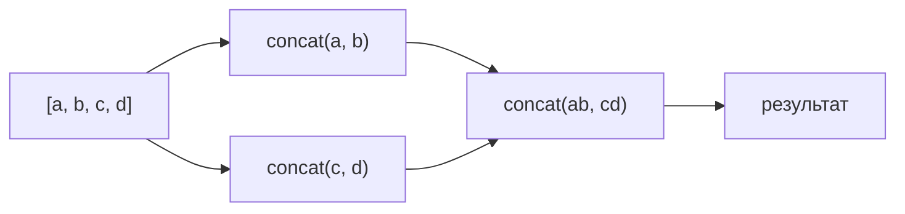
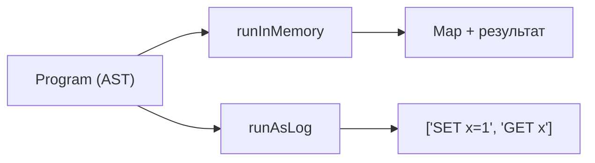

# Level 9: Алгебраические паттерны

## Что такое Semigroup и Monoid

**Semigroup** — тип с операцией `concat`, удовлетворяющей закону ассоциативности:

```
concat(concat(a, b), c) === concat(a, concat(b, c))
```

**Monoid** расширяет Semigroup нейтральным элементом `empty`:

```
concat(a, empty) === a
concat(empty, a) === a
```

Это звучит абстрактно, но вы уже знакомы со многими моноидами:

| Тип      | concat | empty    |
|----------|--------|----------|
| number   | +      | 0        |
| number   | *      | 1        |
| boolean  | &&     | true     |
| boolean  | \|\|   | false    |
| number   | min    | Infinity |
| number   | max    | -Infinity|
| string   | +      | ''       |
| T[]      | concat | []       |

## Зачем абстрагировать concat

Когда вы прячете операцию за интерфейс Monoid, вы можете написать одну функцию `fold`, которая работает с любым моноидом:

```ts
const fold = <T,>(M: Monoid<T>, xs: T[]): T =>
  xs.reduce(M.concat, M.empty)

fold(Sum, [1, 2, 3])       // 6
fold(Product, [2, 3, 4])   // 24
fold(All, [true, true])    // true
fold(Max, [7, 2, 9])       // 9
```

## foldMap — универсальная агрегация

`foldMap` комбинирует `map` и `fold` в одном проходе:

```ts
const foldMap = <A, M,>(monoid: Monoid<M>, f: (a: A) => M, xs: A[]): M =>
  fold(monoid, xs.map(f))
```

Это делает агрегацию декларативной — вы описываете **что** хотите получить, а не **как** итерировать:

```ts
const revenue     = foldMap(Sum, o => o.amount,                    completedOrders)
const hasCancelled = foldMap(Any, o => o.status === 'cancelled',   orders)
const maxOrder    = foldMap(Max, o => o.amount,                    orders)
```

## Диаграмма: fold как дерево редукций



Ассоциативность означает: порядок группировки не важен. Это позволяет **параллелизовать** fold — разбить массив на части, свернуть параллельно, объединить результаты.

## Interpreter pattern: отделение описания от выполнения

Вместо того чтобы сразу выполнять операции, описываем программу как структуру данных (AST):

```ts
type StoreOp<A> =
  | { tag: 'Get';    key: string; next: (value: string | null) => A }
  | { tag: 'Set';    key: string; value: string; next: A }
  | { tag: 'Delete'; key: string; next: A }
  | { tag: 'Return'; value: A }
```

Затем пишем разные интерпретаторы для одной программы:



Аналогия: SQL-запрос — это описание (AST), движок базы данных — интерпретатор.

## Ключевые выводы

- Semigroup и Monoid — это паттерны, абстрагирующие "соединение" значений
- Monoid = Semigroup + нейтральный элемент (`empty`)
- `foldMap` позволяет агрегировать произвольные структуры одной функцией
- Interpreter pattern разделяет построение программы и её выполнение
