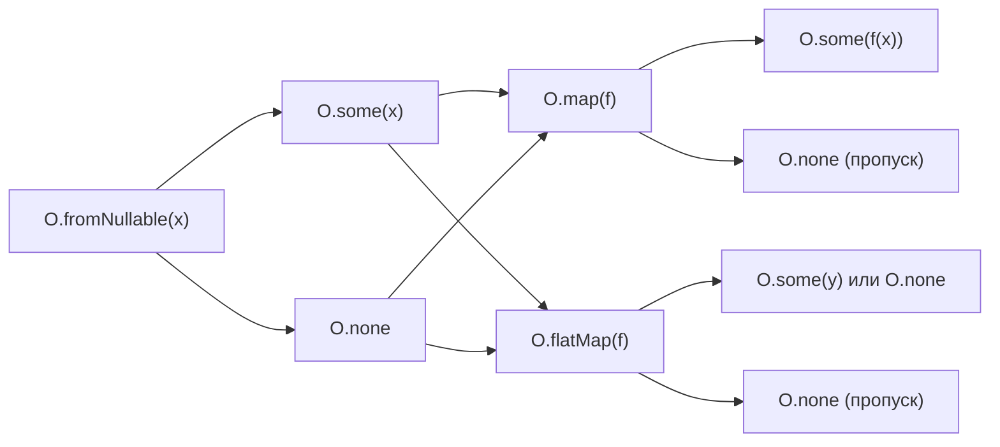
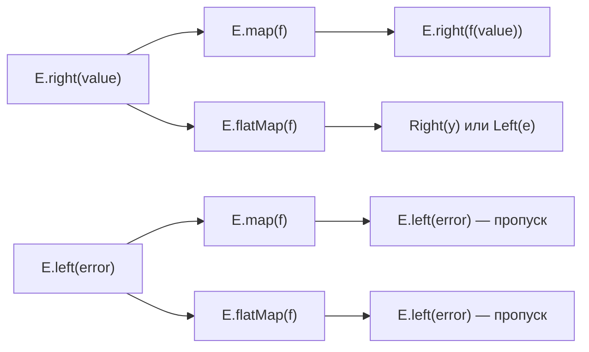

# Level 10: fp-ts — Подробная теория

## Почему fp-ts, а не ручные реализации?

Когда мы писали Maybe и Either на уровнях 6-7, это был учебный инструмент. Посмотрим на проблемы ручных реализаций в реальном проекте:

```ts
// Ручная Maybe — у каждого разработчика своя
type Maybe<T> = { tag: 'Some'; value: T } | { tag: 'None' }

// Ручная Option у другой библиотеки
type Option<T> = { kind: 'just'; data: T } | { kind: 'nothing' }

// Нет совместимости, нет стандарта, нет type class instances
```

fp-ts даёт:
1. Стандартизированный API — весь код говорит на одном языке
2. Закономерные (lawful) реализации — Option подчиняется законам Functor/Monad
3. Богатую экосистему — io-ts, fp-ts-contrib, remote-data-ts и др.
4. Модульную архитектуру — импортируйте только то что нужно

## Архитектура fp-ts

### Модульная система

Каждый тип — отдельный модуль. Нет монолитного импорта.

```ts
import * as O from 'fp-ts/Option'
import * as E from 'fp-ts/Either'
import * as TE from 'fp-ts/TaskEither'
import * as A from 'fp-ts/Array'
import * as NEA from 'fp-ts/NonEmptyArray'
import * as R from 'fp-ts/Record'
import * as S from 'fp-ts/string'
import * as N from 'fp-ts/number'
import { pipe, flow, identity, constant } from 'fp-ts/function'
```

Это не просто организация — это намеренное решение. Модули содержат type class instances (Functor, Monad, Ord, Eq), которые можно передавать как аргументы.

### Convention over configuration: pipe-first style

Все функции в fp-ts используют "data last" соглашение:

```ts
// ❌ data first (не fp-ts стиль)
A.map([1, 2, 3], x => x * 2)

// ✅ data last — работает с pipe
pipe([1, 2, 3], A.map(x => x * 2))
```

Это позволяет использовать `pipe` для composing без промежуточных переменных.

## Подробно: Option



### Ключевые функции

```ts
// Создание
O.some(42)                    // Some<number>
O.none                        // None
O.fromNullable(x)             // null/undefined → None
O.fromPredicate(n => n > 0)   // предикат → Option

// Трансформация
O.map(f)                      // Some(x) → Some(f(x)), None → None
O.flatMap(f)                  // f возвращает Option
O.ap(O.some(f))               // Applicative apply

// Извлечение
O.getOrElse(() => default)    // thunk для lazy evaluation
O.fold(onNone, onSome)        // matching без unwrap

// Комбинирование
O.alt(() => O.some(fallback)) // если None — попробовать альтернативу
O.filter(predicate)           // Some(x) где предикат true, иначе None
```

### Ошибка начинающего: getOrElse не принимает значение

```ts
// ❌ Ошибка: getOrElse принимает thunk, не значение
pipe(opt, O.getOrElse('default'))     // TypeError!

// ✅ Правильно
pipe(opt, O.getOrElse(() => 'default'))
```

Почему thunk? Потому что `default` может быть дорогим вычислением. Thunk гарантирует ленивость.

## Подробно: Either

Either — "railway-oriented programming" в реальной библиотеке.



### Widening: работа с разными типами ошибок

```ts
type ParseError = 'not_a_number'
type ValidationError = 'too_small' | 'too_large'

// E.flatMapW — "W" значит Widen (расширяет тип ошибки)
const result = pipe(
  parseNumber(input),                    // Either<ParseError, number>
  E.flatMap(n =>                         // TS автоматически расширяет тип
    n < 0 ? E.left('too_small' as const) : E.right(n)
  )
  // Тип: Either<ParseError | ValidationError, number>
)
```

В fp-ts v2.15+ `flatMap` уже делает widening автоматически (суффикс `W` устарел).

## Подробно: TaskEither

TaskEither = Either + асинхронность. Самый используемый тип в реальных приложениях.

```ts
// Тип: () => Promise<Either<E, A>>
// Ленивый! Не запускается пока не вызвать ()

const fetchUser = (id: string): TE.TaskEither<ApiError, User> =>
  () => fetch(`/api/users/${id}`)
    .then(r => r.ok
      ? r.json().then(E.right)
      : E.left({ code: r.status, message: r.statusText })
    )
    .catch(err => E.left({ code: 0, message: err.message }))

// Использование
const workflow = pipe(
  fetchUser(id),
  TE.flatMap(user => fetchOrders(user.id)),
  TE.map(orders => orders.filter(o => o.status === 'active')),
  TE.mapLeft(err => `Ошибка: ${err.message}`)
)

// Запуск — workflow это функция!
const result: Either<string, Order[]> = await workflow()
```

### Параллельное выполнение

```ts
import { sequenceT } from 'fp-ts/Apply'

// Последовательно (зависимые шаги)
const sequential = pipe(
  fetchUser(id),
  TE.flatMap(user => fetchProfile(user.id))
)

// Параллельно (независимые шаги)
const parallel = sequenceT(TE.ApplicativePar)(
  fetchUser(id),
  fetchSettings(id),
  fetchNotifications(id)
)
// Either<Error, [User, Settings, Notifications]>
```

## Важные модули

### Array — функциональная работа с массивами

```ts
import * as A from 'fp-ts/Array'
import { Ord as NumOrd } from 'fp-ts/number'

pipe(
  [3, 1, 4, 1, 5, 9],
  A.filter(n => n > 2),
  A.map(n => n * 2),
  A.sort(NumOrd),       // безопасная сортировка с Ord instance
  A.uniq(N.Eq),         // дедупликация
)
```

### NonEmptyArray — гарантированно непустой массив

```ts
import * as NEA from 'fp-ts/NonEmptyArray'

// Если нужна гарантия что массив не пуст
const head: number = NEA.head([1, 2, 3])  // всегда есть!

// Безопасное получение NEA из обычного массива
const maybeNEA: O.Option<NEA.NonEmptyArray<number>> = NEA.fromArray(arr)
```

### Record — функциональная работа с объектами

```ts
import * as R from 'fp-ts/Record'

pipe(
  { alice: 25, bob: 30, carol: 22 },
  R.filter(age => age >= 25),          // { alice: 25, bob: 30 }
  R.map(age => `${age} years`),        // { alice: '25 years', bob: '30 years' }
)
```

## Миграция: от ручных реализаций к fp-ts

| Ручная реализация (Level 6-7) | fp-ts эквивалент |
|-------------------------------|------------------|
| `fromNullable(x)` | `O.fromNullable(x)` |
| `maybe.flatMap(f)` | `pipe(maybe, O.flatMap(f))` |
| `getOrElse(m, fallback)` | `pipe(m, O.getOrElse(() => fallback))` |
| `Left(err)` / `Right(val)` | `E.left(err)` / `E.right(val)` |
| `eitherFlatMap(e, f)` | `pipe(e, E.flatMap(f))` |
| Кастомный Task | `TE.TaskEither<E, A>` |

## Производительность

fp-ts не добавляет overhead в runtime:
- Все функции тонкие обёртки над нативными JS операциями
- Tree-shaking: импортируете только нужные модули
- Option/Either — обычные объекты без классов и прототипов

⚠️ Исключение: `A.sort` создаёт новый массив. Для больших данных используйте `A.sortBy` с `Ord` или нативный `.sort()` если мутация допустима.

## Экосистема

- **io-ts** — runtime validation + TypeScript типы из одного source of truth
- **fp-ts-contrib** — дополнительные утилиты (batchTraverse, readerTaskEither)
- **remote-data-ts** — тип для UI состояний: NotAsked / Loading / Failure / Success
- **hyper-ts** — типобезопасный HTTP сервер

## Тизер: Effect (Level 11)

fp-ts — мощный инструмент, но у него есть ограничения: сложный синтаксис для больших pipeline, нет built-in dependency injection, нет structured concurrency.

Effect — следующее поколение: те же идеи, но с лучшей ergonomics и встроенным управлением ресурсами. Level 11 покрывает переход от fp-ts к Effect.

```ts
// fp-ts
const workflow = pipe(
  TE.of(userId),
  TE.flatMap(fetchUser),
  TE.flatMap(user => fetchProfile(user.id))
)

// Effect — та же идея, другой синтаксис
const workflow = Effect.gen(function* () {
  const user = yield* fetchUser(userId)
  const profile = yield* fetchProfile(user.id)
  return profile
})
```

⚠️ Типовые ошибки при первом знакомстве с fp-ts

### 1. Забываете () при запуске TaskEither

```ts
// ❌ workflow — это функция, не Promise!
const result = await workflow   // undefined или функция!

// ✅ Вызываем функцию
const result = await workflow()
```

### 2. map вместо flatMap когда функция возвращает Option/Either

```ts
// ❌ Получаете Option<Option<string>>
pipe(opt, O.map(x => O.fromNullable(x.email)))

// ✅ flatMap разворачивает вложенный Option
pipe(opt, O.flatMap(x => O.fromNullable(x.email)))
```

### 3. Забываете импортировать конкретный модуль

```ts
// ❌ Нет универсального fp-ts импорта
import { Option, some, none } from 'fp-ts'  // не работает!

// ✅ Каждый тип — свой модуль
import * as O from 'fp-ts/Option'
```

### 4. Смешиваете стиль: pipe + метод chaining

```ts
// ❌ Несовместимые стили
pipe(arr, A.map(x => x * 2)).filter(x => x > 5)  // TypeError!

// ✅ Только pipe
pipe(arr, A.map(x => x * 2), A.filter(x => x > 5))
```
