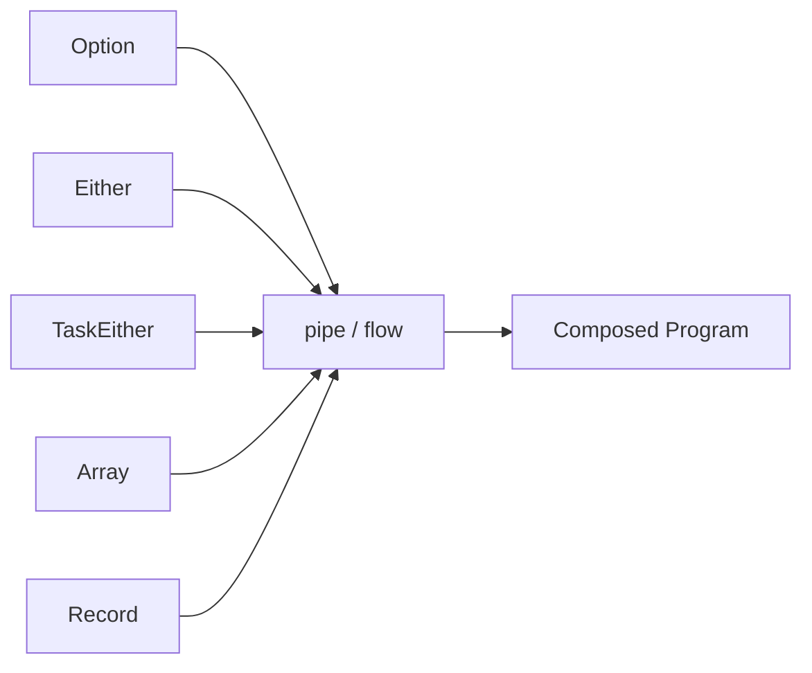
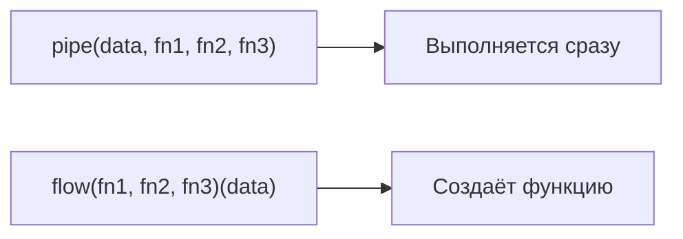

# Level 10: fp-ts

## Зачем библиотека, если мы уже написали Maybe/Either вручную?

На предыдущих уровнях мы реализовывали Maybe, Either, IO и Task с нуля. Это важно для понимания — но в реальных проектах ручная реализация имеет серьёзные недостатки: нет стандартного API, нет совместимости между библиотеками, нет законов, никто не тестировал крайние случаи.

fp-ts решает все эти проблемы. Это де-факто стандарт для TypeScript FP, основанный на Haskell/Scala принципах.

## Архитектура: модульность и pipe-first



Каждый тип — отдельный модуль. Всё работает через `pipe`. Это принципиальное решение: функции не прибиты к объектам через `.map()`, а импортируются явно.

## Три главных типа

### Option

Заменяет `null` и `undefined`. Безопасная работа с отсутствующими значениями.

```ts
import * as O from 'fp-ts/Option'
import { pipe } from 'fp-ts/function'

// O.none  — отсутствующее значение
// O.some(x) — присутствующее значение

pipe(
  O.fromNullable(user?.email),   // null/undefined → O.none
  O.map(e => e.toUpperCase()),   // трансформация, если Some
  O.getOrElse(() => 'N/A')       // извлечение с fallback (thunk!)
)
```

📌 Важно: `getOrElse` принимает `() => A` (функцию), а не `A`. Это для ленивости — fallback вычисляется только если нужен.

### Either

Заменяет `throw/catch`. Ошибки как значения.

```ts
import * as E from 'fp-ts/Either'

// E.left(err)   — ошибка
// E.right(val)  — успех

pipe(
  parseNumber(input),            // Either<string, number>
  E.flatMap(n =>                 // short-circuit при Left
    n > 0 ? E.right(n) : E.left('Must be positive')
  ),
  E.map(Math.sqrt),              // только для Right
  E.fold(
    err => `Error: ${err}`,
    val => `Result: ${val}`
  )
)
```

### TaskEither

Async операции с типизированными ошибками.

```ts
import * as TE from 'fp-ts/TaskEither'

// TaskEither<E, A> = () => Promise<Either<E, A>>

const workflow = pipe(
  fetchUser(id),                         // TE<NetworkError, User>
  TE.flatMap(user => fetchProfile(user.id)),  // TE<NetworkError, Profile>
  TE.mapLeft(err => `Failed: ${err.message}`) // нормализация ошибки
)

const result = await workflow()  // Either<string, Profile>
```

## pipe vs flow



`pipe` — трансформируй данные прямо сейчас.
`flow` — создай переиспользуемую функцию-трансформацию.

## Соглашения fp-ts v2

| Операция | Старое (устарело) | Новое (v2.15+) |
|----------|-------------------|----------------|
| Монадическое связывание | `chain` | `flatMap` |
| Разворачивание Either | `fold` | `match` |
| Опциональное сопоставление | `getOrElseW` | `getOrElse` + widening |

⚠️ В интернете много примеров с `chain` — они работают (не удалены), но в новом коде пишите `flatMap`.
