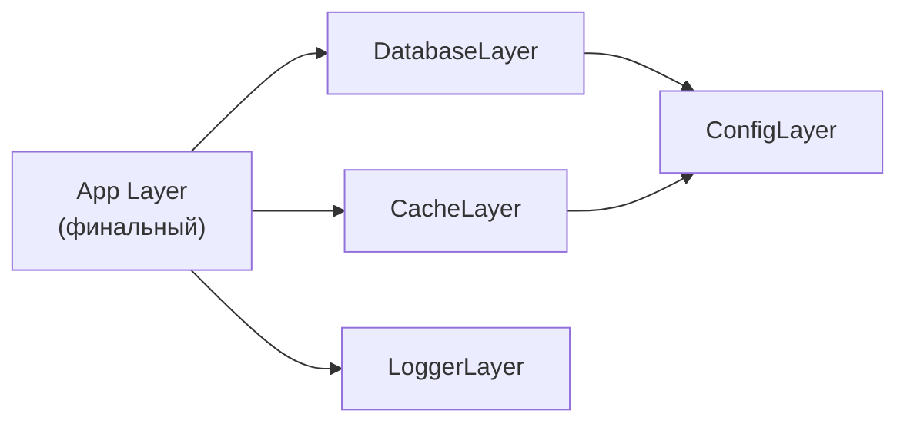
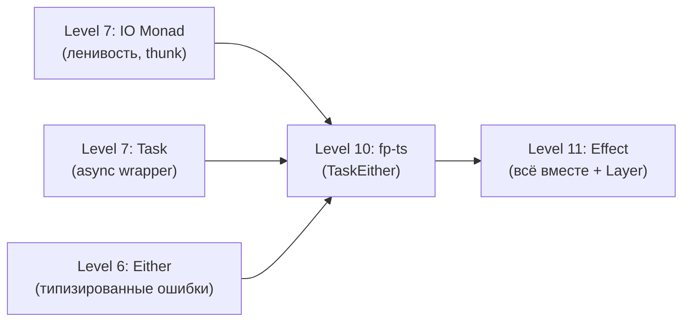

# Уровень 11. Effect — расширенная теория

## Откуда взялся Effect

Effect вырос из опыта работы с `fp-ts` и был вдохновлён библиотекой `ZIO` из мира Scala. Авторы поставили цель: взять лучшее из функциональных паттернов и сделать их эргономичными для реального TypeScript-кода.

Путь к Effect в этом курсе:

```
Уровень 5 → Functor (Box, map)
Уровень 6 → Maybe / Either (типизированные ошибки вручную)
Уровень 7 → IO / Task (ленивость, async)
Уровень 10 → fp-ts (Option, Either, TaskEither — промышленные)
Уровень 11 → Effect (объединяет всё + Layer + typed errors + concurrency)
```

Effect не отменяет fp-ts — он его эволюционирует. Если `fp-ts` — это набор отдельных модулей, то Effect — цельная платформа.

## Архитектура Effect

Тип `Effect<A, E, R>` — это просто описание программы:

```
Effect<
  A,  // Success: что вернёт при успехе
  E,  // Error: типизированная ошибка (never = не может упасть)
  R   // Requirements: нужные сервисы (never = не требует зависимостей)
>
```

Конкретные примеры:

```typescript
Effect.succeed(42)
// Effect<number, never, never>
// — синхронный, не может упасть, не нужны зависимости

Effect.fail(new NetworkError('/api'))
// Effect<never, NetworkError, never>
// — всегда падает с NetworkError

program // Effect<User, AuthError | NetworkError, UserRepo | Logger>
// — нужны два сервиса, может упасть двумя способами
```

## Effect vs fp-ts TaskEither

Это эволюция, а не замена:

| | fp-ts TaskEither | Effect |
|---|---|---|
| Тип | `() => Promise<Either<E, A>>` | `Effect<A, E, R>` |
| Ошибки | один тип E | union типов |
| Зависимости | нет | `R` параметр |
| Concurrency | вручную через Promise.all | встроенная через Fiber |
| Retry / timeout | нет | встроенный |
| Инструментарий | минимальный | огромная экосистема |

```typescript
// fp-ts
const fetchUser = (id: number): TE.TaskEither<Error, User> =>
  TE.tryCatch(() => fetch(`/api/${id}`).then(r => r.json()), E.toError)

// Effect
const fetchUser = (id: number): Effect.Effect<User, NetworkError> =>
  Effect.tryPromise({
    try: () => fetch(`/api/${id}`).then(r => r.json()),
    catch: () => new NetworkError(`/api/${id}`)
  })
```

## Fibers и структурированный параллелизм

Effect имеет встроенную систему конкурентности на основе Fiber — зелёных потоков, управляемых рантаймом. Это даёт структурированный параллелизм:

```typescript
import { Effect } from 'effect'

// Параллельное выполнение
const parallel = Effect.all([
  fetchUser(1),
  fetchData('/api'),
  loadConfig()
], { concurrency: 'unbounded' })

// Все результаты типизированы
// Effect<[User, Data, Config], NetworkError | AuthError>
```

Ключевое свойство структурированного параллелизма: если один эффект падает, все остальные отменяются автоматически. Нет утечек ресурсов, нет "зависших" промисов.

## Layer: модульная инъекция зависимостей

Layer решает ту же задачу что IoC-контейнеры (InversifyJS, tsyringe), но типобезопасно и без рефлексии:

```

```

```typescript
// Сервисы
class Config extends Context.Tag('Config')<Config, { url: string }>() {}
class Database extends Context.Tag('Database')<Database, { query: (sql: string) => Effect.Effect<unknown[]> }>() {}
class Cache extends Context.Tag('Cache')<Cache, { get: (key: string) => Effect.Effect<string | null> }>() {}

// Реализации
const ConfigLive = Layer.succeed(Config, { url: 'postgres://localhost/app' })

const DatabaseLive = Layer.effect(
  Database,
  Effect.gen(function* () {
    const config = yield* Config  // Config как зависимость слоя
    return {
      query: (sql) => Effect.promise(() => runQuery(config.url, sql))
    }
  })
)

// Компоновка слоёв
const AppLayer = Layer.provide(DatabaseLive, ConfigLive)

// Запуск
Effect.runPromise(Effect.provide(program, AppLayer))
```

Layer — это ленивый конструктор. Он не запускается до вызова `runPromise`/`runSync`.

## Schema для runtime validation

Пакет `@effect/schema` даёт парсинг данных с типовыми гарантиями:

```typescript
import { Schema } from '@effect/schema'

const UserSchema = Schema.Struct({
  id: Schema.Number,
  name: Schema.String,
  email: Schema.optional(Schema.String)
})

type User = Schema.Schema.Type<typeof UserSchema>

// Парсинг из unknown данных
const parseUser = Schema.decode(UserSchema)

const program = Effect.gen(function* () {
  const raw = yield* fetchRaw('/api/user/1')
  const user = yield* parseUser(raw)  // Effect<User, ParseError>
  return user
})
```

## Экосистема Effect

Effect — не просто библиотека, а платформа:

| Пакет | Что делает |
|---|---|
| `effect` | Ядро: Effect, Layer, Fiber, Schedule |
| `@effect/schema` | Парсинг и валидация данных с типами |
| `@effect/platform` | HTTP клиент/сервер, FileSystem |
| `@effect/platform-node` | Node.js реализации сервисов |
| `@effect/sql` | Type-safe SQL запросы |
| `@effect/rpc` | Type-safe RPC |

## Effect.gen vs pipe: что выбрать

Оба стиля корректны и часто смешиваются:

```typescript
// Pipe: хорошо для коротких линейных цепочек
const result = Effect.succeed(5).pipe(
  Effect.map(n => n * 2),
  Effect.flatMap(n => Effect.succeed(n + 1))
)

// Gen: хорошо для сложных программ с ветвлением
const program = Effect.gen(function* () {
  const n = yield* Effect.succeed(5)
  const doubled = n * 2
  if (doubled > 8) {
    yield* logger.log('big number')
  }
  return doubled + 1
})
```

Правило: если нужен `if/else`, `try/catch`, циклы — используй `gen`. Для простых трансформаций — `pipe`.

## Когда Effect — overkill

Effect добавляет сложности. Не стоит его использовать если:

- Скрипт на 50 строк без зависимостей
- Прототип / throwaway код
- Команда не знакома с функциональным подходом (кривая обучения крутая)
- Приложение уже написано на Promise без планов рефакторинга

## Когда Effect незаменим

- Большое приложение с десятками сервисов (Layer как IoC)
- Нужны typesafe ошибки вместо `throw`/`catch`
- Нужен retry, timeout, rate limiting из коробки
- Нужен структурированный параллелизм без утечек
- Нужна тестируемость без моков (замена Layer в тестах)
- Backend на Node.js с HTTP, DB, кешем

## Аналогия: чертёж и строительство

Представь что строишь дом:

- **`program`** — чертёж архитектора. Описывает что нужно, но не содержит материалов.
- **`Layer`** — поставщики материалов. Можно заменить "кирпичи" (PostgreSQL → SQLite) без изменения чертежа.
- **`Effect.runPromise`** — само строительство. Только здесь происходят реальные действия.

Такое разделение даёт максимальную тестируемость: в тестах подаём `MockLayer`, в продакшене — `ProdLayer`. Бизнес-логика остаётся нетронутой.

## Связь с предыдущими уровнями курса

```

```

Effect — логическое завершение пути. Все паттерны, которые мы реализовывали вручную (IO, Task, Either, Do-notation), здесь — встроенные примитивы с промышленной реализацией.

## Практические советы

**Начинай с малого**: можно использовать только `Effect.tryPromise` + `Effect.catchTag`, не трогая Layer. Инкрементальное освоение.

**Используй Effect.runSync для синхронного кода**: не нужно везде Promise.

**Schema + Effect** — это killer combo для валидации API ответов без `any`.

**Смотри на Exit**: `Effect.runSyncExit` возвращает `Exit.Success | Exit.Failure` — удобно для тестирования без `try/catch`.

```typescript
import { Effect, Exit } from 'effect'

const exit = Effect.runSyncExit(
  Effect.fail(new Error('oops'))
)

if (Exit.isFailure(exit)) {
  console.log(exit.cause) // типизированный Cause
}
```
