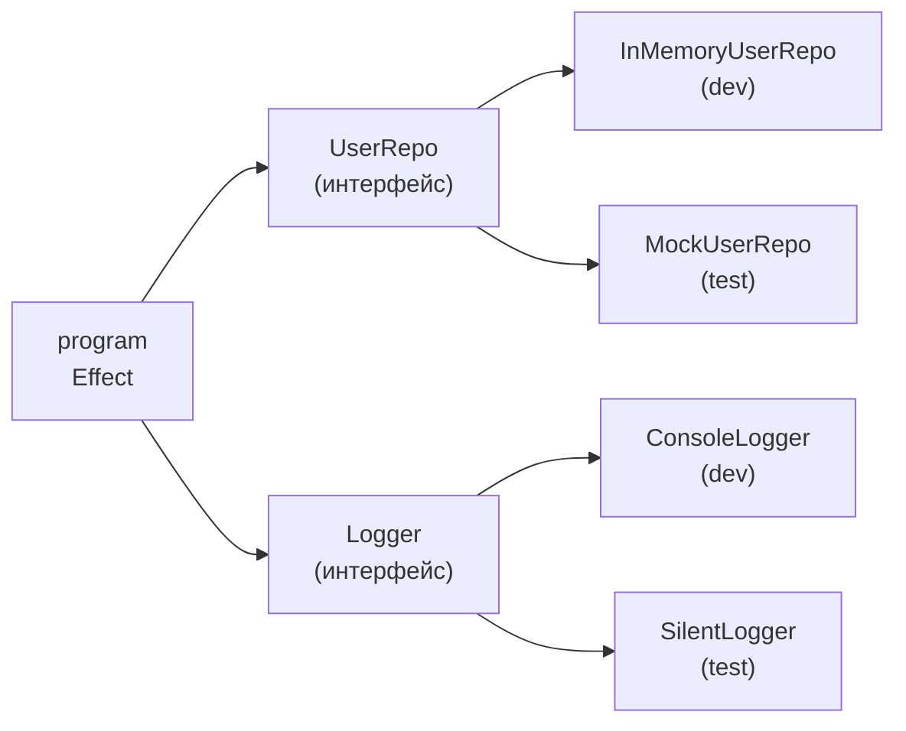

# Уровень 11. Effect

## Что такое Effect и зачем он нужен

Effect — это TypeScript-библиотека для написания надёжных программ с явным контролем над побочными эффектами, ошибками и зависимостями. Если предыдущие уровни курса показали паттерны вручную (IO, Task, Either), то Effect — это промышленная реализация всех этих идей в одном инструменте.

Главный тип:

```
Effect<Success, Error, Requirements>
```

- `Success` — что вернёт программа при успехе
- `Error` — какие типизированные ошибки возможны
- `Requirements` — какие сервисы нужны из окружения (Layer)

## Effect vs Promise: ленивость как суперсила

```
┌─────────────┐       создание       ┌────────────────────────────────┐
│   Promise   │──────────────────────▶   SIDE EFFECT происходит сразу  │
└─────────────┘                       └────────────────────────────────┘

┌─────────────┐       создание       ┌────────────────────────────────┐
│   Effect    │──────────────────────▶   ничего не происходит          │
└─────────────┘                       └────────────────────────────────┘
                        runSync /             ▼
                        runPromise     SIDE EFFECT происходит
```

```typescript
import { Effect } from 'effect'

// Promise — eager: код в конструкторе выполняется сразу
const p = new Promise(resolve => {
  console.log('Side effect!') // выполнится немедленно
  resolve(42)
})

// Effect — lazy: это просто описание, ничего не запущено
const e = Effect.sync(() => {
  console.log('Side effect!') // выполнится только при runSync/runPromise
  return 42
})

Effect.runSync(e) // только теперь запускается
```

## Цепочки с pipe

```typescript
const program = Effect.succeed(5).pipe(
  Effect.map(n => n * 2),
  Effect.flatMap(n => Effect.succeed(n + 1)),
  Effect.map(n => `Result: ${n}`)
)

Effect.runSync(program) // "Result: 11"
```

## Типизированные ошибки

Effect хранит тип ошибки в сигнатуре — компилятор знает, что может пойти не так:

```typescript
class NetworkError { readonly _tag = 'NetworkError'; constructor(readonly url: string) {} }
class AuthError    { readonly _tag = 'AuthError'; constructor(readonly reason: string) {} }

declare function fetchData(url: string): Effect.Effect<Data, NetworkError>
declare function auth(token: string):    Effect.Effect<User, AuthError>

// catchTag сужает тип ошибки
const safe = fetchData('/api').pipe(
  Effect.catchTag('NetworkError', e =>
    Effect.succeed(fallbackData) // NetworkError убран из типа ошибки
  )
)
```

## Layer: Dependency Injection

```

```

```typescript
import { Effect, Context, Layer } from 'effect'

// Интерфейс сервиса
class UserRepo extends Context.Tag('UserRepo')<
  UserRepo, { findById: (id: number) => Effect.Effect<User | null> }
>() {}

// Реализации
const InMemoryUserRepo = Layer.succeed(UserRepo, {
  findById: id => Effect.succeed(users.find(u => u.id === id) ?? null)
})

// Программа не знает про реализацию
const program = Effect.gen(function* () {
  const repo = yield* UserRepo
  return yield* repo.findById(42)
})

// Инъекция
Effect.runPromise(Effect.provide(program, InMemoryUserRepo))
```

## Запуск эффектов

| Функция | Когда использовать |
|---|---|
| `Effect.runSync` | Синхронный эффект без async-операций |
| `Effect.runPromise` | Асинхронный эффект, возвращает Promise |
| `Effect.runSyncExit` | Синхронный, возвращает Exit (Success/Failure) |
| `Effect.runPromiseExit` | Асинхронный, возвращает Exit |

## Генераторный синтаксис

`Effect.gen` — аналог async/await, но для Effect:

```typescript
const program = Effect.gen(function* () {
  const user = yield* fetchUser(id)     // Effect<User, AuthError>
  const data = yield* fetchData(user)   // Effect<Data, NetworkError>
  return { user, data }
})
// тип: Effect<{user, data}, AuthError | NetworkError>
```

## ⚠️ Частые ошибки начинающих

**Забыть запустить Effect**

```typescript
// ❌ Ничего не произойдёт
const e = Effect.sync(() => console.log('hello'))

// ✅ Нужен runner
Effect.runSync(e)
```

**Смешивать Effect.sync и async-код**

```typescript
// ❌ Crash: Effect.sync не может содержать Promise
const bad = Effect.sync(() => fetch('/api'))

// ✅ Для async используй Effect.promise или Effect.tryPromise
const good = Effect.promise(() => fetch('/api').then(r => r.json()))
```

**Создавать Layer заново в каждом запросе**

```typescript
// ❌ Layer пересоздаётся при каждом вызове
function getUser(id: number) {
  const layer = Layer.succeed(UserRepo, impl) // плохо
  return Effect.provide(program(id), layer)
}

// ✅ Layer создаётся один раз
const AppLayer = Layer.succeed(UserRepo, impl)
function getUser(id: number) {
  return Effect.provide(program(id), AppLayer)
}
```
