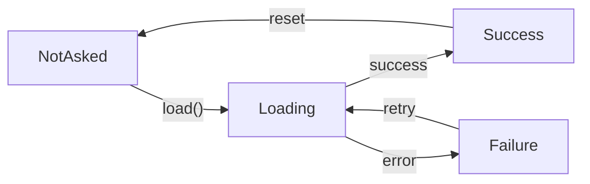

# Уровень 12. FP в React

## Почему React функционален

React с самого начала проектировался вокруг функциональных идей. Компонент — это чистая функция из props в UI. `useReducer` — это Redux без магии. Хуки — это замыкания. Функциональные паттерны не привносятся в React снаружи, они встроены в его основу.

```
Props → Component(props) → Virtual DOM
State × Action → Reducer(state, action) → State'
```

## Иммутабельный стейт: useReducer + Immer

`useReducer` принимает pure reducer — функцию без побочных эффектов:

```typescript
const reducer = (state: State, action: Action): State =>
  produce(state, draft => {
    switch (action.type) {
      case 'ADD_ITEM':
        draft.items.push(newItem)  // мутация внутри produce безопасна
        break
    }
  })
```

`produce` из Immer позволяет писать "мутирующий" код, который внутри использует структурное разделение (structural sharing) и возвращает новый объект. Это совмещает читаемость мутации с безопасностью иммутабельности.

Undo/Redo строится через стек иммутабельных снимков:

```typescript
type History = { past: State[]; present: State; future: State[] }

// При каждом dispatch:
//   past = [...past, present]   // сохраняем текущий в прошлое
//   present = reducer(present, action)
//   future = []                 // будущее сбрасывается
```

## RemoteData: state machine для загрузки



Вместо трёх отдельных флагов (`loading`, `error`, `data`) — один тип:

```typescript
type RemoteData<E, A> =
  | { tag: 'NotAsked' }
  | { tag: 'Loading' }
  | { tag: 'Failure'; error: E }
  | { tag: 'Success'; data: A }
```

Невозможно оказаться в состоянии `loading: true` и `data: [...]` одновременно.

## Composed hooks = HOF в React

Хук — это функция, которая может принимать другие функции (правила, фильтры) и возвращать поведение. Это то же самое, что HOF:

```typescript
function useFilteredList<T>(items: T[], filters: FilterFn<T>[]): T[] {
  return items.filter(item => filters.every(f => f(item)))
}

// Использование:
const visible = useFilteredList(products, [
  byCategory(cat),
  byPriceRange(min, max),
  bySearchTerm(query),
])
```

Каждый фильтр — чистая функция. Их можно добавлять, удалять, переставлять. Хук только применяет их.

## ⚠️ Частые ошибки начинающих

**Мутировать state в reducer напрямую**

```typescript
// ❌ прямая мутация — React не заметит изменение
const reducer = (state, action) => {
  state.items.push(action.item)
  return state
}

// ✅ вернуть новый объект (или использовать Immer)
const reducer = (state, action) =>
  produce(state, draft => { draft.items.push(action.item) })
```

**Не очищать future при dispatch**

```typescript
// ❌ future остаётся — Undo/Redo будет некорректным
dispatch: { past: [...past, present], present: next }

// ✅ при новом действии будущее сбрасывается
dispatch: { past: [...past, present], present: next, future: [] }
```

**Моделировать состояние загрузки тремя флагами**

```typescript
// ❌ возможны некорректные комбинации
const [loading, setLoading] = useState(false)
const [error, setError] = useState<string | null>(null)
const [data, setData] = useState<User[] | null>(null)

// ✅ один тип, одно состояние
const [rd, setRd] = useState<RemoteData<string, User[]>>(notAsked())
```

**Не убирать setTimeout в useDebouncedValue**

```typescript
// ❌ при быстром вводе накапливаются таймеры
useEffect(() => {
  setTimeout(() => setDebounced(value), delay)
}, [value])

// ✅ cleanup очищает предыдущий таймер
useEffect(() => {
  const id = setTimeout(() => setDebounced(value), delay)
  return () => clearTimeout(id)
}, [value, delay])
```
