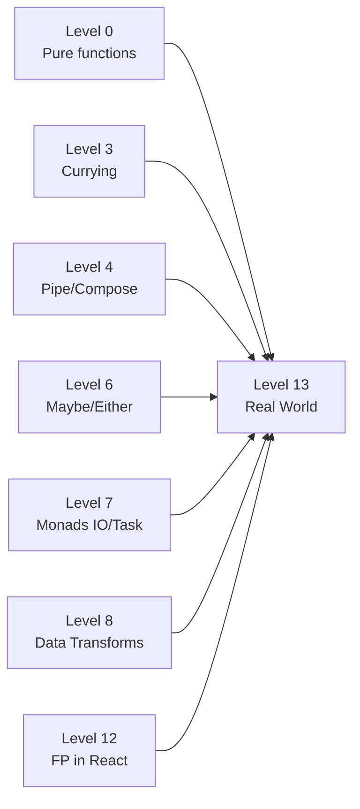

# Level 13. Реальные проекты — расширенная теория

## Validation vs Either: applicative vs monadic

### Монадическая цепочка (Either, fail-fast)

Either — монада. Это значит: следующий шаг зависит от результата предыдущего. `flatMap` передаёт значение дальше только если предыдущий шаг успешен:

```ts
// Monadic chain
const result: Either<string, Order> =
  flatMap(parseUserId(raw.userId), userId =>
    flatMap(findUser(userId), user =>
      flatMap(checkBalance(user, raw.amount), () =>
        createOrder(user, raw.amount)
      )
    )
  )
// Если parsUserId — Left, остальные три функции не вызываются
// Последовательная зависимость: нет userId → нет user → нет проверки → нет заказа
```

Монада хороша, когда шаги логически зависят друг от друга. `checkBalance` бессмысленна без `user`. `createOrder` бессмысленна без успешной проверки баланса.

### Applicative (Validation, collect all)

Applicative — слабее монады. Независимые вычисления могут выполняться параллельно. `Validation` накапливает ошибки в `Left`:

```ts
// Applicative: все валидаторы запускаются независимо
type Validation<E, A> = Either<E[], A>

function validateForm(data: FormData): Validation<string, ValidData> {
  // Все четыре запускаются — результаты независимы
  const nameR  = validateName(data.name)
  const emailR = validateEmail(data.email)
  const ageR   = validateAge(data.age)
  const passR  = validatePassword(data.password)

  const errors = [nameR, emailR, ageR, passR]
    .filter(isLeft)
    .map(e => e.value)

  if (errors.length > 0) return Left(errors)
  return Right({
    name:  (nameR  as Right<string>).value,
    email: (emailR as Right<string>).value,
    age:   (ageR   as Right<number>).value,
    password: (passR as Right<string>).value,
  })
}
```

Ключевое: `validateEmail` запускается, даже если `validateName` вернул `Left`. Все ошибки собираются в массив.

### Выбор стратегии

```
Вопрос: зависит ли шаг N от результата шага N-1?
├── Да → Either (monadic flatMap)
│         validateAge зависит от parseAge?
│         createOrder зависит от checkBalance?
└── Нет → Validation (applicative)
          validateName независимо от validateEmail?
          validateAge независимо от validatePassword?
```

В реальных проектах часто комбинируют: сначала парсинг входных данных через Either (fail-fast), потом бизнес-валидация через Validation (все ошибки).

---

## Composable API-клиенты: axios interceptors как FP

### Проблема с императивным подходом

```ts
// ❌ Типичный код без FP: логика размазана по коду
async function getUser(id: string) {
  const response = await axios.get(`/api/users/${id}`, {
    headers: {
      Authorization: `Bearer ${localStorage.getItem('token')}`,
      'Content-Type': 'application/json',
    },
  })
  if (!isUser(response.data)) throw new Error('Invalid user schema')
  return formatUser(response.data)
}
```

Каждый endpoint дублирует логику авторизации, обработки ошибок, валидации схемы.

### FP-решение: функции как строительные блоки

```ts
// Запрос — данные, middleware — pure функции трансформации
const request = (method: string) => (url: string) => (headers: Record<string, string>) => (body?: unknown) =>
  ({ method, url, headers, body })

// Middleware: принимают ApiRequest, возвращают ApiRequest
const withAuth    = (token: string) => (req: ApiRequest): ApiRequest => ({
  ...req, headers: { ...req.headers, Authorization: `Bearer ${token}` }
})

const withRetry   = (n: number) => (req: ApiRequest): ApiRequest => ({
  ...req, retries: n
})

const withTimeout = (ms: number) => (req: ApiRequest): ApiRequest => ({
  ...req, timeout: ms
})

// Composable: комбинируем любые middleware
const apiRequest = pipe(
  request('GET')('/api/users/1')({})(undefined),
  withAuth(getToken()),
  withRetry(3),
  withTimeout(5000),
)
```

### Сравнение с axios interceptors

Axios interceptors — это та же идея, но скрытая за API фреймворка:

```ts
// axios interceptor = неявный withAuth
axios.interceptors.request.use(config => {
  config.headers.Authorization = `Bearer ${token}`
  return config
})
```

FP-подход явный: каждый middleware виден в коде, тестируется отдельно, комбинируется произвольно.

---

## Event processing: CQRS и Event Sourcing

### Связь с архитектурными паттернами

Event processing pipeline — это упрощённая версия **Event Sourcing**. Вместо хранения текущего состояния — поток событий. Текущее состояние вычисляется как `fold` по событиям:

```ts
// Event Sourcing: state = fold(events, reducer)
const currentState = events.reduce(reducer, initialState)

// CQRS: команды пишут события, запросы читают из проекций
type Command = { type: 'PlaceOrder'; userId: string; items: Item[] }
type Event   = { type: 'OrderPlaced'; orderId: string; userId: string }

const handleCommand = (cmd: Command): Event[] => [
  { type: 'OrderPlaced', orderId: uuid(), userId: cmd.userId }
]
```

### Functional core, imperative shell

В event pipeline чистые функции обрабатывают данные, а побочные эффекты (запись в БД, отправка Kafka) — снаружи:

```
                  ┌────────────────────────────┐
                  │    Functional core         │
rawEvents ──────→ │  enrich → validate → route │ ──────→ routedEvents
                  │  (pure functions)          │
                  └────────────────────────────┘
                           ↓
                  ┌────────────────────┐
                  │  Imperative shell  │
                  │  kafka.publish()   │
                  │  db.insert()       │
                  │  metrics.record()  │
                  └────────────────────┘
```

Это паттерн из Level 7 (IO-монада) применённый в промышленном масштабе.

---

## FP в open-source: реальные примеры

### Redux: pure reducers

Redux — классический пример FP в React-экосистеме:

```ts
// Redux reducer — pure function
const reducer = (state = initialState, action: Action): State => {
  switch (action.type) {
    case 'INCREMENT': return { ...state, count: state.count + 1 }
    default: return state
  }
}
// state × action → state
// Детерминированность, тестируемость без моков, time-travel debugging
```

Почему Redux работает: чистые редьюсеры позволяют сериализовать историю состояний. Это основа Redux DevTools time-travel.

### React Query: data fetching как Effect

React Query моделирует состояние загрузки как `RemoteData` (Level 12):

```ts
const { data, isLoading, isError, error } = useQuery({
  queryKey: ['user', id],
  queryFn: () => fetchUser(id),
})

// В терминах RemoteData:
// isLoading           → Loading
// isError && error    → Failure(error)
// data !== undefined  → Success(data)
// (!isLoading && !data) → NotAsked
```

Декларативный `useQuery` — FP-подход: описываем, что хотим получить, а не как делать запрос.

### Zod: composable validation

Zod — библиотека валидации в FP-стиле:

```ts
import { z } from 'zod'

// Схемы — composable объекты
const UserSchema = z.object({
  name:  z.string().min(2).max(50),
  email: z.string().email(),
  age:   z.number().int().min(18).max(120),
})

// parse возвращает Either-подобный результат
const result = UserSchema.safeParse(rawData)
if (!result.success) {
  console.log(result.error.issues)  // все ошибки сразу — applicative!
}
```

Zod внутри использует Validation (applicative), не Either (monadic). `safeParse` всегда проверяет все поля.

---

## FP adoption strategy

### Уровни внедрения

FP не требует переписывать всё сразу. Стратегия по уровням:

**Уровень 1: Утилиты** (всегда безопасно)
- Pure functions для трансформации данных
- Замена `if/else` на `map/filter/reduce`
- `pipe` для цепочек трансформаций

**Уровень 2: Обработка ошибок** (низкий риск)
- Either/Result вместо исключений в бизнес-логике
- Validation для форм
- Это практикуется в Rust, Go, Swift без "FP-фреймворков"

**Уровень 3: Архитектура** (требует команды)
- Event sourcing / CQRS
- Functional core, imperative shell
- Effect-системы (fp-ts, effect-ts)

### Когда НЕ применять FP

```
Признаки overkill:
- Команда не знает FP — абстракции стоят больше, чем дают
- Простой CRUD без бизнес-логики — pipe добавляет сложность
- Прототип/MVP — скорость важнее корректности
- I/O-bound код (работа с БД) — функциональный core здесь мал

Признаки, что FP поможет:
- Сложная трансформация данных (ETL, event processing)
- Много точек, где может пойти не так (Either + Validation)
- Нужна тестируемость (pure functions = unit-тесты без моков)
- Переиспользование логики (каррирование + частичное применение)
```

---

## Связи с предыдущими уровнями



Этот уровень — не новые концепции, а применение всего изученного к реальным задачам.

---

## Итог курса

За 14 уровней вы прошли путь от теории к практике:

| Уровень | Концепция | Применение |
|---------|-----------|------------|
| 0 | Pure functions | Детерминированность, тестируемость |
| 1 | Immutability | React state, structural sharing |
| 2 | HOF | map/filter/reduce, decorators |
| 3 | Currying | Point-free, data-last |
| 4 | Pipe/Compose | Readable transformations |
| 5 | Functors | Box, Lazy, map-закон |
| 6 | Maybe/Either | Null safety, railway-oriented |
| 7 | Monads | IO, Task, Do-нотация |
| 8 | Data Transforms | Lens, Transducers |
| 9 | Algebraic Patterns | Semigroup, Monoid, Interpreter |
| 10 | fp-ts | Typed FP в production |
| 11 | Effect | Structured concurrency |
| 12 | FP in React | Reducer, RemoteData, ADT |
| 13 | Real World | Validation, API client, Events |

FP — это инструмент управления сложностью. Как и любой инструмент, он хорош в правильных руках и в правильном контексте.
