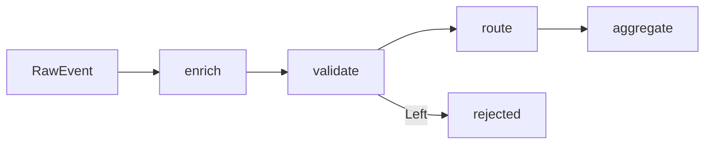

# Level 13. Реальные проекты

## Что такое FP в продакшене

Функциональное программирование — не теоретическая абстракция. Паттерны, которые вы изучили на предыдущих уровнях (pure functions, Either, pipe, каррирование), появляются в реальном коде каждый раз, когда нужно управлять сложностью: ошибками, составными запросами, потоками событий.

Этот уровень — точка сборки. Три задания воспроизводят типичные задачи из продакшн-проектов.

---

## Задание 13.1 — Either vs Validation

### Проблема

У вас есть форма с несколькими полями. Как правильно валидировать?

Новички пишут цепочку `if/else` и останавливаются на первой ошибке. Пользователь исправляет её, отправляет форму, получает вторую ошибку. И так по одной. Это раздражает.

### Два подхода

**Either (fail-fast)** — monadic chain. При первой ошибке цепочка прерывается:

```ts
// flatMap: если Left — пропускает, если Right — передаёт значение дальше
const result = flatMap(validateName(name), validName =>
  flatMap(validateEmail(email), validEmail =>
    map(validateAge(age), validAge =>
      ({ name: validName, email: validEmail, age: validAge })
    )
  )
)
// При ошибке имени — validateEmail никогда не вызовется
```

Когда использовать: когда следующая проверка зависит от предыдущей (нет смысла проверять формат даты, если поле пустое).

**Validation (collect all)** — applicative. Все проверки независимы:

```ts
type Validation<E, A> = Either<E[], A>  // Left = массив ошибок

const nameR  = validateName(name)
const emailR = validateEmail(email)
const ageR   = validateAge(age)

const errors = [nameR, emailR, ageR].filter(isLeft).map(e => e.value)
if (errors.length > 0) return Left(errors)  // ВСЕ ошибки сразу
return Right({ name: nameR.value, email: emailR.value, age: ageR.value })
```

Когда использовать: формы регистрации, CSV-валидация, API-запросы — везде, где хотите дать максимум информации сразу.

### Ключевое различие

| | Either | Validation |
|---|---|---|
| Структура | Monadic chain | Applicative |
| Ошибки | Первая | Все |
| Зависимость между шагами | Да | Нет |

---

## Задание 13.2 — Composable API-клиент

### Проблема

Типичный API-вызов обрастает логикой: авторизация, Content-Type, повторные попытки, обработка ошибок, парсинг. Это либо превращается в монолитную функцию, либо дублируется везде.

### FP-решение: каррирование + pure middleware

Запрос — это данные. Middleware — pure функции, трансформирующие эти данные:

```ts
const request = (method: string) => (url: string) => (headers: Record<string, string>) => (body?: unknown) =>
  ({ method, url, headers, body })

const withAuth = (token: string) => (req: ApiRequest): ApiRequest => ({
  ...req,
  headers: { ...req.headers, Authorization: `Bearer ${token}` },
})

// Сборка:
const req = withAuth('token123')(
  request('GET')('/api/users/1')({})(undefined)
)
```

Каждый `withX` — pure функция: принимает запрос, возвращает новый запрос без мутаций. Их можно комбинировать в любом порядке.

### Pipeline обработки ответа

```
Build → Send → Parse JSON → Validate schema → Transform
                 ↓ Left        ↓ Left
              parse error  validation error
```

Каждый шаг возвращает `Either`. При ошибке на любом этапе — цепочка прерывается (fail-fast).

---

## Задание 13.3 — Event processing pipeline

### Pipeline как последовательность pure функций



Четыре этапа, каждый — отдельная pure функция:

| Этап | Вход | Выход | Задача |
|------|------|-------|--------|
| enrich | RawEvent | EnrichedEvent | Добавить sessionId, region |
| validate | EnrichedEvent | Either<E, EnrichedEvent> | Отфильтровать невалидные |
| route | EnrichedEvent | { channel, event } | Направить по каналу |
| aggregate | routed[] | stats | Посчитать метрики |

### Почему это FP-подход

- **Enrich** — всегда успешен. `RawEvent → EnrichedEvent`. Данные только добавляются.
- **Validate** — возвращает Either. Невалидные события не попадают дальше.
- **Route** — чистая классификация. Нет побочных эффектов, нет исключений.
- **Aggregate** — свёртка. Накапливает результат через чистую функцию.

---

## Когда FP оправдан

✅ Сложная трансформация данных с разветвлением ошибок  
✅ Составные операции (middleware, validators, pipeline)  
✅ Параллельная/независимая обработка (Validation applicative)  
✅ Необходимость тестируемости без моков

⚠️ Простой CRUD — pipe и Either добавляют overhead без выгоды  
⚠️ Незнакомая команда — паттерны должны быть понятны всем

---

## Связь с предыдущими уровнями

- **Level 6** (Maybe/Either) — основа для fail-fast в 13.1
- **Level 3** (Currying) — основа для request builder в 13.2
- **Level 4** (Pipe/Compose) — структура pipeline в 13.3
- **Level 8** (Data Transformations) — паттерн enrich/validate/route

⚠️ Частые ошибки:

**Either вместо Validation для формы** — пользователь видит только первую ошибку из трёх. Раздражает.

```ts
// ❌ fail-fast для формы
const result = flatMap(validateName(name), n =>
  flatMap(validateEmail(email), e => Right({ n, e }))
)
// При ошибке имени — email не проверяется

// ✅ collect all для формы
const errors = [validateName(name), validateEmail(email)].filter(isLeft)
if (errors.length > 0) return Left(errors.map(e => e.value))
```

**Мутация в middleware** — нарушает referential transparency:

```ts
// ❌
const withAuth = (token, req) => {
  req.headers['Authorization'] = token  // мутация!
  return req
}

// ✅
const withAuth = (token) => (req) => ({
  ...req,
  headers: { ...req.headers, Authorization: `Bearer ${token}` },
})
```

**Побочные эффекты внутри pipeline-функций** — нарушает идемпотентность:

```ts
// ❌
const enrich = (event) => {
  analytics.track(event)  // side effect в pure function!
  return { ...event, sessionId: '...' }
}

// ✅ побочные эффекты — после pipeline, отдельно
const enrichedEvents = rawEvents.map(enrich)
enrichedEvents.forEach(e => analytics.track(e))  // side effects последними
```
