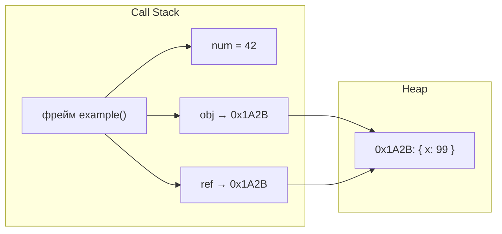
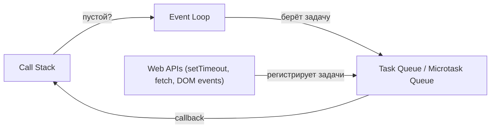

# Call Stack и однопоточность — углублённо

## Heap vs Stack: где что хранится

В процессе выполнения JavaScript-движок управляет двумя областями памяти.

**Stack (стек)** — быстрая, фиксированного размера память для:

- Примитивных значений (`number`, `boolean`, `string`, `undefined`, `null`, `symbol`, `bigint`)
- Ссылок на объекты (не сами объекты, только адреса)
- Метаданных фреймов: адрес возврата, локальные переменные

**Heap (куча)** — динамическая, большая память для:

- Объектов (`{}`, `[]`, `function`, `Date`, …)
- Замыканий (closure environments)
- Прототипных цепочек

```js
function example() {
  const num = 42               // примитив — живёт в стековом фрейме
  const obj = { x: 1 }        // объект — в Heap; стек хранит только ссылку
  const ref = obj              // ref — ещё одна ссылка на тот же Heap-объект

  ref.x = 99
  console.log(obj.x)           // 99 — обе переменные указывают на одно место
}
```



Это объясняет, почему `const obj = { x: 1 }` защищает от переприсвоения переменной, но не от мутации объекта.

## Execution Context в деталях

Каждый раз, когда движок входит в контекст выполнения, он создаёт три компонента:

### Variable Environment

Хранит объявления `var` и `function`. Они поднимаются (hoisting) в начало контекста ещё до выполнения кода.

```js
console.log(x)    // undefined, не ReferenceError
var x = 5
console.log(foo)  // [Function: foo], function hoisting
function foo() {}
```

### Lexical Environment

Хранит `let`, `const` и параметры функции. Попытка обратиться до инициализации — `ReferenceError` (Temporal Dead Zone).

```js
console.log(y)    // ReferenceError: Cannot access 'y' before initialization
let y = 10
```

Именно в Lexical Environment хранятся замыкания: когда внутренняя функция "запоминает" переменные внешней.

### `this` Binding

Определяется в момент создания контекста. Зависит от того, как функция была вызвана:

```js
const obj = {
  name: 'Alice',
  greet() {
    console.log(this.name)   // 'Alice' — метод вызван через obj
  }
}

const fn = obj.greet
fn()                          // undefined — вызов без контекста, this === window/undefined
```

## Визуализация через Mermaid

Полная схема того, что происходит при вызове `a()`:


## Tail Call Optimization (TCO)

Хвостовой вызов — это когда рекурсивный вызов является **последней операцией** функции, и её результат напрямую возвращается.

```js
// Обычная рекурсия: стек растёт, нельзя убрать фрейм
function factorial(n) {
  if (n <= 1) return 1
  return n * factorial(n - 1)  // n * ... — фрейм нужен для умножения!
}

// Хвостовая рекурсия: acc хранит промежуточный результат
function factorialTail(n, acc = 1) {
  if (n <= 1) return acc
  return factorialTail(n - 1, n * acc)  // последняя операция — вызов
}
```

В хвостовой рекурсии движок может **повторно использовать фрейм** вместо создания нового. Стек не растёт.

### Поддержка в JavaScript

Спецификация ES2015 включает TCO. Реальность иная:

| Среда | TCO |
|---|---|
| Safari / JavaScriptCore | Поддерживается |
| V8 (Chrome, Node.js) | **Отключено** (удалено в 2017) |
| SpiderMonkey (Firefox) | Не реализовано |

Причины отказа V8: сложность отладки (стектрейсы становятся нечитаемыми), редкость реального использования.

**Практический вывод:** в Node.js и Chrome не рассчитывайте на TCO. Глубокую рекурсию заменяйте итерацией или trampolining.

```js
// Trampolining — TCO в пользовательском пространстве
type Thunk<A> = () => A | (() => Thunk<A>)

function trampoline<A>(fn: () => A | Thunk<A>): A {
  let result = fn()
  while (typeof result === 'function') {
    result = (result as Thunk<A>)()
  }
  return result as A
}

// Глубокая рекурсия без роста стека:
const countDown = (n: number): number | (() => number) =>
  n <= 0 ? 0 : () => countDown(n - 1)

trampoline(() => countDown(1_000_000)) // не переполнит стек
```

## Как V8 оптимизирует вызовы

### Inline Caching (IC)

V8 запоминает типы аргументов и оптимизирует код под конкретные типы. Первый вызов — "монофорфный" (один тип), последующие с теми же типами — быстрые.

```js
function add(a, b) { return a + b }

add(1, 2)      // V8 замечает: оба числа
add(3, 4)      // оптимизирован под числа — быстро
add('x', 'y') // деоптимизация: тип изменился, откат
```

### Hidden Classes

Объекты с одинаковой структурой свойств разделяют "скрытый класс" — внутренне это делает доступ к полям быстрым, как в статических языках.

```js
// Хорошо: оба объекта имеют одинаковую структуру → один hidden class
const a = { x: 1, y: 2 }
const b = { x: 3, y: 4 }

// Плохо: добавление свойств в разном порядке → разные hidden classes
const c = { x: 1 }; c.y = 2
const d = { y: 2 }; d.x = 1   // другой hidden class!
```

**Практический совет:** объявляйте все свойства объекта при создании, не добавляйте их позже динамически.

## Связь с Event Loop (тизер следующего уровня)

Call Stack — это только часть картины. JavaScript-рантайм включает три компонента:



1. **Call Stack** выполняет код синхронно
2. Когда стек пустой, **Event Loop** проверяет очереди
3. **Task Queue** содержит макрозадачи: `setTimeout`, `setInterval`, события DOM
4. **Microtask Queue** (приоритет выше!) содержит: `Promise.then`, `queueMicrotask`, `MutationObserver`

```js
console.log('1')            // сразу в стек

setTimeout(() => {
  console.log('3')          // макрозадача: уйдёт в Task Queue
}, 0)

Promise.resolve().then(() => {
  console.log('2')          // микрозадача: уйдёт в Microtask Queue
})

console.log('4')            // сразу в стек

// Вывод: 1, 4, 2, 3
// Почему? 1 и 4 — синхронно. Потом все микрозадачи (2). Потом макрозадачи (3).
```

Это будет разобрано в следующем уровне. Пока важно запомнить: Event Loop — это то, что делает JavaScript "асинхронным", оставаясь однопоточным.

## Стектрейс: читаем сообщения об ошибках

Call Stack — это именно то, что вы видите в ошибках в консоли:

```
TypeError: Cannot read properties of undefined (reading 'name')
    at getUserName (app.js:15:18)   ← верхний фрейм (где ошибка)
    at renderUser (app.js:28:5)
    at App (app.js:42:3)
    at renderRoot (react.js:...)    ← нижний — вызов всей цепочки
```

Читать стектрейс нужно снизу вверх: нижняя строка — первый вызов, верхняя — место возникновения ошибки.

## Размер стека и практические ограничения

Ограничения зависят от движка и платформы:

| Движок | Примерный лимит фреймов |
|---|---|
| V8 (Node.js, Chrome) | ~10 000–15 000 |
| SpiderMonkey (Firefox) | ~50 000 |
| JavaScriptCore (Safari) | ~40 000 |

Лимит — не в количестве фреймов, а в байтах стека. Чем больше локальных переменных в каждой функции, тем быстрее кончается место.

```js
// Этот factorial(15000) скорее всего переполнит стек
// Итеративная версия — никогда не переполнит
function factorialIter(n) {
  let result = 1
  for (let i = 2; i <= n; i++) result *= i
  return result
}
```

## Итог

Call Stack — фундамент, на котором строится вся асинхронность JavaScript. Понимание того, что стек однопоточен и что он значит для рендеринга, позволяет:

- Правильно разбивать тяжёлые задачи на чанки
- Понимать, почему `await` "освобождает" поток
- Читать стектрейсы без паники
- Обоснованно выбирать рекурсию или итерацию

Следующий шаг — Event Loop: механизм, который позволяет JavaScript быть "асинхронным" при одном потоке.
