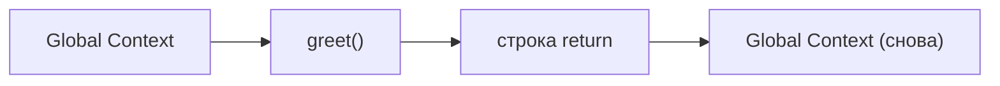

# Call Stack и однопоточность

## Что такое Call Stack

Представьте стопку тарелок на кухне. Каждый раз, когда вы вызываете функцию, движок кладёт тарелку сверху. Когда функция заканчивается — тарелка убирается. Нельзя взять тарелку снизу, не убрав верхние. Именно так работает Call Stack.

**Call Stack** (стек вызовов) — это структура данных типа LIFO (Last In, First Out), которая отслеживает, где находится выполнение программы в данный момент.

```js
function d() { return 42 }
function c() { return d() }
function b() { return c() }
function a() { return b() }

a() // запускаем
```

Как выглядит стек в момент выполнения `d()`:

```
┌──────────┐  ← TOP (выполняется сейчас)
│   d()    │
├──────────┤
│   c()    │
├──────────┤
│   b()    │
├──────────┤
│   a()    │
└──────────┘
```

После того как `d()` выполнится и вернёт `42` — её фрейм снимается, продолжает выполняться `c()`, и так далее.

## Execution Context (контекст выполнения)

Каждая "тарелка" в стеке — это не просто имя функции. Это **Execution Context**, который хранит:

- **Variable Environment** — переменные, объявленные внутри функции (`var`, `function`)
- **Lexical Environment** — переменные из `let`, `const` и параметры
- **`this` binding** — на что ссылается `this` внутри этого вызова
- **Ссылка на внешний контекст** — для замыканий

При запуске программы первым создаётся **Global Execution Context**. Он всегда в основании стека.

## Stack Frame: что хранится

Когда JavaScript-движок встречает вызов функции:

1. Создаётся новый Execution Context
2. Он помещается на вершину Call Stack (push)
3. Управление передаётся в тело функции
4. Когда функция возвращает значение — контекст удаляется (pop)

```js
function greet(name) {
  // В этот момент в стеке: [GlobalContext, greet("Alice")]
  const message = 'Hello, ' + name  // message живёт в Stack Frame
  return message                     // pop — фрейм уничтожается
}

greet('Alice')
```

## Однопоточность JavaScript

JavaScript — однопоточный язык. Это значит: **один Call Stack = один поток выполнения**.

В один момент времени выполняется ровно одна функция. Нет параллельного выполнения. Нет гонок за стек.

```js
// Это выполняется строго последовательно, не параллельно:
console.log('1')    // выполнится первым
console.log('2')    // выполнится вторым
console.log('3')    // выполнится третьим
```



## Stack Overflow: когда стек переполняется

Что случится, если функция вызывает саму себя без условия остановки?

```js
// Бесконечная рекурсия — каждый вызов добавляет фрейм
function recurse() {
  return recurse() // ← никогда не вернётся
}

recurse()
// RangeError: Maximum call stack size exceeded
```

Стек не бесконечный. В V8 (Chrome/Node.js) лимит — около 10 000–15 000 фреймов в зависимости от размера каждого фрейма. При превышении выбрасывается `RangeError`.

Правильная рекурсия обязательно имеет **базовый случай**:

```js
// Правильно: есть условие остановки
function factorial(n) {
  if (n <= 1) return 1        // базовый случай — стек начнёт разматываться
  return n * factorial(n - 1) // рекурсивный вызов
}
```

## Почему тяжёлые вычисления блокируют UI

Браузер использует тот же поток для:

- Выполнения JavaScript
- Отрисовки (рендеринга) страницы
- Обработки событий (клики, ввод)

Пока Call Stack не пустой — браузер не может ничего из этого сделать. Всё ждёт.

```js
// Это заблокирует браузер на несколько секунд
function fib(n) {
  if (n <= 1) return n
  return fib(n - 1) + fib(n - 2)
}

fib(42) // Call Stack занят — UI заморожен
```

Пользователь видит зависший интерфейс: анимации остановились, клики не работают, страница не обновляется.

## Решение: отдавать управление Event Loop

Правильный подход — разбивать тяжёлую работу на маленькие части и уступать управление между ними:

```js
// Вычисляем по чуть-чуть, между чанками — возврат в Event Loop
function computeChunk(i) {
  const end = Math.min(i + 5000, totalN)
  for (; i < end; i++) {
    memo[i] = memo[i-1] + memo[i-2]
  }

  if (i < totalN) {
    setTimeout(() => computeChunk(i), 0) // "уступаю управление, продолжи потом"
  } else {
    onDone(memo[totalN])
  }
}
```

`setTimeout(fn, 0)` не значит "выполнить немедленно". Это значит "положить в очередь задач, выполнить когда Call Stack освободится". Именно это позволяет браузеру перерисовать страницу между чанками.

## Частые ошибки новичков

**Ошибка 1: Рекурсия без базового случая**

```js
// Плохо — переполнит стек
function countdown(n) {
  console.log(n)
  return countdown(n - 1) // никогда не остановится
}

// Хорошо — есть выход
function countdown(n) {
  if (n < 0) return        // базовый случай
  console.log(n)
  return countdown(n - 1)
}
```

**Ошибка 2: Тяжёлые вычисления в обработчиках событий**

```js
// Плохо — при каждом клике браузер зависает
button.addEventListener('click', () => {
  const result = heavyComputation() // блокирует UI
  display(result)
})

// Хорошо — показываем loading, считаем асинхронно
button.addEventListener('click', async () => {
  showLoading()
  const result = await computeAsync()
  display(result)
})
```

**Ошибка 3: Путаница стека и heap**

Примитивы (`number`, `boolean`, `string`) живут в стековых фреймах. Объекты и массивы — в **Heap**, стек хранит лишь ссылку на них. Поэтому мутация объекта в одном месте видна везде, где есть ссылка на него.

## Ключевые выводы

- Call Stack — LIFO-структура, push при вызове, pop при возврате
- JavaScript однопоточный: один стек, одно выполнение за раз
- Переполнение стека = рекурсия без базового случая
- Занятый стек = замороженный браузер
- `setTimeout(fn, 0)` — инструмент для "уступки" управления Event Loop
