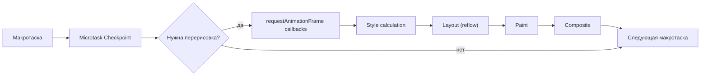
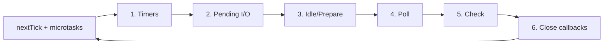

# Event Loop: полное погружение

## HTML Specification: что говорит стандарт

Event Loop — это не "браузерная магия", это строго определённый алгоритм из [спецификации HTML Living Standard](https://html.spec.whatwg.org/multipage/webappapis.html#event-loops).

Цитата (в вольном переводе):
> "У агента (JS-движка) есть ассоциированный event loop. Event Loop координирует выполнение различных задач... Каждый Event Loop имеет одну или несколько очередей задач (task queues). Task queue — это множество задач."

Ключевые понятия спецификации:

| Термин | Описание |
|--------|----------|
| **Task** (задача) | Единица работы в Task Queue (макротаска) |
| **Task Queue** | Множество (set) задач, не очередь в классическом смысле |
| **Microtask** | Задача в специальной Microtask Queue |
| **Microtask Checkpoint** | Момент когда Event Loop опустошает Microtask Queue |

💡 Интересно: Task Queue в спецификации — это **set** (множество), а не queue (очередь). Event Loop выбирает "первую runnable задачу", а не просто первую.

## Rendering Pipeline: где он в цикле?

Браузер рисует страницу не постоянно — он ждёт "удобного момента". Это происходит после обработки макротаски, но только если прошло достаточно времени (обычно ~16ms при 60fps).



### Шаги Rendering Pipeline:

1. **Style** — браузер вычисляет CSS-стили для каждого элемента
2. **Layout** (Reflow) — вычисление размеров и позиций элементов
3. **Paint** — заполнение пикселей (цвета, тени, текст)
4. **Composite** — слои объединяются в финальное изображение

Именно поэтому DOM-манипуляции дорогие: каждое изменение может запустить весь pipeline заново. `transform` и `opacity` дешевле — они работают только на этапе Composite.

## requestAnimationFrame: правильное место для анимаций

`requestAnimationFrame(fn)` — это специальный механизм, который ставит `fn` в очередь **перед** следующей перерисовкой. Это гарантирует:

- Анимация синхронизирована с refresh rate монитора
- Нет "лишних" кадров если вкладка неактивна
- Браузер может батчить несколько rAF-колбэков

```js
// Плохо: setTimeout для анимации
function animate() {
  element.style.left = (parseInt(element.style.left) + 1) + 'px'
  setTimeout(animate, 16)  // ~60fps, но не синхронизировано с монитором
}

// Хорошо: requestAnimationFrame
function animate(timestamp) {
  element.style.left = (parseInt(element.style.left) + 1) + 'px'
  requestAnimationFrame(animate)  // следующий кадр, точно в нужный момент
}
requestAnimationFrame(animate)
```

Порядок в Event Loop:

```
Macrotask → Microtasks → rAF → Style/Layout/Paint → следующая Macrotask
```

## Node.js Event Loop: 6 фаз libuv

Node.js использует libuv — C-библиотеку для асинхронного I/O. Её Event Loop состоит из 6 фаз:



### Детали каждой фазы:

**Фаза 1 — Timers:**
Выполняет колбэки `setTimeout` и `setInterval`, у которых истёк таймер. Node проверяет: "есть ли таймеры, чьё время пришло?"

**Фаза 2 — Pending I/O callbacks:**
Выполняет I/O колбэки из предыдущего цикла, которые были отложены (например, TCP-ошибки).

**Фаза 3 — Idle, Prepare:**
Только для внутреннего использования Node.js. Вы не взаимодействуете с этой фазой напрямую.

**Фаза 4 — Poll:**
Самая важная фаза. Здесь происходит:
- Выполнение новых I/O колбэков (завершившиеся сетевые запросы, file reads)
- Ожидание: если нет готовых событий и нет pending-таймеров — libuv ждёт здесь

**Фаза 5 — Check:**
Выполняет колбэки `setImmediate`. Именно здесь `setImmediate` отличается от `setTimeout(fn, 0)`.

**Фаза 6 — Close callbacks:**
Закрывающие события: `socket.on('close', fn)`, `server.close()` и т.д.

## process.nextTick vs Promise: кто первый?

```js
Promise.resolve().then(() => console.log('Promise'))
process.nextTick(() => console.log('nextTick'))

// Node.js: nextTick → Promise
// Браузер: нет nextTick (только Promise)
```

`process.nextTick` — это не часть libuv. Это специальная очередь Node.js, которая обрабатывается **между любыми двумя фазами** libuv и даже **внутри** фаз.

Иерархия приоритетов в Node.js:

```
1. process.nextTick queue (самый высокий!)
2. Promise microtasks (queueMicrotask, Promise.then)
3. Фазы libuv (setTimeout, setImmediate, I/O)
```

⚠️ Осторожно: бесконечная рекурсия через `process.nextTick` заблокирует Event Loop ещё сильнее, чем через Promise, — он никогда не покинет фазу nextTick.

## setImmediate vs setTimeout(fn, 0) в Node.js

Вечный вопрос: что выполнится первым — `setImmediate` или `setTimeout(fn, 0)`?

```js
setTimeout(() => console.log('setTimeout'), 0)
setImmediate(() => console.log('setImmediate'))
```

**Ответ: зависит от контекста.**

В корне скрипта (вне I/O колбэка) — порядок **не определён**: он зависит от того, как быстро система обработала таймер. Может быть любым.

В I/O колбэке — **всегда setImmediate первым**:

```js
fs.readFile('file.txt', () => {
  setTimeout(() => console.log('setTimeout'), 0)
  setImmediate(() => console.log('setImmediate'))
  // ВСЕГДА: setImmediate → setTimeout
  // Мы в Poll фазе, следующая фаза — Check (setImmediate)
})
```

Причина: внутри I/O-колбэка мы уже в Poll-фазе. Следующая фаза — Check (setImmediate). Таймеры будут рассмотрены только в следующей итерации цикла.

## Microtask Starvation: почему это опасно

```js
// Блокировка через бесконечные микротаски
function runForever() {
  Promise.resolve().then(runForever)
}
runForever()

// Этот таймаут никогда не выполнится:
setTimeout(() => updateUI(), 100)
```

В Node.js ситуация ещё хуже через `process.nextTick`:

```js
function blockForever() {
  process.nextTick(blockForever)
}
blockForever()

// Дальнейший код Node.js не выполнится НИКОГДА
```

**Практические последствия:**
- Браузер: UI замерзает, пользователь видит зависшую страницу
- Node.js: HTTP-сервер перестаёт отвечать на запросы

**Решение:** если нужно сделать много работы через Promise — добавляйте периодические "точки выхода":

```js
async function processLargeArray(items) {
  for (let i = 0; i < items.length; i++) {
    processItem(items[i])

    // Каждые 1000 элементов — уступаем управление
    if (i % 1000 === 0) {
      await new Promise(resolve => setTimeout(resolve, 0))
    }
  }
}
```

## Детальное сравнение: Браузер vs Node.js

| Характеристика | Браузер | Node.js |
|---------------|---------|---------|
| process.nextTick | Нет | Да (высший приоритет) |
| setImmediate | Нет | Да (фаза Check) |
| requestAnimationFrame | Да | Нет |
| requestIdleCallback | Да | Нет |
| MutationObserver | Да (микротаска) | Нет |
| Рендеринг в цикле | Да | Нет |
| Количество фаз | ~4 | 6 (libuv) |
| Promise.then приоритет | Выше setTimeout | Ниже nextTick |

## Практика: порядок в Node.js

```js
console.log('1 — sync')

setTimeout(() => console.log('2 — setTimeout'), 0)
setImmediate(() => console.log('3 — setImmediate'))

Promise.resolve().then(() => console.log('4 — Promise'))
process.nextTick(() => console.log('5 — nextTick'))

console.log('6 — sync')

// Вывод в Node.js:
// 1 — sync
// 6 — sync
// 5 — nextTick      (nextTick очередь — приоритет 1)
// 4 — Promise       (microtask — приоритет 2)
// 2 — setTimeout    (Timer фаза или Check — не определено вне I/O)
// 3 — setImmediate  (Check фаза или Timer — не определено вне I/O)
```

## Инструменты для отладки

**Chrome DevTools:**
- Performance tab → запись → видно микротаски и макротаски
- `console.timeStamp('name')` — маркер на timeline

**Node.js:**
- `--inspect` флаг + Chrome DevTools
- `perf_hooks` — точные замеры
- `clinic.js` — профилировщик Node.js с анализом Event Loop

## Ключевые выводы

- Event Loop — алгоритм из HTML спецификации, не браузерная магия
- Рендеринг происходит между макротасками (не каждый tick)
- rAF — лучший инструмент для анимаций, синхронизирован с монитором
- Node.js: process.nextTick > Promise > libuv фазы
- setImmediate vs setTimeout: предсказуемо только внутри I/O колбэка
- Microtask Starvation — реальная проблема, не теоретическая
