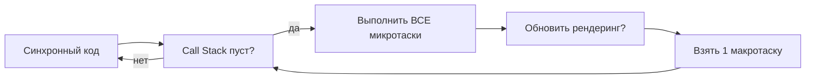

# Event Loop: сердце асинхронного JavaScript

## Зачем нам нужен Event Loop?

JavaScript однопоточный — одна задача за раз, одно место в очереди. Но браузер должен одновременно:
- выполнять ваш код
- слушать клики пользователя
- загружать данные по сети
- рисовать анимации

Как это совместить? Ответ — **Event Loop**. Это как диспетчер в аэропорту: самолёты (задачи) не летят все сразу — диспетчер решает, кто взлетает следующим, строго по очереди и приоритетам.

## Участники Event Loop

```
┌──────────────┐     ┌──────────────────┐
│  Call Stack  │     │    Web APIs      │
│              │────▶│  (setTimeout,    │
│   (V8)       │     │   fetch, DOM)    │
└──────────────┘     └────────┬─────────┘
        ▲                     │
        │               завершились
        │                     │
┌───────┴───────────────▼─────────────┐
│              Event Loop              │
│   1. Call Stack пуст?               │
│   2. Выполнить ВСЕ микротаски       │
│   3. Выполнить ОДНУ макротаску      │
│   4. Повторить                      │
└──────────────────────────────────────┘
        │                     │
  ┌─────▼──────┐    ┌────────▼─────────┐
  │ Microtask  │    │  Macrotask Queue │
  │   Queue    │    │  (Task Queue)    │
  │ Promise.then│   │  setTimeout      │
  │ queueMicro │    │  setInterval     │
  │ MutationObs│    │  I/O callbacks   │
  └────────────┘    └──────────────────┘
```

## Web APIs — "помощники" браузера

Когда вы вызываете `setTimeout(fn, 1000)` — вы не блокируете JavaScript. Браузер берёт таймер себе:

- **Браузер** начинает отсчёт 1000ms в своём потоке
- **JavaScript** продолжает выполнять следующий код
- Через 1000ms **браузер** кладёт `fn` в Macrotask Queue
- **Event Loop** видит пустой Call Stack и берёт `fn` из очереди

Так работают все "асинхронные" операции: `fetch`, `addEventListener`, `setTimeout`, `setInterval` — они делегируют работу браузеру, а сами немедленно возвращают управление.

## Macrotask Queue (Task Queue)

Сюда попадают "тяжёлые" задачи от Web APIs:

- `setTimeout(fn, delay)` — колбэк после задержки
- `setInterval(fn, delay)` — колбэк по расписанию
- I/O-колбэки — обработчики событий DOM (click, input)
- MessageChannel

📌 Важно: Event Loop берёт **одну** макротаску за раз, не все сразу.

## Microtask Queue

Сюда попадают "лёгкие" задачи с высоким приоритетом:

- `Promise.then()`, `Promise.catch()`, `Promise.finally()`
- `queueMicrotask(fn)` — явная постановка в очередь
- `MutationObserver` — наблюдение за изменениями DOM
- `async/await` (под капотом — Promise.then)

🔥 Ключевое правило: **все** микротаски выполняются до того, как Event Loop возьмёт следующую макротаску.

## Алгоритм Event Loop



## Пример: разбираем порядок

```js
console.log('1')                              // синхронно
setTimeout(() => console.log('2'), 0)         // в Macrotask Queue
Promise.resolve().then(() => console.log('3')) // в Microtask Queue
console.log('4')                              // синхронно

// Вывод: 1 → 4 → 3 → 2
```

Почему именно так?

1. `'1'` — синхронно, прямо сейчас
2. `setTimeout(fn, 0)` — кладёт fn в Macrotask Queue и **сразу** возвращает
3. `Promise.resolve().then(fn)` — кладёт fn в Microtask Queue и **сразу** возвращает
4. `'4'` — синхронно, прямо сейчас
5. Call Stack пуст → Event Loop смотрит на Microtask Queue → выполняет `'3'`
6. Microtask Queue пуст → Event Loop берёт одну макротаску → выполняет `'2'`

## Почему Promise раньше setTimeout?

Даже `setTimeout(fn, 0)` — это **макротаска**. А `Promise.then` — **микротаска**. Event Loop по спецификации HTML обязан опустошить всю очередь микротасок перед тем, как взять следующую макротаску.

```js
setTimeout(() => console.log('macro'), 0)    // макротаска
Promise.resolve().then(() => console.log('micro')) // микротаска

// ВСЕГДА: micro → macro
```

## Microtask Starvation — опасность бесконечных микротасок

```js
function endless() {
  Promise.resolve().then(endless)  // каждый then добавляет новый
}
endless()

setTimeout(() => console.log('НИКОГДА'), 0) // не выполнится никогда!
```

Если микротаски добавляют новые микротаски быстрее чем они выполняются — макротаска никогда не получит управление. UI замёрзнет.

## Частые ошибки новичков

**Ошибка 1: "setTimeout(fn, 0) выполнится сразу"**

```js
// Плохо: ожидание немедленного выполнения
setTimeout(() => { /* это будет после всех микротасок */ }, 0)
Promise.resolve().then(() => { /* это РАНЬШЕ setTimeout */ })
```

**Ошибка 2: Не учитывать порядок Promise.then**

```js
// Что выведет?
Promise.resolve()
  .then(() => { console.log('A'); return 'x' })
  .then(() => console.log('B'))

Promise.resolve()
  .then(() => console.log('C'))

// Ответ: A → C → B
// 'B' ждёт пока 'A' вернёт значение — это новая задача в Microtask Queue
```

**Ошибка 3: Думать, что async/await убирает асинхронность**

```js
async function main() {
  console.log('A')
  await Promise.resolve()  // здесь функция "уступает" управление
  console.log('B')         // выполнится в следующей микротаске
}

main()
console.log('C')

// A → C → B
```

## Ключевые выводы

- Event Loop = бесконечный цикл: проверить стек → все микротаски → одна макротаска
- Микротаски (Promise) всегда раньше макротасок (setTimeout)
- `queueMicrotask` — явный способ встать в очередь микротасок
- Бесконечные микротаски — это блокировка (Microtask Starvation)
- `async/await` под капотом — это Promise.then, т.е. микротаски
