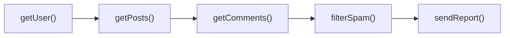

# Callbacks: расширенная теория

## Синхронные vs асинхронные колбэки

Не все колбэки одинаковы. Важно различать два принципиально разных случая:

**Синхронный колбэк** вызывается немедленно — в том же стеке, до возврата из функции:

```js
// forEach вызывает колбэк синхронно для каждого элемента
const doubled = []
[1, 2, 3].forEach(n => doubled.push(n * 2))
console.log(doubled) // [2, 4, 6] — сразу доступны
```

**Асинхронный колбэк** вызывается позже — после того, как текущий стек освободится:

```js
let data = null
setTimeout(() => { data = 42 }, 0) // даже с задержкой 0
console.log(data) // null — колбэк ещё не выполнился!
```

Смешивать синхронное и асинхронное поведение в одном API — смертный грех программиста. Это называется **"releasing Zalgo"**.

## Паттерн Thunk

Thunk — функция, которая не принимает аргументов и оборачивает вычисление, откладывая его на потом. В мире колбэков thunk используется для "ленивой" передачи асинхронных операций:

```js
// Создаём thunk — функцию, которая "запомнила" параметры
function fetchUserThunk(userId) {
  return function(callback) {  // только здесь начинается реальная работа
    fetch(`/users/${userId}`)
      .then(r => r.json())
      .then(user => callback(null, user))
      .catch(err => callback(err))
  }
}

// Передаём thunk, не результат — выполнение отложено
const getAlice = fetchUserThunk(42)
// ... передаём куда нужно ...
getAlice((err, user) => console.log(user))  // теперь запускаем
```

Thunk — это способ превратить "значение, которого ещё нет" в объект первого класса. Библиотека `redux-thunk` использует этот паттерн для асинхронных action creators.

## Контракт Error-First

Почему ошибка идёт **первым** аргументом, а не последним? Isaac Z. Schlueter (создатель npm) объяснял: если бы ошибка шла последней, разработчики могли бы писать `(a, b, c, err)` и забывать про неё. Когда `err` первый — ты видишь его сразу и должен явно решить: игнорировать (плохо) или обработать.

Контракт включает несколько правил:
1. Первый аргумент — `err` (объект Error или `null`)
2. При ошибке последующие аргументы неопределены (не используй их!)
3. При успехе `err === null`, данные в следующих аргументах
4. Колбэк вызывается ровно один раз (Promise-контракт строже, колбэки — нет)

```js
// Корректная реализация функции с error-first колбэком
function parseJSON(str, callback) {
  try {
    const result = JSON.parse(str)
    callback(null, result)  // успех: err = null, данные есть
  } catch (e) {
    callback(e)             // ошибка: только err, данных нет
  }
}
```

## Zalgo: опасность смешивания синхронного и асинхронного

Статья Айзека Шлюетера "Don't Release Zalgo" (2011) описала один из самых коварных багов:

```js
// Опасная функция — поведение непредсказуемо
function getUser(id, callback) {
  if (userCache[id]) {
    callback(null, userCache[id])  // СИНХРОННО если в кэше
  } else {
    db.query(`SELECT * FROM users WHERE id = ?`, [id], callback)  // АСИНХРОННО
  }
}

// Код, который сломается при кэш-хите
let user
getUser(1, (err, u) => {
  user = u  // если синхронно — установится до console.log ниже
})
console.log(user)  // undefined при db-запросе, объект при кэш-хите!
```

Решение — **всегда быть асинхронным**, даже если есть кэш:

```js
function getUser(id, callback) {
  if (userCache[id]) {
    // process.nextTick/setTimeout делают вызов всегда асинхронным
    return process.nextTick(() => callback(null, userCache[id]))
  }
  db.query(`SELECT * FROM users WHERE id = ?`, [id], callback)
}
```

В браузере — `setTimeout(fn, 0)` или `queueMicrotask(fn)`.

## Библиотека async.js: порядок из хаоса

До промисов разработчики создали библиотеку `async` (caolan/async) чтобы справиться с callback hell. Она предоставляла высокоуровневые примитивы:

```js
const async = require('async')

// Последовательное выполнение — как .then().then()
async.waterfall([
  (done) => getUser(userId, done),
  (user, done) => getPosts(user.id, done),
  (posts, done) => getComments(posts[0].id, done),
], (err, comments) => {
  if (err) return handleError(err)
  console.log('Готово:', comments)
})

// Параллельное выполнение — как Promise.all
async.parallel([
  (done) => getUser(1, done),
  (done) => getConfig(done),
  (done) => getPermissions(userId, done),
], (err, [user, config, perms]) => {
  // все три завершились
})

// Последовательно, результат каждого = вход следующего
async.series([
  (done) => step1(done),
  (done) => step2(done),
], (err, results) => {})
```

`async.js` решила синтаксическую проблему пирамиды, но не устранила фундаментальный Inversion of Control.

## Визуальное сравнение: Callback Hell vs Promise Chain



Callbacks — пирамида, растущая вправо:

```
getUser(cb)
  └─ getPosts(cb)
       └─ getComments(cb)
            └─ filterSpam(cb)
                 └─ sendReport(cb)
                      └─ done!
```

Promises — плоская цепочка:

```
getUser()
  .then(getPosts)
  .then(getComments)
  .then(filterSpam)
  .then(sendReport)
  .then(() => done!)
  .catch(handleError)  // одна точка обработки ошибок
```

## Почему Promise решает проблему IoC

С промисами функция больше не принимает ваш колбэк — она **возвращает объект** (Promise), на котором уже вы сами вешаете обработчик через `.then()`:

```js
// Callbacks: ВЫ передаёте функцию → ДРУГОЙ код её вызывает (IoC!)
fetchData(url, (err, data) => { ... })

// Promises: функция возвращает объект → ВЫ контролируете, что делать дальше
const promise = fetchData(url)
promise.then(data => { ... })  // ваш код в ваших руках
```

Контракт Promise гарантирует:
- `.then()` вызывается ровно один раз
- Всегда асинхронно (никакого Zalgo)
- Ошибка через отдельный канал (rejected state, `.catch()`)
- Promise immutable — нельзя вызвать и resolve, и reject

Это и есть ответ на вопрос, зачем нужны промисы. Не "красивый синтаксис" — а **возврат контроля** разработчику.

## Когда колбэки всё ещё уместны

Несмотря на промисы и async/await, колбэки живы:

- **addEventListener** — не промисифицирован и не должен быть (событие может стрелять много раз, Promise — один)
- **setTimeout/setInterval** — по той же причине (повторяемость)
- **Синхронные колбэки** — `Array.map`, `Array.filter`, `Array.sort` — никуда не уйдут
- **Node.js Streams** — data-события, end-события
- **Производительность** — overhead промисов (создание объекта + микрозадача) иногда важен в hot-path коде

```js
// EventEmitter по природе своей — не промис
emitter.on('data', (chunk) => process(chunk))   // много событий
emitter.on('end', () => finalize())             // один раз

// Но можно промисифицировать разово
const once = require('events').once
const [data] = await once(emitter, 'data')
```
