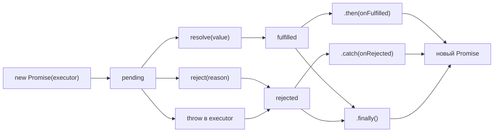

# Promise: основы — расширенная теория

## Promise/A+ спецификация

Promise/A+ — это открытая спецификация, определяющая поведение промисов в JavaScript. Написана сообществом до включения промисов в ES6. Все браузерные реализации и большинство библиотек (Bluebird, Q, когда.js) её реализуют.

Ключевые гарантии спецификации:

1. **Колбэки всегда асинхронны** — даже если промис уже resolved, `onFulfilled` вызывается асинхронно
2. **Колбэки вызываются не более одного раза** — settled-промис фиксирует своё состояние навсегда
3. **Исключения перехватываются** — throw внутри `onFulfilled` превращается в rejected-промис

```js
// Promise/A+ гарантия: асинхронность ВСЕГДА
const resolved = Promise.resolve(42)

resolved.then(v => console.log('async:', v))
console.log('sync')

// Вывод: 'sync' → 'async: 42'
// Даже для уже resolved промиса — then ВСЕГДА асинхронен
```

## Promise Resolution Procedure

Когда промис разрешается значением `x`, выполняется специальная процедура:

```
[[Resolve]](promise, x):
  1. Если x === promise → RangeError (промис не может разрешиться сам собой)
  2. Если x — объект или функция:
     a. Получаем x.then
     b. Если x.then — функция (thenable) → вызываем x.then(resolve, reject)
     c. Иначе → resolve(x) как обычное значение
  3. Если x — не объект и не функция → fulfill с x
```

На практике это значит: `Promise.resolve(anotherPromise)` не создаёт вложенный промис — он "разворачивает" его:

```js
const inner = new Promise(resolve => setTimeout(() => resolve(42), 1000))
const outer = Promise.resolve(inner)

// outer — это НЕ Promise<Promise<42>>
// outer — это тот же промис, что и inner
// (или новый промис, который ждёт inner)
outer.then(v => console.log(v)) // 42, через 1000мс
```

## throw в executor vs reject()

Оба пути приводят к rejected промису, но есть нюанс:

```js
// Вариант 1: throw
const p1 = new Promise((resolve, reject) => {
  throw new Error('через throw')
  // Движок перехватывает и вызывает reject(error) автоматически
})

// Вариант 2: reject()
const p2 = new Promise((resolve, reject) => {
  reject(new Error('через reject'))
})

// Оба ведут к rejected состоянию
p1.catch(e => console.log(e.message)) // 'через throw'
p2.catch(e => console.log(e.message)) // 'через reject'
```

⚠️ Важно: throw перехватывается только в **синхронном** коде executor. Асинхронные ошибки не перехватываются:

```js
// Плохо — ошибка НЕ будет перехвачена промисом
const p = new Promise((resolve, reject) => {
  setTimeout(() => {
    throw new Error('асинхронная ошибка') // uncaught!
  }, 100)
})

// Хорошо — асинхронные ошибки нужно передавать через reject
const p = new Promise((resolve, reject) => {
  setTimeout(() => {
    try {
      throw new Error('ошибка')
    } catch (e) {
      reject(e) // явная передача в reject
    }
  }, 100)
})
```

## Promise.resolve() и Promise.reject() — быстрые создания

```js
// Создать уже выполненный промис
const p1 = Promise.resolve(42)
// Эквивалентно: new Promise(resolve => resolve(42))

// Создать уже отклонённый промис
const p2 = Promise.reject(new Error('ошибка'))
// Эквивалентно: new Promise((_, reject) => reject(new Error('ошибка')))
```

💡 Особое поведение `Promise.resolve(value)`:
- Если `value` — уже промис той же реализации, возвращается он же без обёртки
- Если `value` — thenable, создаётся новый промис, следующий за ним
- Если `value` — примитив или обычный объект, создаётся resolved промис

```js
const original = Promise.resolve(42)
const wrapped = Promise.resolve(original)

console.log(original === wrapped) // true — тот же объект!
```

## Executor выполняется синхронно — почему это важно

Синхронность executor имеет практические последствия:

```js
let promiseRef

// Внешний код может сохранить resolve/reject
let externalResolve
const p = new Promise(resolve => {
  externalResolve = resolve  // сохраняем resolve снаружи
})

// Позже, в другом месте:
externalResolve('значение')  // разрешаем промис извне
p.then(v => console.log(v))  // 'значение'
```

Это паттерн называется **Deferred** — разделение создания промиса и его разрешения. В современном коде лучше использовать `Promise.withResolvers()` (ES2024):

```js
const { promise, resolve, reject } = Promise.withResolvers()

// promise — промис, resolve и reject — его управляющие функции
setTimeout(() => resolve(42), 1000)
await promise // 42
```

## Жизненный цикл промиса



## Unhandled Promise Rejection

Если промис отклонён и не имеет обработчика ошибки — это **Unhandled Promise Rejection**:

```js
// Это создаст Unhandled Promise Rejection
Promise.reject(new Error('никто не поймал'))

// В браузере:
window.addEventListener('unhandledrejection', (event) => {
  console.error('Unhandled:', event.reason)
  event.preventDefault() // подавляет консольное предупреждение
})

// В Node.js:
process.on('unhandledRejection', (reason, promise) => {
  console.error('Unhandled Rejection:', reason)
  // В продакшне — завершить процесс:
  // process.exit(1)
})
```

📌 В Node.js начиная с v15, Unhandled Promise Rejection завершает процесс с ненулевым кодом выхода — как и необработанное синхронное исключение.

## Микротаски и порядок выполнения

Колбэки промисов помещаются в очередь **микротасок** (microtask queue) — она имеет приоритет над обычными задачами (setTimeout, setInterval):

```js
setTimeout(() => console.log('macro'), 0)

Promise.resolve()
  .then(() => console.log('micro 1'))
  .then(() => console.log('micro 2'))

console.log('sync')

// Порядок:
// sync
// micro 1
// micro 2
// macro
```

Вся очередь микротасок вычищается **перед** тем, как Event Loop возьмёт следующую макрозадачу. Это значит, что длинная цепочка `.then()` выполнится целиком до следующего setTimeout.

## Ошибки новичков

❌ **Ошибка 1: Promise Constructor Antipattern**

```js
// Плохо — ненужная обёртка
function getUser(id) {
  return new Promise((resolve, reject) => {
    fetch(`/users/${id}`)
      .then(r => resolve(r.json()))
      .catch(err => reject(err))
  })
}

// Хорошо — fetch уже промис
function getUser(id) {
  return fetch(`/users/${id}`).then(r => r.json())
}
```

Почему это плохо: вложенные промисы усложняют код, ошибки из `.then()` внутри executor не будут перехвачены внешним `.catch()`.

❌ **Ошибка 2: забыть return в .then()**

```js
// Плохо — значение теряется
promise
  .then(data => {
    processData(data) // ← нет return! следующий .then получит undefined
  })
  .then(result => console.log(result)) // undefined

// Хорошо
promise
  .then(data => processData(data)) // или явный return
  .then(result => console.log(result)) // правильное значение
```

❌ **Ошибка 3: не обрабатывать асинхронные ошибки**

```js
// Плохо — ошибка в setTimeout не попадёт в промис
const p = new Promise((resolve, reject) => {
  setTimeout(() => {
    doRiskyOperation() // если выбросит — промис никогда не settled
  }, 100)
})

// Хорошо — оборачиваем в try/catch и передаём в reject
const p = new Promise((resolve, reject) => {
  setTimeout(() => {
    try { resolve(doRiskyOperation()) }
    catch (e) { reject(e) }
  }, 100)
})
```

❌ **Ошибка 4: catch не в конце цепочки**

```js
// Плохо — ошибки после .catch() не обработаны
promise
  .catch(err => handleError(err))
  .then(data => riskyTransform(data)) // ← ошибка здесь не поймается

// Хорошо — .catch() в конце
promise
  .then(data => riskyTransform(data))
  .catch(err => handleAnyError(err)) // ловит ошибки из всей цепочки
```
